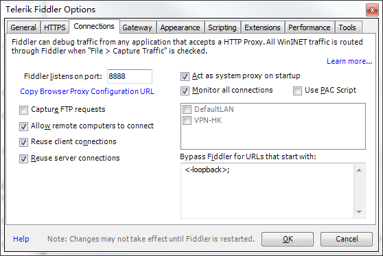
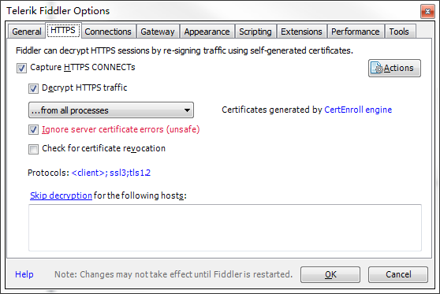
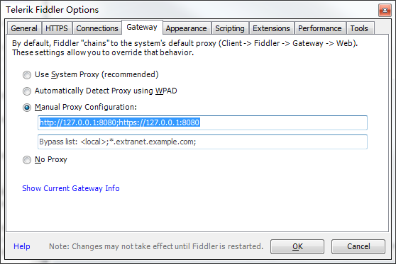
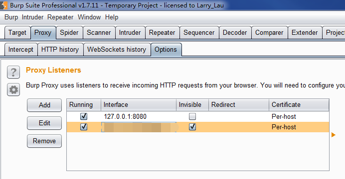
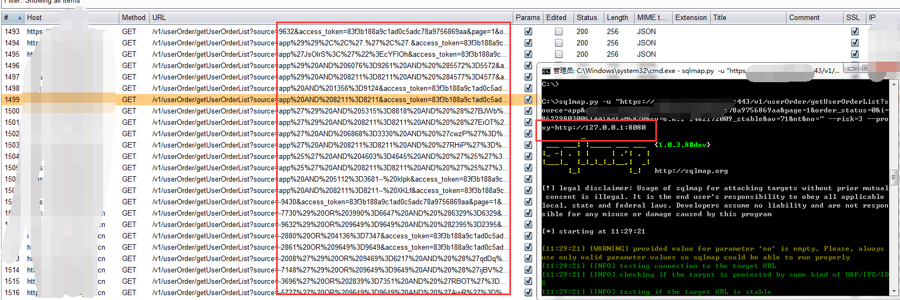

Title: BurpSuite和Fiddler串联使用解决App测试漏包和速度慢的问题
Date: 2017-02-09 10:20
Category: 基础知识
Tags: proxy, Burpsuite,fiddler
Slug: 
Authors: bit4
Summary: 

## 前言

没什么技术含量，就是一个小tips，请轻喷，大侠们有什么更好的也欢迎分享讨论。

## 问题

在实际的测试过程中，我一直使用BurpSuite，但是在使用它进行Android App的测试时发现有两种不好的情况：

1. 使用了burp的代理后，响应速度明显降低，有的App对响应时间有要求，待到响应包返回后，页面已经显示超时，无法完成测试。
2. 第二种情况更是糟糕，就是出现抓不到包的情况。在MottonIN的群也有小伙伴反映过相同的情况；官方论坛也有人遇到：<http://forum.portswigger.net/thread/1115>

## 解决方案

经过反复尝试，找到了如下的解决方法：

手机wifi设置代理 —–>Fiddler —->BurpSuite —–>互联网（或者测试环境网络）

**原理说明**

肯定有个疑问，只用burp都慢了，双重代理岂不是更慢？

答案是非也，串联速度会比只用burp快很多，为什么呢？这可能（我不能保证说得是对的，只是自己的猜测）和2个工具的抓包机制有关了。

Fidder 只是http和https的代理而且是用C#写出来的，而BurpSuite是从底层包中解析http流量，而且是Java写的，这么一对比，单独使用2者的时候，Fidder比BurpSuite也就很正常。

为啥串联还快呢，当Fidder的流量走BurpSuite的时候，没有流量解析的过程，只是单纯的转发，少了最耗时的步骤。总体而言还是比单独使用BurpSuite的时候快很多。

**详细配置**

1.Fidder和BurpSuite的配置

监听8888端口，手机上的代理地址就设置这个

如果要抓https的包，就要如下配置。

gateway的配置，设置的内容是burpsuite的代理地址，表示流量经过Fiddler后，转发到Burp的代理地址

2.手机上的配置：

设置代理地址；安装Fiddler的证书。

**类似案例:**

比如，sql注入的时候想要看到sqlmap使用了哪些payload，就可以使用proxy参数。

**注意：**

Fiddler 默认是不会使用系统hosts 的，而Burpsuite默认是会使用的，所以呢，串联后是会使用的。如果你的测试需要绑定hosts，请注意。