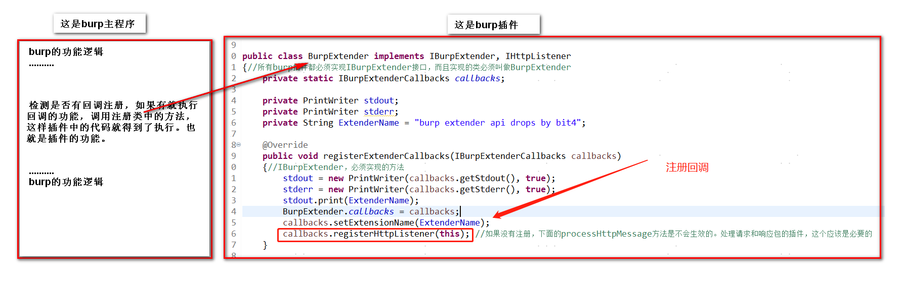

Title: BurpSuite插件开发Tips
Date: 2019-08-28 10:20
Category: 工具相关
Tags: Java, Burpsuite Extender,安全工具
Slug: 
Authors: bit4woo
Summary: 

## 更新说明

20190828更新：之前这篇文章是完成了一个插件项目后的总结，后续渐渐更新发现它更像一个插件编写入门指引了。尤其是完成了JSRC上“安全小课堂第142期【burp插件开发入门】”后，进行了大量更新。

## ~~缘由~~

~~自己使用burp进行测试的过程中遇到好些接口是有sign的，如果修改了请求参数都需要重新计算sign值，所以有用python实现过一个简单的插件，来自动计算sign值，以达到和普通接口测试一样方便的效果。~~

~~后来，好基友在做一个APP的测试的时候，发现有类似的问题，接口的所有参数都有使用AES加密，返回也是一样。他通过逆向获得了加密的算法，我们就通过如下的插件实现了自动加解密的过程。在整个过程中有一点点收获，现分享出来。~~

~~具体bug请移步：[Zealer_android客户端安全检测(从脱壳到burp自动加解密插件案例/SQL注入/逻辑漏洞/附AES加解密脚本POC)](http://www.2cto.com/article/201607/528201.html)~~

~~或者看这里：https://github.com/bit4woo/code2sec.com/tree/master/img/BurpExtenderAES/Zealer_android.png~~

## 语言选择

**尽量使用java、避免python**

一是兼容问题，我平常python用得比较多的，之前也用python写过几个简单插件。但是在开发burp插件的时候，发现还是Java更合适。上面的这个插件，最初就是用py实现的，但是，当这个py文件调了python的其他类，如下图。通过Jython去解析执行，遇到pyd文件就无法进行下去了，因为pyd是C写的，Jython是无法使用C写的模块的。burp本事是Java写的，使用Java去开发插件兼容性最高，会少很多莫名其妙的错误。


下面这个链接对此有详细说明：

- <http://stackoverflow.com/questions/16218183/using-pyd-library-in-jython>


二是调试问题，当使用python写插件进行调试时，只能尽量通过输出去获取信息，没有好的办办法进行下断点的动态调试。而java可以和IDE进行联调，更容易排查问题。


## 回调的概念

如下图，而我们需要编写的就是右边的部分。



## 一些建议

**1.适当代码分离、方便测试**

如果你开发能力比较强，什么多线程、面向对象、设计模式一把梭，那整就完事了。如果刚刚开始，也要尝试将代码分块，让一个功能一个函数。代码的分离将容易理清逻辑，调试bug。


**2.向优秀插件学习**


官方的示例代码是很好的参考，提供了常见功能的多种语言实现https://portswigger.net/burp/extender#SampleExtensions

插件代码的结构基本是固定的。比如，如果想要写一个对http请求和响应进行操作的插件，那么基本上如图的这段代码是可以直接copy使用的，下图标红的几个方法就都是必须的。我想我们大多数时候都是在对http的包进行处理。有了大的框架之后，再进行修改相对会容易很多。所以，如果你想写一个什么样的插件，你完全可以去找一个类似的插件，看他的代码，copy他的代码，改他的代码（比如我的，呵呵）。


你要问怎么样查看已有插件的代码？怎样查API文档？

首先安装一个已有插件。


找到burp所在路径下的bapps目录，里面就是你安装了的插件。


拖到JD-Gui中就可以看代码了，这种一般是不会做混淆的，至少我还没发现~。Py的就更不用说了，直接文件右键打打开。


**3.查找并阅读官方API**

关于API文档，我是通过溯源的方法，对于0基础的读者比较实用。比如我的目的是加密各个参数，那么首先要获取请求中的参数。我先去API库中搜索关键词`parameter`，可以找到多个相关方法，通过对比，我确定`List<IParameter> getParameters();`是我需要的。找到这个方法后，查看它的参数、返回值类型、所属的类这三个关键因素。它属于`IRequestInfo`类，只有`IRequestInfo`类型的对象才可以调用它，那么，有哪些方法会返回这个类型的对象呢？再去找那些方法可以返回这个类型的方法。依次类推，可以知道需要使用哪些方法，哪些类，就能梳理清除大致的思路了。


## **插件代码的套路**

（常见逻辑可参考个人的一些总结 https://github.com/bit4woo/burp-api-drops）


1.public class BurpExtender implements IBurpExtender, IHttpListener


2.public class BurpExtender implements IBurpExtender, IHttpListener


3.http请求的常规处理逻辑

processHttpMessage 中需要做的事

- Burp中最初拿到的东西就是 `IHttpRequestResponse messageInfo`。
- 把它变成我们认识的数据包格式：analyzeRequest = helpers.analyzeRequest(messageInfo);


获取各种需要处理的对象：参数、header、body，对象不同，方法有所差别


修改各对象并更新到最终的数据包

## **图形界面怎么搞**

1.安装windowbuilder插件

教程：

<http://jingyan.baidu.com/article/4d58d54113bfdd9dd5e9c045.html>


通过拖拽来实现图形解密的设计


为按钮添加点击事件

2.`BurpExtender`类中增加 `Itab IContextMenuFactory`


- 这两个类接口也有他们必须实现的方法，否则看不到图形界面 `String getTabCaption(); Component`
- `getUiComponent();` –之前踩过的大坑
- `IContextMenuFactory` —-对应的是那个“send to”功能

## **调试方法**

前面讲了选择Java作为首选语言，这里也就讲Java中的调试方法。国内我们用的burp版本大家都懂的一般有使用helper的，有使用keygen的，如果要调试，你需要使用keygen。

准备好2个文件：burp-loader-keygen-70yeartime-BurpPro.jar和burpsuite_pro_v1.7.37.jar。然后可以用如下命令启动burp并让它处于调试的监听方。

```
Java-agentlib:jdwp=transport=dt_socket,server=y,suspend=n,address=5005 -Xbootclasspath/p:burp-loader-keygen-70yeartime-BurpPro.jar -jar burpsuite_pro_v1.7.37.jar
```

这个命令和正版不同的地方就是需要加 Xbootclasspath/p:burp-loader-keygen-70yeartime-BurpPro.jar 这一段，可以保存个bat，方便一键启动。


另外一边是IDE的配置。以idea为例。


如上debug模式的burp和IDE都配置好后，就可以进行下断点调试了。需要注意的是，你需要保持IDE中的代码，和你打包的插件的代码一致。有一个参考文章给师傅们。
https://blog.netspi.com/debugging-burp-extensions/我们这里讲的方法与之不同的地方，就是刚提到的burp的debug模式启动命令。


## 参考

向先行者致敬，让我们少走弯路。

**Java篇：**

- [BurpSuite 扩展开发1-API与HelloWold](http://drops.wooyun.org/papers/3962)
- [BurpSuite插件编写教程（第一篇）](http://www.moonsos.com/Article/penetration/107.html)
- [国产BurpSuite插件Assassin V1.0发布](http://www.moonsos.com/tools/webscan/97.html)
- [BurpSuite插件开发指南之 API 上篇](http://www.evil0x.com/posts/17487.html)
- [BurpSuite插件开发指南之 API 下篇](http://drops.wooyun.org/tools/14685)
- [BurpSuite插件开发指南之 Java 篇](http://drops.wooyun.org/tools/16056)
- [Burpsuite插件开发之RSA加解密](http://blog.nsfocus.net/burpsuite-plugin-development-rsa-encryption-decryption/)

**Python篇：**

- [burpsuite扩展开发之Python（change unicode to chinese） PS：我是从这入门的](http://drops.wooyun.org/tools/5751)
- [BurpSuite插件开发之过狗菜刀](https://www.blackh4t.org/archives/1730.html)
- [toolflag](https://portswigger.net/burp/extender/api/constant-values.html#burp.IBurpExtenderCallbacks)

**个人的其他分享**：

[安全小课堂第142期【burp插件开发入门】](https://mp.weixin.qq.com/s?__biz=MjM5OTk2MTMxOQ==&mid=2727831405&idx=1&sn=a5319122d8430e4f8599bf3d805fc887&chksm=8050b0e5b72739f3b7ef7f3e635189750b740e9b183a8eac15f85f4f248520a5f338c9900837&scene=27#wechat_redirect)

https://github.com/bit4woo/burp-api-drops

https://github.com/bit4woo/burp-api-common

**调试方法：**

https://blog.netspi.com/debugging-burp-extensions/