Title: BurpSuite插件开发Tips：请求响应参数的AES加解密
Date: 2017-01-07 10:20
Category: Java,安全工具
Tags: Java, Burpsuite Extender,工具
Slug: 
Authors: bit4
Summary: 

## 缘由

自己使用burp进行测试的过程中遇到好些接口是有sign的，如果修改了请求参数都需要重新计算sign值，所以有用python实现过一个简单的插件，来自动计算sign值，以达到和普通接口测试一样方便的效果。

后来，好基友在做一个APP的测试的时候，发现有类似的问题，接口的所有参数都有使用AES加密，返回也是一样。他通过逆向获得了加密的算法，我们就通过如下的插件实现了自动加解密的过程。在整个过程中有一点点收获，现分享出来。

具体bug请移步：[Zealer_android客户端安全检测(从脱壳到burp自动加解密插件案例/SQL注入/逻辑漏洞/附AES加解密脚本POC)](http://www.2cto.com/article/201607/528201.html)

## 代码

闲话少说，上代码，BurpExtender主类代码如下，进行了较为详细的注释。AES算法类的参考链接：

- <http://www.wenhq.com/article/view_716.html>

code：

- <https://github.com/bit4woo/Burp_Extender_Pro>

## 收获和建议

**1.尽量使用java、避免python**

我平常python用得比较多的，之前也用python写过几个简单插件。但是在开发burp插件的时候，发现还是Java更合适。上面的这个插件，最初就是用py实现的，但是，当这个py文件调了python的其他类，如下图。通过Jython去解析执行，遇到pyd文件就无法进行下去了，因为pyd是C写的，Jython是无法使用C写的模块的。burp本事是Java写的，使用Java去开发插件兼容性最高，会少很多莫名其妙的错误。

下面这个链接对此有详细说明：

- <http://stackoverflow.com/questions/16218183/using-pyd-library-in-jython>

**2.适当代码分离、方便测试**

我会分别将插件的代码和AES算法的代码分别写在两个不同文件中。这样可以单独调试算法的代码，也可以让插件代码更简洁不易出错。因为插件的代码每修改一次都需要重新在burp中加载才可以看到效果，不像一般的程序在IDE中就可以调试，所以个人认为这样比较好。

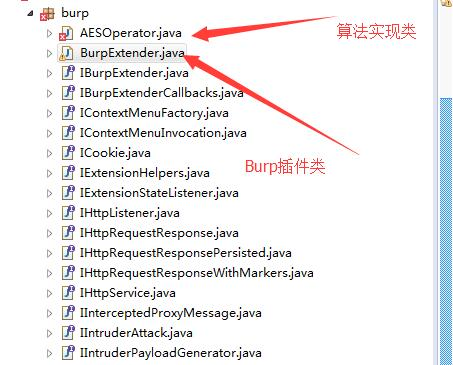

**3.向优秀插件学习**

插件代码的结构基本是固定的。比如，如果想要写一个对http请求和响应进行操作的插件，那么基本上如图的这段代码是可以直接copy使用的，下图标红的几个方法就都是必须的。我想我们大多数时候都是在对http的包进行处理。有了大的框架之后，再进行修改相对会容易很多。所以，如果你想写一个什么样的插件，你完全可以去找一个类似的插件，看他的代码，copy他的代码，改他的代码（比如我的，呵呵）。

你要问怎么样查看已有插件的代码？怎样查API文档？

首先安装一个已有插件。

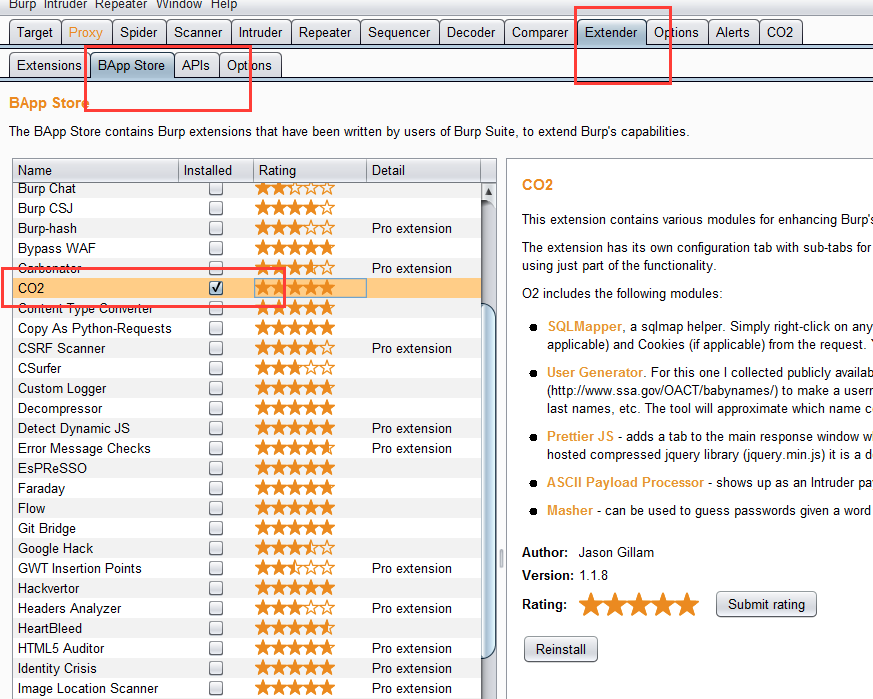

找到burp所在路径下的bapps目录，里面就是你安装了的插件。

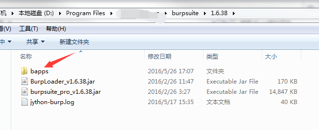

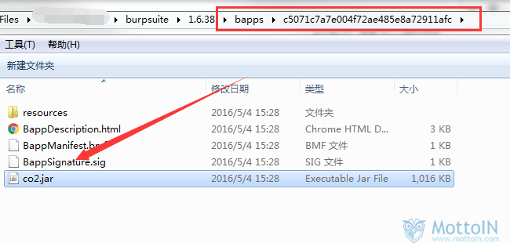

拖到JD-Gui中就可以看代码了，这种一般是不会做混淆的，至少我还没发现~。Py的就更不用说了，直接文件右键打打开。

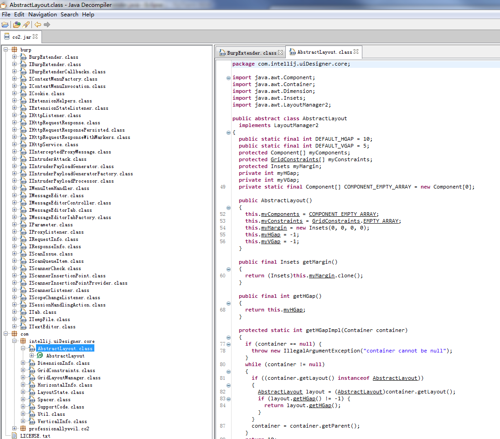

**4.查找并阅读官方API**

关于API文档，我是通过溯源的方法，对于0基础的读者比较实用。比如我的目的是加密各个参数，那么首先要获取请求中的参数。我先去API库中搜索关键词`parameter`，可以找到多个相关方法，通过对比，我确定`List<IParameter> getParameters();`是我需要的。找到这个方法后，查看它的参数、返回值类型、所属的类这三个关键因素。它属于`IRequestInfo`类，只有`IRequestInfo`类型的对象才可以调用它，那么，有哪些方法会返回这个类型的对象呢？再去找那些方法可以返回这个类型的方法。依次类推，可以知道需要使用哪些方法，哪些类，就能梳理清除大致的思路了。

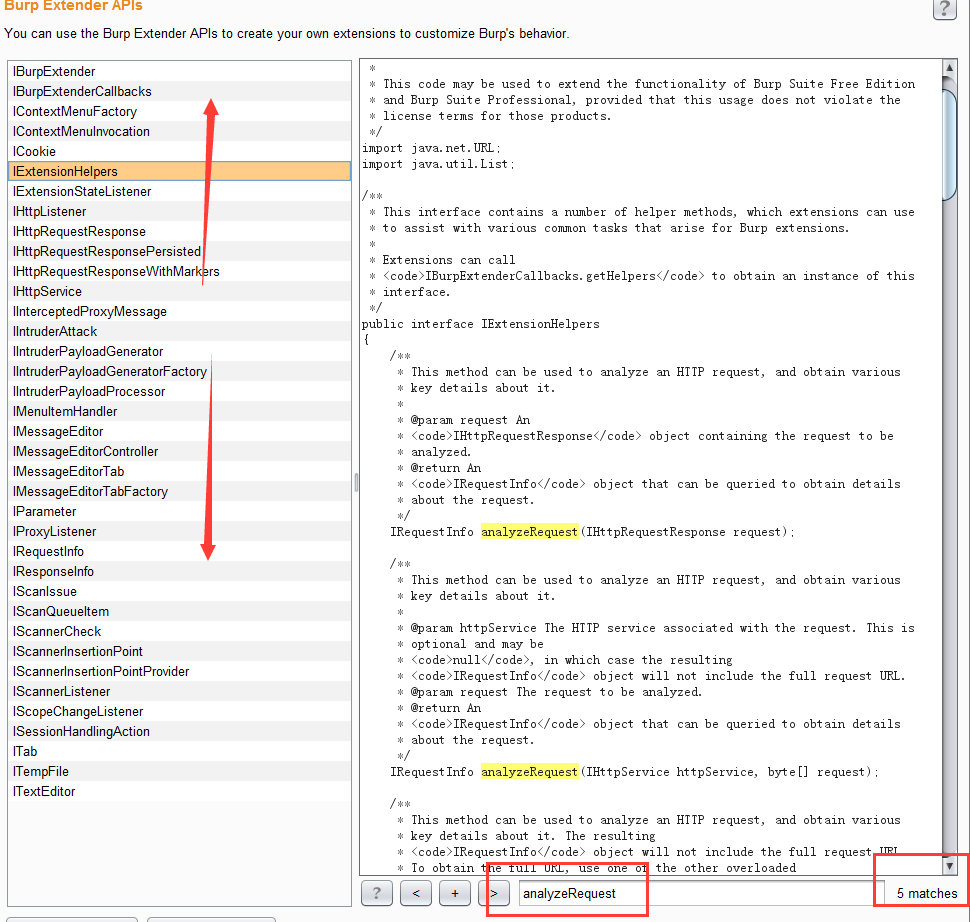

**5.插件代码的套路**

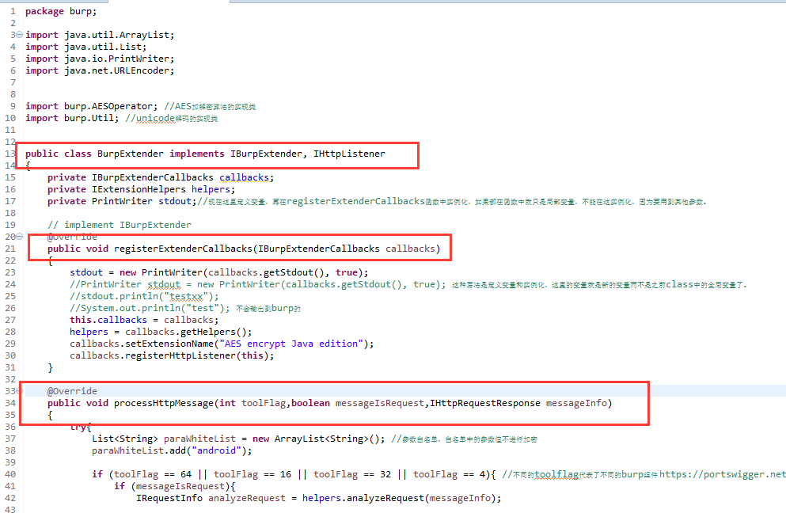

1.public class BurpExtender implements IBurpExtender, IHttpListener

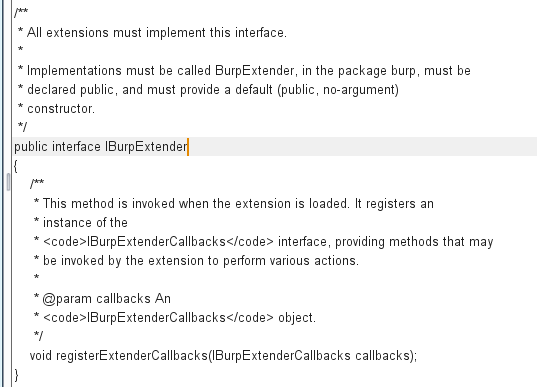

2.public class BurpExtender implements IBurpExtender, IHttpListener

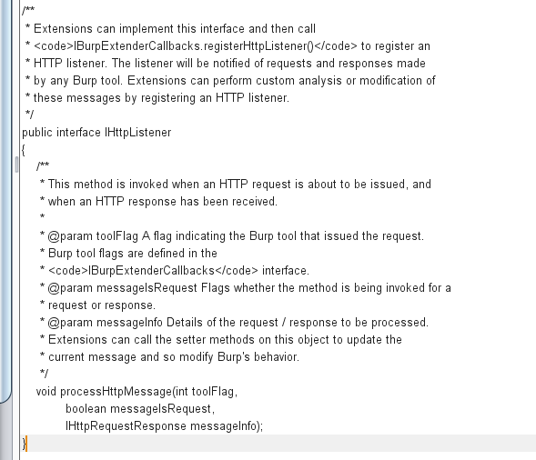

3.http请求的常规处理逻辑

processHttpMessage 中需要做的事

- Burp中最初拿到的东西就是 `IHttpRequestResponse messageInfo`。
- 把它变成我们认识的数据包格式：analyzeRequest = helpers.analyzeRequest(messageInfo);

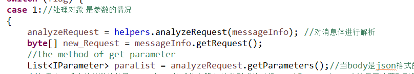

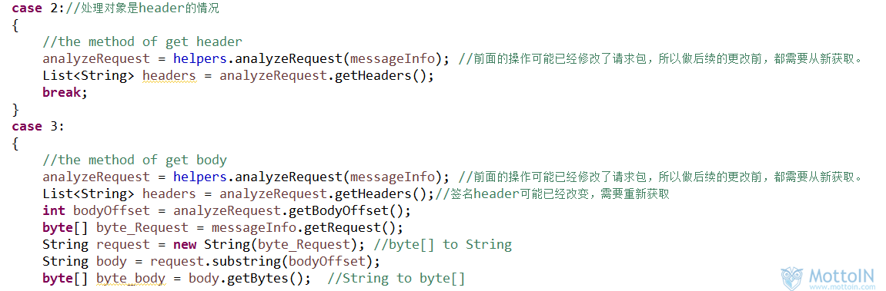

获取各种需要处理的对象：参数、header、body，对象不同，方法有所差别

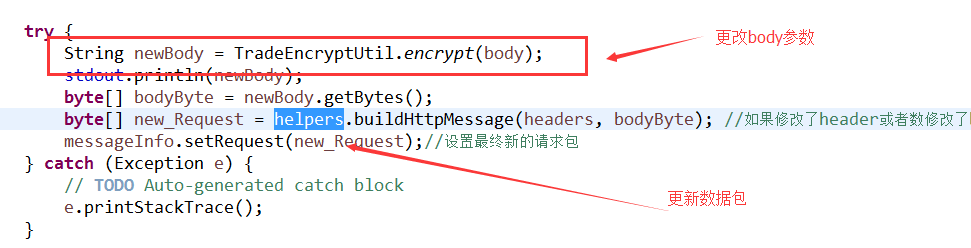

修改各对象并更新到最终的数据包

**6.图形界面怎么搞**

1.安装windowbuilder插件

教程：

<http://jingyan.baidu.com/article/4d58d54113bfdd9dd5e9c045.html>

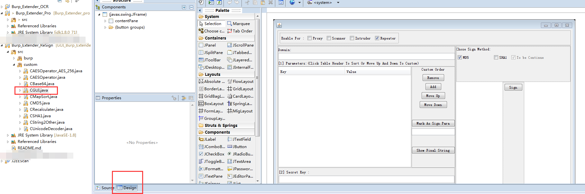

通过拖拽来实现图形解密的设计

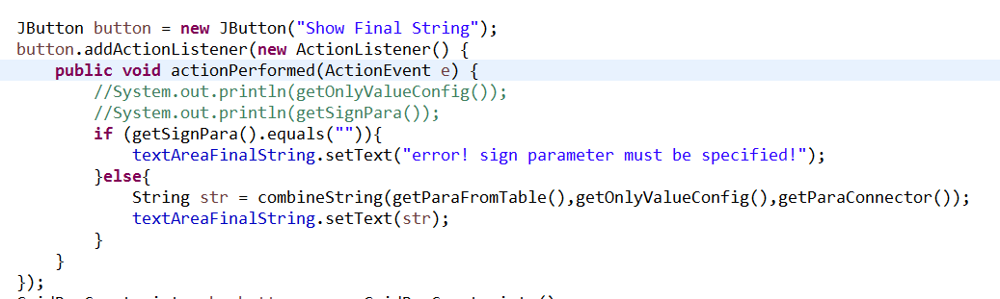

为按钮添加点击事件

2.`BurpExtender`类中增加 `Itab IContextMenuFactory`

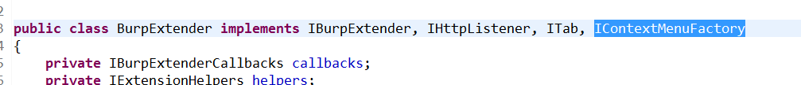

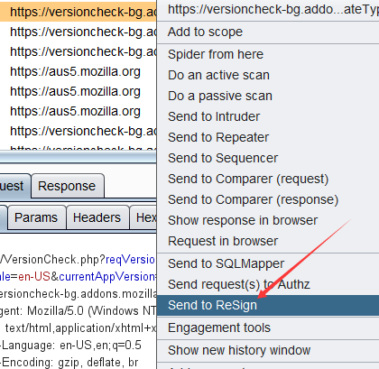

- 这两个类接口也有他们必须实现的方法，否则看不到图形界面 `String getTabCaption(); Component`
- `getUiComponent();` –之前踩过的大坑
- `IContextMenuFactory` —-对应的是那个“send to”功能

**7.关于调试和移植**

不能在IDE中直接调试，只能导出jar包，通过burp调用才能看到效果。 ———–所以编写过程尽量多使用输出排查错误。

图形界面的编写可以在IDE中调试完成后再移植到burp中，但是移植到burp需要修改一些地方。

## 项目主页

[BurpSuite插件分享：图形化重算sign和参数加解密插件（更新2.2版本）](http://www.polaris-lab.com/index.php/archives/19/)

## 参考文档汇总

向先行者致敬，让我们少走弯路。

**Java篇：**

- [BurpSuite 扩展开发1-API与HelloWold](http://drops.wooyun.org/papers/3962)
- [BurpSuite插件编写教程（第一篇）](http://www.moonsos.com/Article/penetration/107.html)
- [国产BurpSuite插件Assassin V1.0发布](http://www.moonsos.com/tools/webscan/97.html)
- [BurpSuite插件开发指南之 API 上篇](http://www.evil0x.com/posts/17487.html)
- [BurpSuite插件开发指南之 API 下篇](http://drops.wooyun.org/tools/14685)
- [BurpSuite插件开发指南之 Java 篇](http://drops.wooyun.org/tools/16056)
- [Burpsuite插件开发之RSA加解密](http://blog.nsfocus.net/burpsuite-plugin-development-rsa-encryption-decryption/)

**Python篇：**

- [burpsuite扩展开发之Python（change unicode to chinese） PS：我是从这入门的](http://drops.wooyun.org/tools/5751)
- [BurpSuite插件开发之过狗菜刀](https://www.blackh4t.org/archives/1730.html)
- [toolflag](https://portswigger.net/burp/extender/api/constant-values.html#burp.IBurpExtenderCallbacks)