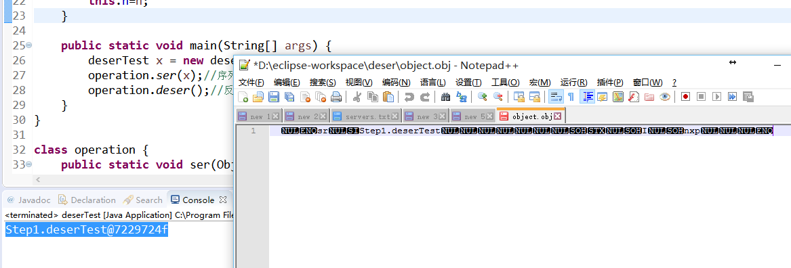
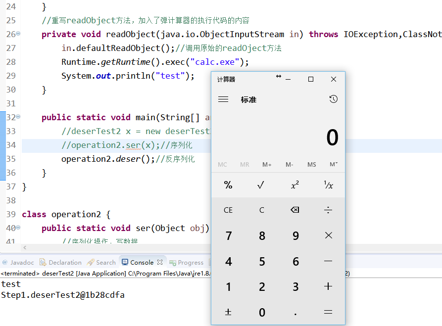

Title:Java反序列化漏洞学习实践一：从Serializbale接口开始，先弹个计算器
Date: 2017-12-05 10:20
Category: 漏洞实践
Tags: Java,反序列化,漏洞
Slug: 
Authors: bit4
Summary: 

### 0x0、基本概念

 

**1、什么是序列化和反序列化**

Serialization（序列化）是指把Java对象保存为二进制字节码的过程；反序列化deserialization是把二进制码重新转换成Java对象的过程。

 

**2、什么情况下需要序列化 **

a）当你想把的内存中的对象保存到一个文件中或者数据库中时候；

b）当你想用套接字在网络上传送对象的时候；

c）当你想通过RMI传输对象的时候；

 

总之，序列化的用途就是传递和存储。

 

**3、如何实现序列化**

将需要序列化的类实现Serializable接口就可以了，Serializable接口中没有任何方法，可以理解为一个标记，即表明这个类可以被序列化。

序列化与反序列化都可以理解为“写”和“读”操作 ，通过如下这两个方法可以将对象实例进行“序列化”与“反序列化”操作。

```java
/**

 * 写入对象内容

 */

private void writeObject(java.io.ObjectOutputStream out)

/**

 * 读取对象内容

 */

private void readObject(java.io.ObjectInputStream in)

```


**4、一些注意点**

 

当然，并不是一个实现了序列化接口的类的所有字段及属性，都是可以序列化的：

如果该类有父类，则分两种情况来考虑：

1.如果该父类已经实现了可序列化接口，则其父类的相应字段及属性的处理和该类相同；

2.如果该类的父类没有实现可序列化接口，则该类的父类所有的字段属性将不会序列化，并且反序列化时会调用父类的默认构造函数来初始化父类的属性，而子类却不调用默认构造函数，而是直接从流中恢复属性的值。

如果该类的某个属性标识为static类型的，则该属性不能序列化。

如果该类的某个属性采用transient关键字标识，则该属性不能序列化。

a）当一个父类实现序列化，子类自动实现序列化，不需要显式实现Serializable接口；

b）当一个对象的实例变量引用其他对象，序列化该对象时也把引用对象进行序列化；

 

### 0x1、简单实例

 

以下代码是一个简单的实现序列化和反序列化操作的demo。

```java
package Step1;

import java.io.File;
import java.io.FileInputStream;
import java.io.FileNotFoundException;
import java.io.FileOutputStream;
import java.io.IOException;
import java.io.ObjectInputStream;
import java.io.ObjectOutputStream;
import java.io.Serializable;

public class deserTest implements Serializable {  
	
    /**
	 * 创建一个简单的可被序列化的类，它的实例化后的对象就是可以被序列化的。
	 */
	private static final long serialVersionUID = 1L;
	
	private int n;  
    
    public deserTest(int n){ //构造函数，初始化时执行
        this.n=n;
    }
    
    public static void main(String[] args) {
    	deserTest x = new deserTest(5);//实例一个对象
    	operation.ser(x);//序列化
    	operation.deser();//反序列化
    }
}

class operation {
	public static void ser(Object obj) {
		//序列化操作，写数据
		try{
	        ObjectOutputStream oos = new ObjectOutputStream(new FileOutputStream("object.obj"));
	        //ObjectOutputStream能把Object输出成Byte流
	        oos.writeObject(obj);//序列化关键函数
	        oos.flush();  //缓冲流 
	        oos.close(); //关闭流
	    } catch (FileNotFoundException e) 
	    {        
	        e.printStackTrace();
	    } catch (IOException e) 
	    {
	        e.printStackTrace();
	    }
	}
	
	public static void deser() {
		//反序列化操作，读取数据
		try {
			File file = new File("object.obj");
			ObjectInputStream ois= new ObjectInputStream(new FileInputStream(file));
			Object x = ois.readObject();//反序列化的关键函数
			System.out.print(x);
			ois.close();
		} catch (FileNotFoundException e) {
			// TODO Auto-generated catch block
			e.printStackTrace();
		} catch (Exception e) {
			// TODO Auto-generated catch block
			e.printStackTrace();
		}
	}
}
```

运行结果：

 

 

### 0x2、自定义反序列化的行为--弹个计算器

 

自定义序列化和反序列化过程，就是重写writeObject和readObject方法。

 

对以上代码进行改造，加入readObject方法的重写，再重写函数中加入自己的代码逻辑。

 

```java
package Step1;

import java.io.File;
import java.io.FileInputStream;
import java.io.FileNotFoundException;
import java.io.FileOutputStream;
import java.io.IOException;
import java.io.ObjectInputStream;
import java.io.ObjectOutputStream;
import java.io.Serializable;

public class deserTest2 implements Serializable {  
	
    /**
	 * 创建一个简单的可被序列化的类，它的实例化后的对象就是可以被序列化的。
	 * 然后重写readObject方法，实现弹计算器。
	 */
	private static final long serialVersionUID = 1L;
	
	private int n;
    
    public deserTest2(int n){ //构造函数，初始化时执行
        this.n=n;
    }
    //重写readObject方法，加入了弹计算器的执行代码的内容
    private void readObject(java.io.ObjectInputStream in) throws IOException,ClassNotFoundException{
    	in.defaultReadObject();//调用原始的readOject方法
    	Runtime.getRuntime().exec("calc.exe");
    	System.out.println("test");
    }
    
    public static void main(String[] args) {
    	//deserTest2 x = new deserTest2(5);//实例一个对象
    	//operation2.ser(x);//序列化
    	operation2.deser();//反序列化
    }
}

class operation2 {
	public static void ser(Object obj) {
		//序列化操作，写数据
		try{
	        ObjectOutputStream oos = new ObjectOutputStream(new FileOutputStream("object.obj"));
	        //ObjectOutputStream能把Object输出成Byte流
	        oos.writeObject(obj);//序列化关键函数
	        oos.flush();  //缓冲流 
	        oos.close(); //关闭流
	    } catch (FileNotFoundException e) 
	    {        
	        e.printStackTrace();
	    } catch (IOException e) 
	    {
	        e.printStackTrace();
	    }
	}
	
	public static void deser() {
		//反序列化操作，读取数据
		try {
			File file = new File("object.obj");
			ObjectInputStream ois= new ObjectInputStream(new FileInputStream(file));
			Object x = ois.readObject();//反序列化的关键函数
			System.out.print(x);
			ois.close();
		} catch (FileNotFoundException e) {
			// TODO Auto-generated catch block
			e.printStackTrace();
		} catch (Exception e) {
			// TODO Auto-generated catch block
			e.printStackTrace();
		}
	}
}
```

以上代码，先取消main函数中的注释运行一次，以便生成正确的object.obj文件。而后加上注释运行一次，以保证只从object.obj文件中读取内容进行反序列化操作。如果无错误，第二次执行将看到弹计算器。



总结：

这是一个极端的例子，在真实场景中，不会有人真的这样直接写一句执行命令的代码在readObject()中。但是一般会有其他的代码逻辑，如果它的代码逻辑里，如果有某一个分支有像method.invoke()这种可以调用其他函数的代码，那么就可以跳转过去，再从这个“其他函数”的角度去看有没有执行代码或调用其他函数的可能。这个“其他函数”也就是所谓的gadget了。


本文代码可从github下载：

<https://github.com/bit4woo/Java_deserialize_vuln_lab/tree/master/src/Step1>


参考：

<http://www.cnblogs.com/xdp-gacl/p/3777987.html>

<http://www.importnew.com/20125.html>

<http://beautyboss.farbox.com/post/study/shen-ru-xue-xi-javaxu-lie-hua>