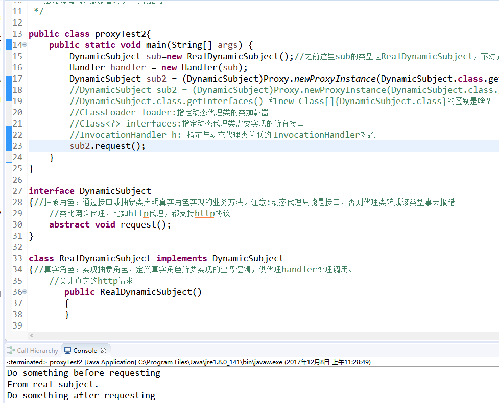

Title: Java反序列化漏洞学习实践三：理解java的动态代理机制
Date: 2017-12-08 10:20
Category: 漏洞实践
Tags: Java,反序列化,漏洞
Slug: 
Authors: bit4woo
Summary: 

### **0x0、基础**

代理的使用场景：某程序员入职公司接手了一个项目，他读源码发现某些地方可以增强，比如在某些函数执行前应该打印日志。如果他直接在原始代码的基础上直接修改容易出错，他的做法是：自己实现一个类，和原始类实现相同的接口（或者继承相同的类），通过在方法中引用老程序的方法来实现自己的方法，从而实现在不改动源代码的基础上达到增强方法的目的。

代理模式：为其他对象提供一种代理以便控制对这个对象的访问（所谓控制，就是可以在其调用行为前后分别加入一些操作）。

代理模式分类：

1. 静态代理，其实质是类的继承或接口的实现，比较容易理解，注意结合场景。
2. **动态代理（Jdk动态代理），这是我们需要关注的重点，在反序列化漏洞的场景中需要用到！**

3. cglib动态代理

 

### **0x1、静态代理demo和理解**

 

```java
package Step3;

/*
 * 代理模式的简单demo，静态代理
 * 
 * 代理的使用场景：某程序员入职公司接手了一个项目，他读源码发现某些地方可以增强（比如在某些函数执行前应该打印日志）。
 * 如果他直接在原始代码的基础上直接修改容易出错，他的做法是：自己实现一个类，和原始类实现相同的接口（或者继承相同的类），
 * 通过在方法中引用老程序的方法来实现自己的方法，从而实现增强方法的目的。
 */

public class proxyTest{
	public static void main(String[] args) {
		//Subject sub = new RealSubject();//场景中得旧代码，老程序员写的。
		Subject sub = new ProxySubject();//新入职的程序员，自己实现了ProxySubject类，然后改成了这句。来增强老程序的代码。
		sub.request();
	}
}

abstract class Subject//也可以是接口interface
{//抽象角色：通过接口或抽象类声明真实角色实现的业务方法。
	//类比网络代理，比如http代理，都支持http协议
    abstract void request();
}

//老程序员写的代码，实现了需要的主要功能。
class RealSubject extends Subject
{//真实角色：实现抽象角色，定义真实角色所要实现的业务逻辑，供代理角色调用。
	//类比真实的http请求
       public RealSubject()//默认构造方法
       {
       }
       
       @Override
       public void request()
       {
              System.out.println("From real subject.");
       }
}

//新入职程序员实现的类，目的是增强老程序员的代码。
class ProxySubject extends Subject//关键是类的继承。
{//代理角色：实现抽象角色，是真实角色的代理，通过真实角色的业务逻辑方法来实现抽象方法，并可以附加自己的操作。
	//类比通过代理发出http请求，这个代理当然可以对http请求做出任何想要的修改。
    private RealSubject realSubject; //以真实角色作为代理角色的属性
      
       public ProxySubject()
       {
       }
       
       @Override
       public void request() //该方法封装了真实对象的request方法，老程序员的方法。
       {//所谓的“控制”就体现在这里
        preRequest(); 
        if( realSubject == null )
        {
            realSubject = new RealSubject();
        }
        realSubject.request(); //此处执行真实对象的request方法
        postRequest();
       }
 
    private void preRequest()
    {
        //在请求前做某些处理，比如打印日志，修改请求包等等
    	System.out.println("Do something before requesting: print log,change request");
    }
 
    private void postRequest()
    {
        //在请求后做某些处理，打印日志
    	System.out.println("Do something after requesting: print log");
    }
}

```

运行效果：


### **0x2、动态代理demo及理解**

但是静态代理这个模式本身有个大问题，如果类方法数量越来越多的时候，代理类的代码量是十分庞大的。比如为老程序员的所有代码都加上日志打印，难道老程序员实现过的所有类，新程序员都需要再实现一遍吗？

所以引入动态代理来解决此类问题。JDK内置的Proxy动态代理可以在运行时动态生成字节码，而没必要针对每个类编写代理类。他只需实现一个InvocationHandler就可以了。

在java的动态代理机制中，有两个重要的类或接口：一个是 InvocationHandler(Interface)；另一个则是 Proxy(Class)，这一个类和接口是实现我们动态代理所必须用到的。

```java
package Step3;

import java.lang.reflect.InvocationHandler;
import java.lang.reflect.Method;
import java.lang.reflect.Proxy;

/*
 * 动态代理的简单demo，动态代理利用了反射机制
 * 每一个动态代理类都会有一个与之关联的invocation handler。真正的调用是在invocation handler的invoke()方法里完成的。
 * 感谢蝶离飞、廖新喜2位师傅的指导
 */

public class proxyTest2{
	public static void main(String[] args) {
		DynamicSubject sub=new RealDynamicSubject();//之前这里sub的类型是RealDynamicSubject，不对；但是为什么呢？
		Handler handler = new Handler(sub);
		
		//newProxyInstance(ClassLoader loader,Class<?>[] interfaces,InvocationHandler h)
		//CLassLoader loader:指定动态代理类的类加载器,即生成完成后的代理对象的类加载器
		//Class<?> interfaces:指定动态代理类需要实现的所有接口，需要被增强的接口列表（数据）
		//InvocationHandler h: 指定与动态代理类关联的 InvocationHandler对象，具体的增强逻辑
		
		DynamicSubject sub2 = (DynamicSubject)Proxy.newProxyInstance(DynamicSubject.class.getClassLoader(), new Class[]{DynamicSubject.class}, handler); 

		DynamicSubject sub3 = (DynamicSubject)Proxy.newProxyInstance(DynamicSubject.class.getClassLoader(), sub.getClass().getInterfaces(), handler);
		
		DynamicSubject sub4 = (DynamicSubject)Proxy.newProxyInstance(DynamicSubject.class.getClassLoader(), RealDynamicSubject.class.getInterfaces(), handler);
		
		//从上面的调用方法可知，可以对不同的对象使用相同的模式实现来实现其代理，这就是相对静态代理的优势。
		
		System.out.println("sub.getClass() = "+sub.getClass());
		System.out.println("DynamicSubject.class = " +DynamicSubject.class);
		System.out.println(new Class[]{DynamicSubject.class});
		System.out.println(RealDynamicSubject.class.getInterfaces());

		sub2.request();
		sub3.request();
		sub4.request();
	}
}

interface DynamicSubject
{//抽象角色：通过接口或抽象类声明真实角色实现的业务方法。注意:动态代理只能是接口，否则代理类转成该类型事会报错
	//类比网络代理，比如http代理，都支持http协议
    abstract void request();
}

class RealDynamicSubject implements DynamicSubject
{//真实角色：实现抽象角色，定义真实角色所要实现的业务逻辑，供代理handler处理调用。
	//类比真实的http请求
       public RealDynamicSubject()
       {
       }
      
       public void request()
       {
              System.out.println("From real subject.");
       }
}
 
/**
 * 处理器
 */
class Handler implements InvocationHandler{
	private Object obj; //被代理的对象（也就是老程序员实现的对象），不管对象是什么类型；之前声明成RealDynamicSubject，不应该这么做
    /**
     * 所有的流程控制都在invoke方法中
     * proxy：代理类
     * method：正在调用的方法，反射机制调用函数所必须！
     * args：被调用方法的参数列表，反射机制调用函数所必须！
     */
    @Override
    public Object invoke(Object proxy, Method method, Object[] args) throws Throwable {//接口必须实现的方法，也是逻辑核心
    	System.out.println("Do something before requesting: print log");
    	Object xxx = method.invoke(this.obj, args);//通过反射机制调用老程序员的对象代码。
        System.out.println("Do something after requesting: print log");
        return xxx;
    }
    public Handler(Object obj) {
    	//构造函数，把真实角色的实例传递进来,这个代理handler的目的就是增强它，或者说需要调用它来实现主要的功能。
        this.obj = obj;
    }
}

```

运行效果：



### 0x3、思考总结

 

在后续将要学习的反序列化PoC构造过程中，我们需要用到这个动态代理机制，因为它提供一种【方法之间的跳转，从任意方法到invoke方法的跳转】，是我们将参数入口和代码执行联系起来的关键！

 

本文代码下载地址：

<https://github.com/bit4woo/Java_deserialize_vuln_lab/tree/master/src/Step3>

参考

<http://www.runoob.com/design-pattern/design-pattern-intro.html>

<https://www.cnblogs.com/xiaoluo501395377/p/3383130.html>

<https://www.cnblogs.com/xiaoxi/p/5961093.html>