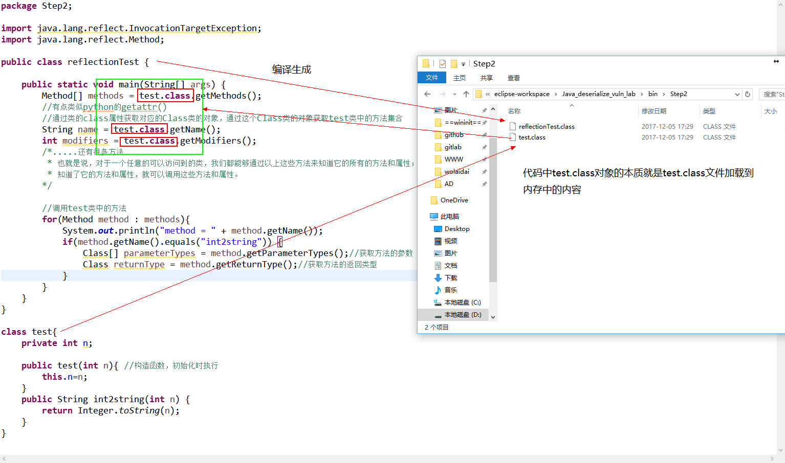
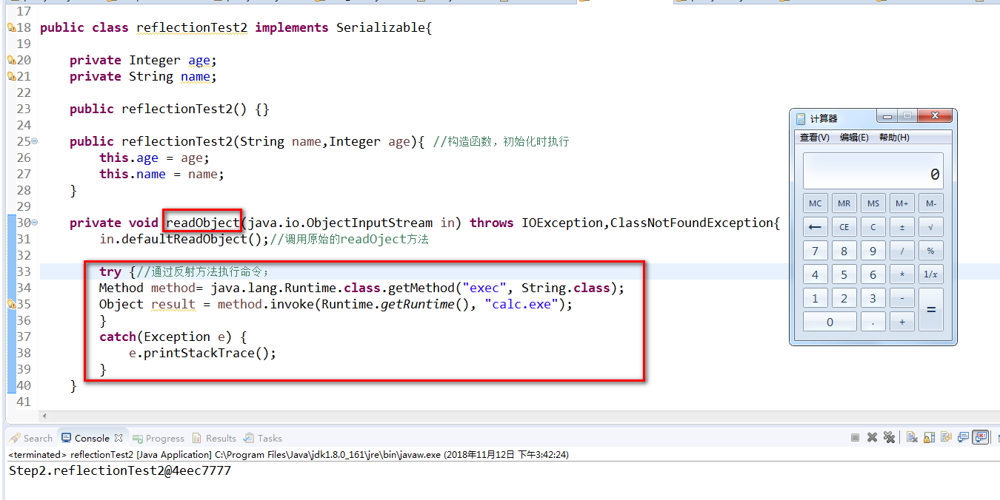

Title: Java反序列化漏洞学习实践二：Java的反射机制（Java Reflection）
Date: 2017-12-05 10:20
Category: 漏洞实践
Tags: Java,反序列化,漏洞
Slug: 
Authors: bit4
Summary: 

学习Java的反射机制是为了理解Apache Commons Collections中的反序列化漏洞做准备的。

 

### 0x0、基础

 

**Java反射机制**

 

- 指的是可以于运行时加载,探知和使用编译期间完全未知的类.
- 程序在运行状态中, 可以动态加载一个只有名称的类, 对于任意一个已经加载的类,都能够知道这个类的所有属性和方法; 对于任意一个对象,都能调用他的任意一个方法和属性;
- 加载完类之后, 在堆内存中会产生一个Class类型的对象(一个类只有一个Class对象), 这个对象包含了完整的类的结构信息,而且这个Class对象就像一面镜子,透过这个镜子看到类的结构,所以被称之为:反射.
- 每个类被加载进入内存之后,系统就会为该类生成一个对应的java.lang.Class对象,通过该Class对象就可以访问到JVM中的这个类.

**Class对象的获取方法**

- 实例对象的getClass()方法;
- 类的.class(最安全/性能最好)属性;（如demo代码和下图）
- 运用Class.forName(String className)动态加载类,className需要是类的全限定名(最常用).

注意，有一点很有趣，使用功能”.class”来创建Class对象的引用时，不会自动初始化该Class对象，使用forName()会自动初始化该Class对象



 

### 0x1、通过反射方法调用函数

 

该demo主要实践学习使用反射方法来调用类中的函数。

 

```java
package Step2;

import java.lang.reflect.Method;

public class reflectionTest {
	
	public static void main(String[] args){
		try {

			//Class获取类的方法一:实例对象的getClass()方法;
			User testObject = new User("zhangshan",19);
			Class Method1Class = testObject.getClass();
			
			//Class获取类的方法二:类的.class(最安全/性能最好)属性;有点类似python的getattr()。java中每个类型都有class 属性.
			Class Method2Class = User.class;
			
			//Class对象的获取方法三:运用Class.forName(String className)动态加载类,className需要是类的全限定名(最常用).
			//这种方法也最容易理解，通过类名(jar包中的完整namespace)就可以调用其中的方法，也最符合我们需要的使用场景.
			//j2eeScan burp 插件就使用了这种反射机制。
			String path = "Step2.User"; 
			Class Method3Class = Class.forName(path);
			
			
			
			Method[] methods = Method3Class.getMethods();
			//Method[] methods = Method2Class.getMethods();
			//Method[] methods = Method3Class.getMethods();
			
			//通过类的class属性获取对应的Class类的对象，通过这个Class类的对象获取test类中的方法集合

			/* String name = Method3Class.getName();
			 * int modifiers = Method3Class.getModifiers();
			 * .....还有很多方法
			 * 也就是说，对于一个任意的可以访问到的类，我们都能够通过以上这些方法来知道它的所有的方法和属性；
			 * 知道了它的方法和属性，就可以调用这些方法和属性。
			 */
			
			//调用User类中的方法
			
			for(Method method : methods){
			    if(method.getName().equals("getName")) {
			    	System.out.println("method = " + method.getName());
			    	
			    	Class[] parameterTypes = method.getParameterTypes();//获取方法的参数
			    	Class returnType = method.getReturnType();//获取方法的返回类型
			    	try {
			    		User user = (User)Method3Class.newInstance();
			    		Object x = method.invoke(user);//user.getName();
			    		//Object x = method.invoke(new test(1), 666);
			    		//new关键字能调用任何构造方法,newInstance()只能调用无参构造方法。但反射的场景中是不应该有机会使用new关键词的。
			    		System.out.println(x);
			    		
					} catch (Exception e) {
						e.printStackTrace();
					}
			    }
			}
			
			
			
			Method method = Method3Class.getMethod("setName",String.class);
			User user1 = (User)Method3Class.getConstructor(String.class,Integer.class).newInstance("lisi",19);
			//调用自定义构造器的方法
			Object x = method.invoke(user1,"李四");//第一个参数是类的对象。第二参数是函数的参数
			System.out.println(user1.getName());
		} catch (Exception e1) {
			e1.printStackTrace();
		}

	}
}

class User{
	private Integer age;
	private String name;
	
    public User() {}
    
    public User(String name,Integer age){ //构造函数，初始化时执行
    	this.age = age;
    	this.name = name;
    }
    

	public Integer getAge() {
		return age;
	}

	public void setAge(Integer age) {
		this.age = age;
	}

	public String getName() {
		return name;
	}
	
    public void setName(String name) {
    	this.name = name;
    }
}
```


### 0x2、通过反射方法弹个计算器

 

step1中，我们通过重写readObject方法，直接在里面使用Runtime.getRuntime().exec("calc.exe")来执行代码。现在需要改造一下，使用反弹方法来实现，成功调试的代码如下。

```java
package Step2;

import java.io.File;
import java.io.FileInputStream;
import java.io.FileNotFoundException;
import java.io.FileOutputStream;
import java.io.IOException;
import java.io.ObjectInputStream;
import java.io.ObjectOutputStream;
import java.io.Serializable;
import java.lang.reflect.Method;

/*
 * 有了反射方法的基础，再结合step1，实现一个基于反射方法的弹计算器。
 * 在实现了Serializable的类中， 通过重写readObject方法来实现
 */

public class reflectionTest2 implements Serializable{

	private Integer age;
	private String name;
	
    public reflectionTest2() {}
	
    public reflectionTest2(String name,Integer age){ //构造函数，初始化时执行
    	this.age = age;
    	this.name = name;
    }
    
    private void readObject(java.io.ObjectInputStream in) throws IOException,ClassNotFoundException{
    	in.defaultReadObject();//调用原始的readOject方法
    	
    	try {//通过反射方法执行命令；
    	Method method= java.lang.Runtime.class.getMethod("exec", String.class);
    	Object result = method.invoke(Runtime.getRuntime(), "calc.exe");    
    	}
    	catch(Exception e) {
    		e.printStackTrace();
    	}
    }
	
	public static void main(String[] args){
		reflectionTest2 x= new reflectionTest2();
		operation.ser(x);
		operation.deser();
	}
}


class operation {
	public static void ser(Object obj) {
		//序列化操作，写数据
		try{
	        ObjectOutputStream oos = new ObjectOutputStream(new FileOutputStream("object.obj"));
	        //ObjectOutputStream能把Object输出成Byte流
	        oos.writeObject(obj);//序列化关键函数
	        oos.flush();  //缓冲流 
	        oos.close(); //关闭流
	    } catch (FileNotFoundException e) 
	    {        
	        e.printStackTrace();
	    } catch (IOException e) 
	    {
	        e.printStackTrace();
	    }
	}
	
	public static void deser() {
		//反序列化操作，读取数据
		try {
			File file = new File("object.obj");
			ObjectInputStream ois= new ObjectInputStream(new FileInputStream(file));
			Object x = ois.readObject();//反序列化的关键函数
			System.out.print(x);
			ois.close();
		} catch (FileNotFoundException e) {
			e.printStackTrace();
		} catch (Exception e) {
			e.printStackTrace();
		}
	}
}
```

执行结果：



### 0x3、通过setAccessible访问私有属性和函数

```java
package Step2;

import java.lang.reflect.Constructor;
import java.lang.reflect.Method;
/*
 * 测试setAccessible方法，可以通过将它设置为true--setAccessible(true) 来访问private属性和函数。
 * 而且可以提高程序的执行效率，因为减少了安全检查。
 */
public class reflectionTest3 {
	
	public static void main(String[] args){
		try {
			String path = "Step2.User3"; 
			Class clazz = Class.forName(path);
			
			//Method method = clazz.getMethod("setName",String.class);
			//getMethod只能获取public的方法，private的方法需要使用getDeclaredMethod来获取，并且设置setAccessible(true)才可以调用访问。
			//参数属性也是一样。
			Method method = clazz.getDeclaredMethod("setName", String.class);
			method.setAccessible(true);
			
			//Constructor strut = clazz.getConstructor(String.class,Integer.class);
			//getConstructor只能获取public的构造方法
			Constructor strut = clazz.getDeclaredConstructor(String.class,Integer.class);
			strut.setAccessible(true);
			User3 user = (User3)strut.newInstance("bit4",19);
			//调用自定义构造器的方法
			Object x = method.invoke(user,"比特");//第一个参数是类的对象。第二参数是函数的参数
			System.out.println(user.getName());
			
			
		} catch (Exception e1) {
			e1.printStackTrace();
		}
	}
}

class User3{
	
	private Integer age;
	private String name;
	
	private User3() {}
    
	private User3(String name,Integer age){ //构造函数，初始化时执行
    	this.age = age;
    	this.name = name;
    }
    

	private Integer getAge() {
		return age;
	}

	private void setAge(Integer age) {
		this.age = age;
	}

	public String getName() {
		return name;
	}
	
	private void setName(String name) {
    	this.name = name;
    }
}
```


### 0x4、思考总结

<u>程序的两大根本：变量与函数</u>

*所以总的来说，要想控制程序实现命令执行，有2个方向*：

1.控制代码、函数：就像命名注入等注入类漏洞一样数据被当作了代码执行；或者和上面的demo代码一样重写readObject，加入自定义的代码（当然这种场景基本不存在，任意文件上传和执行勉强算是属于这种情况）。

2.控制输入、数据、变量：利用代码中已有的函数和逻辑，通过改变输入内容的形态实现流程的控制（不同的输入会走不同的逻辑流程，执行不同代码块中的代码）。

 

*对于java反序列化漏洞，属于控制数据输入，它有2个基本点必须要满足*：

1.有一个可序列化的类，并且该类是重写了readObject()方法的（由于不存在代码注入，只能查找已有代码逻辑中是否有这样的类）。

2.在重写的readObject()方法的逻辑中有 method.invoke函数出现，而且参数可控。


*再稍作抽象：*

1.有一个可序列化的类，并且该类是重写了readObject()方法的，除了默认的对象读取外，还有其他处理逻辑。（主线流程，反序列化漏洞都是这个主线逻辑流程，这是反序列化漏洞的入口点。）

2..在重写的readObject()方法的逻辑中有 直接或间接使用类似method.invoke这种可以执行调用任意方法的函数，而且参数可控。（是否还有其他函数可以达到相同的目的呢？）


 Apache Commons Collections 3.x 版本的 Gadget 构造过程 就是典型的例子。它的调用链如下：

```
/*
    Gadget chain:
        ObjectInputStream.readObject()
            AnnotationInvocationHandler.readObject()
                AbstractInputCheckedMapDecorator$MapEntry.setValue()
                    TransformedMap.checkSetValue()
                        ConstantTransformer.transform()
                        InvokerTransformer.transform()
                            Method.invoke()
                                Class.getMethod()
                        InvokerTransformer.transform()
                            Method.invoke()
                                Runtime.getRuntime()
                        InvokerTransformer.transform()
                            Method.invoke()
                                Runtime.exec()
 
    Requires:
        commons-collections <= 3.2.1
*/
```


本文代码可从github下载：

 

<https://github.com/bit4woo/Java_deserialize_vuln_lab/tree/master/src/Step2>

 

参考：

<http://blog.csdn.net/liujiahan629629/article/details/18013523>

<http://blog.csdn.net/zjf280441589/article/details/50453776>

<http://ifeve.com/java-reflection/>

[Apache Commons Collections 3.x 版本的 Gadget调用链](http://blog.knownsec.com/2015/12/untrusted-deserialization-exploit-with-java/)