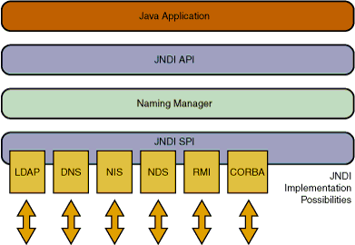
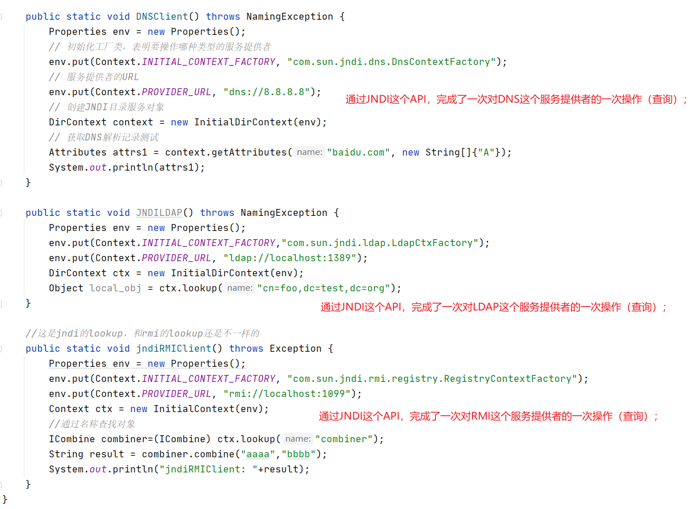
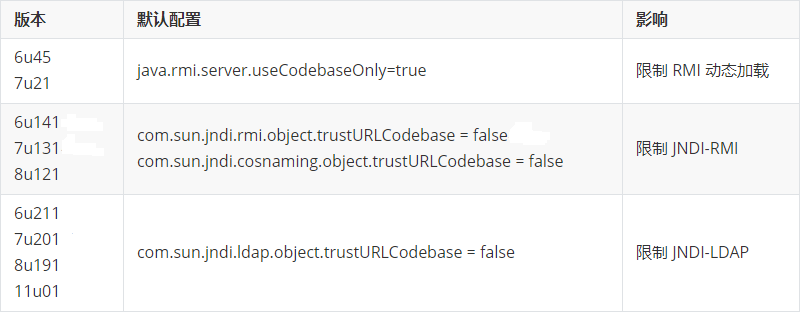

Title: Java反序列化漏洞学习实践五：JNDI的简单理解和使用
Date: 2018-11-12 18:04
Category: 漏洞实践
Tags: Java,反序列化,漏洞
Slug: 
Authors: bit4woo
Summary: 

### **0x0、理解什么是JNDI**

RMI是Remote Method Invocation，说的是一种行为、一个过程。就像“吃饭”、“喝水”一样，说的是一种行为、过程。我们通常说的RMI其实是在说Java RMI。

Java RMI 是Java中实现了“远程过程调用”的应用程序编程接口。

JRMP是Java Remote Method Protocol，是一个协议，是用于Java中实现远程方法调用使用的协议，就像HTTP是实现Web访问使用的协议一样。

JNDI是Java Naming and Directory Interface，本质是一组API接口，是可以操作【目录服务、域名服务】的接口。



```
什么是目录服务、域名服务？

侦探提供 【通过“张三这个名字”找到张三这个人】的寻人服务
导游提供 【通过“深圳这个名称”找到深圳这个具体的城市】的导航服务
DNS服务器提供【通过“域名”找到具体的IP地址】的解析服务

等等，他们提供的都是都是“通过名称找具体的对象（数据、资源）”的这一类型的服务。侦探、导游、DNS服务器都是服务提供者。

JNDI中涉及的JDBC、LDAP、RMI、DNS、NIS、CORBA也是一样，都是服务提供者，提供的都是【某种对象（数据、资源）的查询服务】。
而JNDI就是一组API接口，可以操作这些服务提供者的接口。它的角色类似Navicat之类的数据库客户端，通过这个“客户端”就可以完成对各种类型数据库的各种操作。
```



### **0x1、JNDI注入**

RMI 被调用的方法，在远程服务器上执行，只是返回执行的结果。

JNDI 获取远程类的对象，并把对象下载到本地进行执行。----只有某个特殊的类型是这样的，ObjectFactory https://javasec.org/javase/RMI/#rmi


LocateRegistry 类的对象的 rebind() 和 lookup() 来实现绑定注册和查找远程对象的

利用命名服务 java.rmi.Naming 类的 rebind() 和 lookup() 来实现绑定注册和查找远程对象的

利用JNDI(Java Naming and Directory Interface,Java命名和目录接口) java.naming.InitialContext 类来 rebind() 和 lookup() 来实现绑定注册和查找远程对象的

### **0x2、动态代理demo及理解**

**使用JNDI reference，结合RMI，LDAP实现；或者利用RMI的codebase特性。**

 JDK <= 8u231





在后续将要学习的反序列化PoC构造过程中，我们需要用到这个动态代理机制，因为它提供一种【方法之间的跳转，从任意方法到invoke方法的跳转】，是我们将参数入口和代码执行联系起来的关键！

 

本文代码下载地址：


参考：

[JDNI的使用场景和作用](http://shitou521.iteye.com/blog/696006)