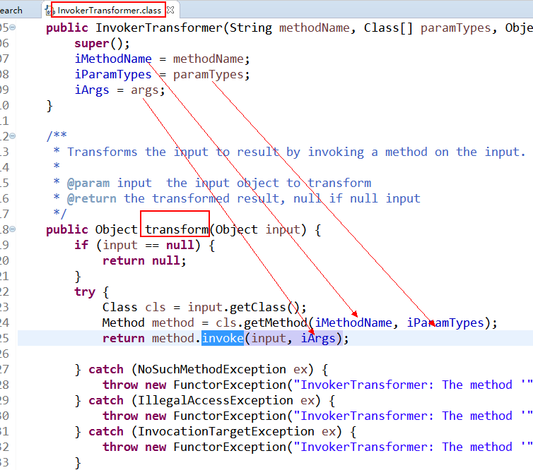

Title: Java反序列化漏洞学习实践四：Apache-CommonsCollections反序列化漏洞
Date: 2017-12-18 10:20
Category: 漏洞实践
Tags: Java,反序列化,漏洞
Slug: 
Authors: bit4
Summary: 

本文主要尝试复现该漏洞的发现思路，以及利用链的构造思路。漏洞条件： apache commons collections <3.2.2

### 0x0、找到漏洞触发点

根据[step2](http://www.code2sec.com/2017/12/05/java%E5%8F%8D%E5%BA%8F%E5%88%97%E5%8C%96%E6%BC%8F%E6%B4%9E%E5%AD%A6%E4%B9%A0%E5%AE%9E%E8%B7%B5%E4%BA%8C/)【Java反序列化漏洞学习实践二：Java的反射机制（Java Reflection）】中的总结，我们需要2个基本点才能构造出完整的利用链（必要条件、非充分条件），满足了这2个条件，才可以执行任意代码了：

1. 需要一个可序列化的类，而且是重写了readObject()方法的，。
2. readOject()方法中的代码，必须要直接或间接地使用了method.invoke()，且参数可控。

下面尝试根据这2个条件，查找Apache-CommonsCollections中可能的漏洞点。

我们先分析条件一

由于不存在代码注入，只能查找已有代码逻辑中是否有这样的类。所以我们通过eclipse的查找功能查找一下，重写了readObject()方法的类，如下图。
.png)

搜索结果：

```java
/Java_deserialize_vuln_lab/Lib/commons-collections-3.1.jar
org.apache.commons.collections
org.apache.commons.collections.CursorableLinkedList
org.apache.commons.collections.CursorableLinkedList.readObject(ObjectInputStream)
org.apache.commons.collections.MultiHashMap
org.apache.commons.collections.MultiHashMap.readObject(ObjectInputStream)
org.apache.commons.collections.ReferenceMap
org.apache.commons.collections.ReferenceMap.readObject(ObjectInputStream)
org.apache.commons.collections.bag
org.apache.commons.collections.bag.HashBag
org.apache.commons.collections.bag.HashBag.readObject(ObjectInputStream)
org.apache.commons.collections.bag.TreeBag
org.apache.commons.collections.bag.TreeBag.readObject(ObjectInputStream)
org.apache.commons.collections.bag.UnmodifiableBag
org.apache.commons.collections.bag.UnmodifiableBag.readObject(ObjectInputStream)
org.apache.commons.collections.bag.UnmodifiableSortedBag
org.apache.commons.collections.bag.UnmodifiableSortedBag.readObject(ObjectInputStream)
org.apache.commons.collections.bidimap
org.apache.commons.collections.bidimap.DualHashBidiMap
org.apache.commons.collections.bidimap.DualHashBidiMap.readObject(ObjectInputStream)
org.apache.commons.collections.bidimap.DualTreeBidiMap
org.apache.commons.collections.bidimap.DualTreeBidiMap.readObject(ObjectInputStream)
org.apache.commons.collections.buffer
org.apache.commons.collections.buffer.BoundedFifoBuffer
org.apache.commons.collections.buffer.BoundedFifoBuffer.readObject(ObjectInputStream)
org.apache.commons.collections.buffer.UnboundedFifoBuffer
org.apache.commons.collections.buffer.UnboundedFifoBuffer.readObject(ObjectInputStream)
org.apache.commons.collections.buffer.UnmodifiableBuffer
org.apache.commons.collections.buffer.UnmodifiableBuffer.readObject(ObjectInputStream)
org.apache.commons.collections.collection
org.apache.commons.collections.collection.AbstractSerializableCollectionDecorator
org.apache.commons.collections.collection.AbstractSerializableCollectionDecorator.readObject(ObjectInputStream)
org.apache.commons.collections.list
org.apache.commons.collections.list.AbstractSerializableListDecorator
org.apache.commons.collections.list.AbstractSerializableListDecorator.readObject(ObjectInputStream)
org.apache.commons.collections.list.CursorableLinkedList
org.apache.commons.collections.list.CursorableLinkedList.readObject(ObjectInputStream)
org.apache.commons.collections.list.NodeCachingLinkedList
org.apache.commons.collections.list.NodeCachingLinkedList.readObject(ObjectInputStream)
org.apache.commons.collections.map
org.apache.commons.collections.map.CaseInsensitiveMap
org.apache.commons.collections.map.CaseInsensitiveMap.readObject(ObjectInputStream)
org.apache.commons.collections.map.FixedSizeMap
org.apache.commons.collections.map.FixedSizeMap.readObject(ObjectInputStream)
org.apache.commons.collections.map.FixedSizeSortedMap
org.apache.commons.collections.map.FixedSizeSortedMap.readObject(ObjectInputStream)
org.apache.commons.collections.map.Flat3Map
org.apache.commons.collections.map.Flat3Map.readObject(ObjectInputStream)
org.apache.commons.collections.map.HashedMap
org.apache.commons.collections.map.HashedMap.readObject(ObjectInputStream)
org.apache.commons.collections.map.IdentityMap
org.apache.commons.collections.map.IdentityMap.readObject(ObjectInputStream)
org.apache.commons.collections.map.LazyMap
org.apache.commons.collections.map.LazyMap.readObject(ObjectInputStream)
org.apache.commons.collections.map.LinkedMap
org.apache.commons.collections.map.LinkedMap.readObject(ObjectInputStream)
org.apache.commons.collections.map.ListOrderedMap
org.apache.commons.collections.map.ListOrderedMap.readObject(ObjectInputStream)
org.apache.commons.collections.map.LRUMap
org.apache.commons.collections.map.LRUMap.readObject(ObjectInputStream)
org.apache.commons.collections.map.PredicatedMap
org.apache.commons.collections.map.PredicatedMap.readObject(ObjectInputStream)
org.apache.commons.collections.map.ReferenceIdentityMap
org.apache.commons.collections.map.ReferenceIdentityMap.readObject(ObjectInputStream)
org.apache.commons.collections.map.ReferenceMap
org.apache.commons.collections.map.ReferenceMap.readObject(ObjectInputStream)
org.apache.commons.collections.map.TransformedMap
org.apache.commons.collections.map.TransformedMap.readObject(ObjectInputStream)
org.apache.commons.collections.map.UnmodifiableMap
org.apache.commons.collections.map.UnmodifiableMap.readObject(ObjectInputStream)
org.apache.commons.collections.map.UnmodifiableOrderedMap
org.apache.commons.collections.map.UnmodifiableOrderedMap.readObject(ObjectInputStream)
org.apache.commons.collections.map.UnmodifiableSortedMap
org.apache.commons.collections.map.UnmodifiableSortedMap.readObject(ObjectInputStream)
org.apache.commons.collections.set
org.apache.commons.collections.set.AbstractSerializableSetDecorator
org.apache.commons.collections.set.AbstractSerializableSetDecorator.readObject(ObjectInputStream)
org.apache.commons.collections.set.UnmodifiableSortedSet
org.apache.commons.collections.set.UnmodifiableSortedSet.readObject(ObjectInputStream)
```

条件一是主逻辑，是漏洞触发点的入口，所以接下来的思路，我们应该逐个分析找到的readObject()方法，并查验其中的代码是否有可能直接或间接调用到method.invoke() ,遇到未知的函数，需要跟踪下去，直到判断出是否存在这样的调用。

这里以上图中标记的LazyMap为例，单看lazyMap的readObject方法，根据已有知识，这段代码是没有可能间接调用到method.invoke()的，这样就可以排除一个点了。

```java
    private void readObject(ObjectInputStream in) throws IOException, ClassNotFoundException {
        in.defaultReadObject();
        map = (Map) in.readObject();
```

当然，在无工具辅助时想要完全手动分析以上类中的方法还是有点困难的。所以我们尝试下从条件二出发。

条件二

和前面一样先搜索一下，发现如下类和方法。这就比条件一的搜索结构好多了，就从这里下手吧。.png)
因为method.invoke()方法是执行代码的核心，所以我们应该问自己：”在什么时候，什么场景会用到当前的这个类，当前类的这个函数？”，这个就有点需要个人的编程经验了。

比如，我们在InvokeTransformer中找到了这个方法，我们看到它是在transform函数中，那我们就应该想，哪里会用到InvokerTransformer中的transform呢？所以再次搜索tranform。




```java
//包含method.invoke()方法的类：
org.apache.commons.collections
    BeanMap
        get(Object)
        put(Object, Object)
    IteratorUtils
        getIterator(Object)
org.apache.commons.collections.functors
    InvokerTransformer
        transform(Object)
    PrototypeCloneFactory
        create()
```


```java
public class InvokerTransformer implements Transformer, Serializable {
```

.png).png)
第二个就是代理处理句柄，得理解下java的代理机制，他提供一种方法之间的跳转，从任意方法到invoke方法的跳转

### 0x1、自动化思路

自动化思路：

自动获取当前代码块（比如readObject()方法中的代码）中所有可能的调用栈，然后再搜索所有调用链中是否有指定函数（比如method.invoke()）,如果有了这么一个调用链存在，再分析其中的参数传递流程，是否有过滤，是否可构造poc。

<https://github.com/baidu/openrasp>

```java
包含method.invoke()方法的类：
org.apache.commons.collections
    BeanMap
        get(Object)
        put(Object, Object)
    IteratorUtils
        getIterator(Object)
org.apache.commons.collections.functors
    InvokerTransformer
        transform(Object)
    PrototypeCloneFactory
        create()
```

参考：

<https://www.iswin.org/2015/11/13/Apache-CommonsCollections-Deserialized-Vulnerability/><http://blog.csdn.net/u011066706/article/details/51176051>

<https://security.tencent.com/index.php/blog/msg/97>

<https://paper.seebug.org/312/>

<https://blog.chaitin.cn/2015-11-11_java_unserialize_rce/>