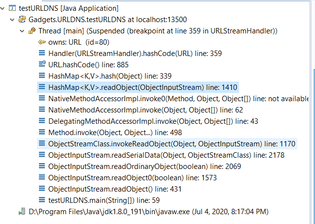
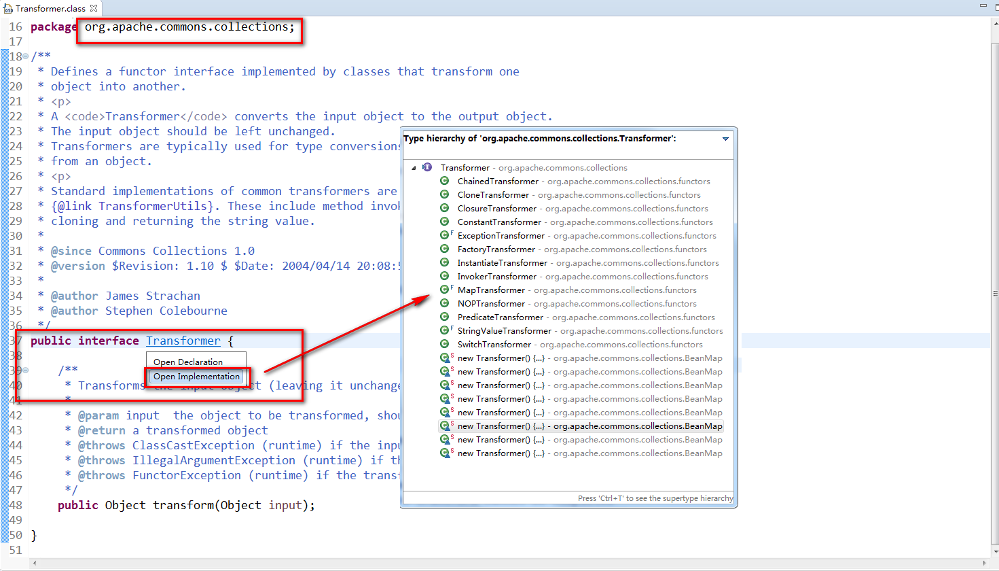
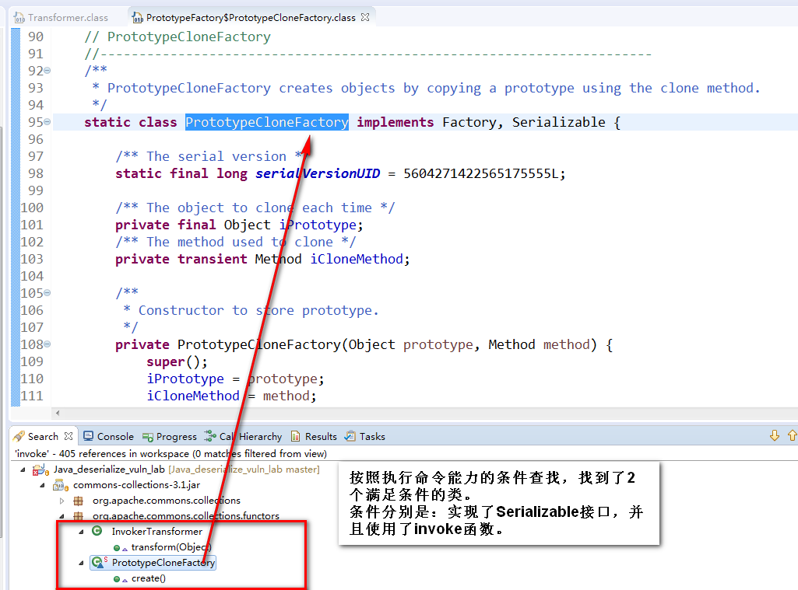

Title: Java反序列化漏洞学习实践四：寻找Gadget
Date: 2018-11-12 18:04
Category: 漏洞实践
Tags: Java,反序列化,漏洞
Slug: 
Authors: bit4woo
Summary: 

### **0x0、基础**

Gadget是什么？


Gadget需要满足什么条件？


### 一个完整调用链的基本组成

作为gadget的类的基本特征（寻找同类gadget的思路）：

一个类就是一个环节，就像链条的一个扣：

**入口类：**
1、实现了Serializable即可并重写了readObject()方法；或者实现了Externalization接口，重写了readExternal()方法；
2、重写的方法中有特定的逻辑。大致分为2类：
	一、具有【调用其他类的某个函数方法】的能力，比如通过invoke()反射机制调用，比如直接调用其他类的某个函数方法：
	二、具有直接执行任意命令、发起DNS请求等最终需要实现的能力，这种情况基本没有。如果是这种情况，就需要后面的环节了。

**中间衔接类：**
1、它的某个函数方法可以被入口类调用，直接被调用或通过invoke等反射机制被调用都可以。
2、被调用的这个函数方法，还可以再调用其他类的某个函数方法。

它的关键作用就是 承上启下，动态代理(proxy)的特性就具有这种能力

**目的实现类：**
1、它的某个函数方法具有直接执行任意命令、发起DNS请求等最终需要实现的能力。
2、这个函数方法，可以被入口类、或中间衔接类调用。

```java
URLDNS的调用链 Gadget Chain:

	  HashMap.readObject()
	    HashMap.putVal()
	      HashMap.hash()
	        URL.hashCode()
	          Handler(URLStreamHandler).hashCode(URL)
	        	URLStreamHandler.getHostAddress(URL)
          
//HashMap是入口类：1、它实现了Serializable，并重写了readObject()方法。2、重写的readObject()方法中，调用putVal()的逻辑，最终调用了URL的方法，满足了“调用其他类的某个函数方法”。

//URL是中间衔接类：它被HashMap.hash()调用，又调用了handler.hashCode()。
          
//URLStreamHandler是目的实现类：它的getHostAddress()方法最终会发起DNS查询。并且被handler.hashCode()调用，handler.hashCode()又被URL.hashCode()这个中间类的函数调用了。
```



前面已经说过，我们现在已经可以构造特殊的bytestream并且通过反序列化来还原成为一个Object并且该Object的构造函数和类的构造函数都已经被调用。那么哪些类的构造函数能够提供执行代码的能力。研究者们发现如果一个应用classpath中使用了common-collections,那么就有了非常好用的ChainedTransformer和InvokerTransformer,后者甚至构造函数中直接提供了根据传入的类名和函数名反射执行之的能力!

http://blog.topsec.com.cn/ad_lab/java%E5%8F%8D%E5%BA%8F%E5%88%97%E5%8C%96%E6%BC%8F%E6%B4%9E%E6%8A%80%E6%9C%AF%E5%88%86%E6%9E%90/


**如何在代码中寻找Gadget？**

1.正向：找到一个对象，它的readObject是重写过的，而且其中的代码可能调用任意代码。。readobject 是入口，，，这个重写了的方法中，有某个逻辑，具有执行任意代码的能力。


2.反向：找到一个类，它的构造函数或者其他函数，可以执行任意代码：


实现了Serializable，并且使用了method.invoke的函数是其中一种。（http://blog.knownsec.com/2015/12/untrusted-deserialization-exploit-with-java/）




```java
public class InvokerTransformer implements Transformer, Serializable {
...省略...
    private final String iMethodName;
    private final Class[] iParamTypes;
    private final Object[] iArgs;
    public Object transform(Object input) {
        if (input == null) {
            return null;
        }
        try {
            Class cls = input.getClass();  // 反射获取类
            Method method = cls.getMethod(iMethodName, iParamTypes);  // 反射得到具有对应参数的方法
            return method.invoke(input, iArgs);  // 使用对应参数调用方法，并返回相应调用结果
        } catch (NoSuchMethodException ex) {
...省略...
```

接下来就是寻找InvokerTransformer的上传调用者，也就是寻找transform：

主要参考：https://www.iswin.org/2015/11/13/Apache-CommonsCollections-Deserialized-Vulnerability/


org.apache.commons.collections.Transformer-->找到其实现列表--->InvokerTransformer的transform方法包含method.invoke方法----> 找到InvokerTransformer的transform的上层调用----->发现LazyMap和TransforedMap。

但其实其中的关键应该是找到，可以执行命令的类，虽然PrototypeFactory也满足了这2个条件，但是，如果要构造命令执行，需要iPrototype是一个runtime对象，（因为runtime是不可以实例化的，所以不能通过程序自己构造一个runtime对象？？？也就无法满足这个条件）





第二种：？？？？反序列化都做了什么，readObject--还原一个对象，所以会调用类造函数？？？？，如果一个反序列对象，可以控制器构造器，具有执行代码的能力，那么他即可以执行任意命令。记得有一个漏洞就是这种的。


**反序列化的利用为什么需要用到反射机制？**

提供了跨域包进行对象方法获取的能力！！！可以看到使用JAVA的反射机制后，能够对无法直接访问的类进行序列化。


sun.reflect.annotation.AnnotationInvocationHandler类无法直接访问，因此在构造需要序列化的对象时，需要使用JAVA反射机制。


 当需要操作无法直接访问的类时，需要使用JAVA的反射机制。即对无法直接访问的类进行序列化时，需要使用JAVA的反射机制。以下测试代码为testReflection.TestReflection类，与前文中的test.MyObject类不在同一个包中，在TestReflection类中对MyObject类进行序列化时，需要使用JAVA的反射机制。


JAVA中间件通常通过网络接收客户端发送的序列化数据，JAVA中间件在对序列化数据进行反序列化数据时，会调用被序列化对象的readObject方法。

如果某个对象的readObject方法中能够执行任意代码，那么JAVA中间件在对其进行反序列化时，也会执行对应的代码。

如果能够找到满足上述条件的对象进行序列化并发送给JAVA中间件，JAVA中间件也会执行指定的代码，即存在反序列化漏洞。


在真实场景中，不会有人真的这样直接写一句执行命令的代码在readObject()中。但是一般会有其他的代码逻辑，如果它的代码逻辑里，如果有某一个分支有像method.invoke()这种可以调用其他函数的代码，那么就可以跳转过去，再从这个“其他函数”的角度去看有没有执行代码或调用其他函数的可能。这个“其他函数”也就是所谓的gadget了。


### **0x1、静态代理demo和理解**

 

### **0x2、动态代理demo及理解**


 


在后续将要学习的反序列化PoC构造过程中，我们需要用到这个动态代理机制，因为它提供一种【方法之间的跳转，从任意方法到invoke方法的跳转】，是我们将参数入口和代码执行联系起来的关键！

 

本文代码下载地址：


参考

找gadgets：

<https://github.com/mbechler/serianalyzer/>

<https://github.com/bit4woo/gadgetinspector>

https://github.com/pwntester/SerialKillerBypassGadgetCollection

Apache Commons Collections的分析文章

[JAVA反序列化漏洞完整过程分析与调试](http://www.vuln.cn/6296)

[从反序列化到命令执行 – Java 中的 POP 执行链](http://blog.knownsec.com/2015/12/untrusted-deserialization-exploit-with-java/)

[Lib之过？Java反序列化漏洞通用利用分析](https://blog.chaitin.cn/2015-11-11_java_unserialize_rce/)

[JAVA Apache-CommonsCollections 序列化漏洞分析以及漏洞高级利用](https://www.iswin.org/2015/11/13/Apache-CommonsCollections-Deserialized-Vulnerability/)