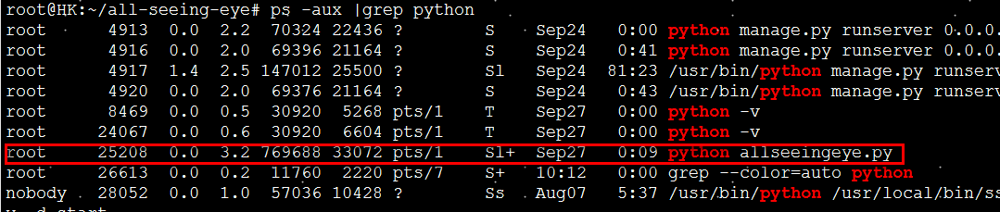
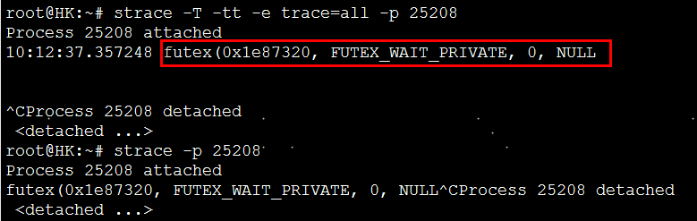
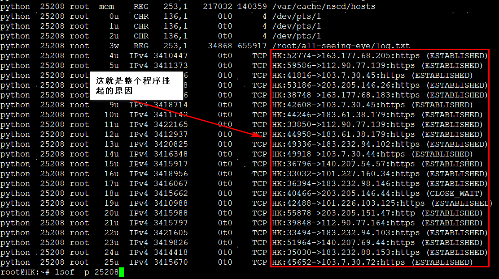

Title:python threading使用的一些注意点
Date: 2018-08-28 10:20
Category: 代码片段
Tags: python,threading
Slug: 
Authors: bit4
Summary: 

#### 0x0、threading的join和setDaemon方法的区别及用法

join ()方法：主线程A中，创建了子线程B，并且在主线程A中调用了B.join()，那么，主线程A会在调用的地方等待，直到子线程B完成操作后，才可以接着往下执行，那么在调用这个线程时可以使用被调用线程的join方法。 join可以设置超时时间。      -------主线程（一般是当前逻辑代码所在线程）等待子线程结束后再继续运行


setDaemon()方法：主线程A中，创建了子线程B，并且在主线程A中调用了B.setDaemon(),这个的意思是，把主线程A设置为守护线程，这时候，要是主线程A执行结束了，就不管子线程B是否完成,一并和主线程A退出.**这就是setDaemon方法的含义，这基本和join是相反的。**此外，还有个要特别注意的：必须在start() 方法调用之前设置，如果不设置为守护线程，程序会被无限挂起。


也就是说用了join()主线程会等子线程；而用了setDaemon()主线程结束时，子线程会被强制结束。


当同时使用了join()和setDaemon()方法时，join会起作用(会等待)，setDaemon失效。测试代码如下。

```python
# !/usr/bin/env python
# -*- coding:utf-8 -*-
__author__ = 'bit4'
__github__ = 'https://github.com/bit4woo'

import time
import threading
import requests


def fun():
    default_proxies = {
        "http": "http://127.0.0.1:8080",
        "https": "https://127.0.0.1:8080",
    }
    print "sub thread start"
    time.sleep(5)
    requests.get("http://www.code2sec.com",proxies= default_proxies)
    print "sub thread sleep done"
    print "sub thread end"

try:
    print "main thread start"
    t1 = threading.Thread(target=fun,args=())
    #t1.setDaemon(True)
    t1.start()
    t1.join() #当同时使用了join和setDaemon，join会起作用，setDaemon失效
    t1.join()
    t1.join()#多次join无影响
    time.sleep(3)
    print "main thread sleep done"
    print "main thread end"
except KeyboardInterrupt as e:
    print "exit"
```


#### 0x1、同时运行的线程数据量控制

```python
# !/usr/bin/env python
# -*- coding:utf-8 -*-
__author__ = 'bit4'
__github__ = 'https://github.com/bit4woo'
#https://my.oschina.net/u/3524921/blog/920303
import threading
import time

sem = threading.Semaphore(4)  # 限制线程的最大数量为4个

def test(a):
    print(t.name)
    print(a)
    time.sleep(3)
    sem.release()#+1 释放一个计数资源，所以“资源”的数量加一


threadpool = []
for i in range(10):
    sem.acquire()#-1 获取、占用一个计数资源
    t = threading.Thread(target=test, args=(i,))
    threadpool.append(t)
    t.start()
# 如果这个步骤里，最大线程数占满，而且都异常阻塞了怎么办？整个程序就阻塞了。

for i in threadpool:#其实这里只对现存的活动线程有效。因为在上一个循环中，计数等待的时候就会有些线程运行完成了。
    print "join"
    i.join()

##################################################################################  
for i in threading.enumerate():# 所以可以用它代替上面的join循环
    if i.name =="MainThread":
        pass
    else:
        i.join()
    print(i.name)
```


针对上一个测试程序中的问题，优化代码如下：

```python
# !/usr/bin/env python
# -*- coding:utf-8 -*-
__author__ = 'bit4'
__github__ = 'https://github.com/bit4woo'
#https://my.oschina.net/u/3524921/blog/920303
import threading
import time

sem = threading.Semaphore(4)  # 限制线程的最大数量为4个

def test(a):
    print(t.name)
    print(a)
    time.sleep(3)
    sem.release()#+1


for i in range(10):
    if sem ==0:#可惜python的库没有像Java可以获取可用数量。这个写法不对！！！！！！！！！
    #思路：当活动线程数为最大值得时候，就设置超时时间并等待，这样的话可以防止整个程序阻塞，但是，必须等到当前所有的活动线程都结束才会进行下一步，可能增加程序的运行时间
        for i in threading.enumerate():
            if i.name == "MainThread":
                pass
            else:
                i.join()

    sem.acquire()#-1
    t = threading.Thread(target=test, args=(i,))
    t.start()

for i in threading.enumerate():#这里的也不能少，否则最后运行的线程可能还没结束，主线程就已经结束了
    if i.name == "MainThread":
        pass
    else:
        i.join()
```

### 0x2、最佳实践

上面的代码都不是最佳的，它们的特征是每个资源都创建一个线程，线程创建完成后再逐个运行。这就需要将创建的线程先存储起来，如果资源特别庞大呢？这种模式的代码根本就无法运行，会内存错误！

IBM博客推荐的写法如下。

这其实是“生产者--消费者”模式的写法：ThreadUrl是生产者，将生成结果放入out_queue中，DatamineThread是消费者，从out_queue取出对象进行处理。在main函数中直接固定创建了它们的线程数，线程数量利于控制；如果是大量资源的问题也容易解决，生产者负责生产大量资源（比如从其他地方读取，或者自己生成）然后放入queue缓存区中，消费者再从其中取出进行处理，再大的量都不怕！今后尽量使用这种模式。

```python
#IBM网站推荐的threading的最佳实践代码，输入和输出都使用Queue，线程数量创建时就固定，
#https://www.ibm.com/developerworks/aix/library/au-threadingpython/index.html
#!/usr/bin/env python
import Queue
import threading
import urllib2
import time
from BeautifulSoup import BeautifulSoup

hosts = ["http://yahoo.com", "http://google.com", "http://amazon.com",
        "http://ibm.com", "http://apple.com"]

queue = Queue.Queue()
out_queue = Queue.Queue()

class ThreadUrl(threading.Thread):
    """Threaded Url Grab"""
    def __init__(self, queue, out_queue):
        threading.Thread.__init__(self)
        self.queue = queue
        self.out_queue = out_queue

    def run(self):
        while True:
            #grabs host from queue
            host = self.queue.get()

            #grabs urls of hosts and then grabs chunk of webpage
            url = urllib2.urlopen(host)
            chunk = url.read()

            #place chunk into out queue
            self.out_queue.put(chunk)

            #signals to queue job is done
            self.queue.task_done()

class DatamineThread(threading.Thread):
    """Threaded Url Grab"""
    def __init__(self, out_queue):
        threading.Thread.__init__(self)
        self.out_queue = out_queue

    def run(self):
        while True:
            #grabs host from queue
            chunk = self.out_queue.get()

            #parse the chunk
            soup = BeautifulSoup(chunk)
            print soup.findAll(['title'])

            #signals to queue job is done
            self.out_queue.task_done()

start = time.time()
def main():

    #spawn a pool of threads, and pass them queue instance
    for i in range(5):
        t = ThreadUrl(queue, out_queue)
        t.setDaemon(True)
        t.start()

    #populate queue with data
    for host in hosts:
        queue.put(host)

    for i in range(5):
        dt = DatamineThread(out_queue)
        dt.setDaemon(True)
        dt.start()


    #wait on the queue until everything has been processed
    queue.join()
    out_queue.join()

main()
print "Elapsed Time: %s" % (time.time() - start)


```


#### 0x3、多线程挂起问题排查


1.找到对应都得线程ID

ps -aux |grep python



2.用strace命令查看挂起原因

strace -T -tt -e trace=all -p 25208



3.用lsof命令查看所打开的IO资源，比如简历的请求链接

lsof -p 25208



```python
程序挂起的原因可能有：

1.requests等其他http请求没有设置超时时间，多个慢的服务器导可能长时间简历链接并等待，致整个程序挂起。避免方法，设置请求超时时间。

response= requests.get(url,verify=False,timeout=(5, 27))

2.当多个线程中都有使用Queue.get()方法时，在queue为空时，可能导致死锁从而挂起。避免方法，get方法设置超时

 while not ips_Queue.empty():
        iplist.append(ips_Queue.get(timeout=0.1))
        
3.其他各种资源、IO共享操作，可以通过设置join超时来避免，值得注意的是，我们需要注意join方法是否对可能挂起的线程生效了，在某些程序逻辑中，代码还未运行到join所在逻辑就已经挂起了。

    for t in threading.enumerate():
        if t.name == "MainThread":
            pass
        else:
            t.join(30)
```
