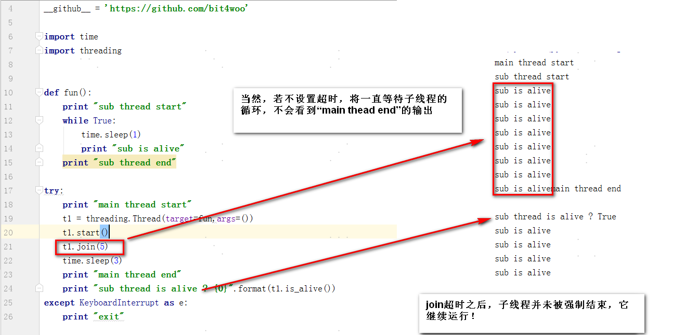
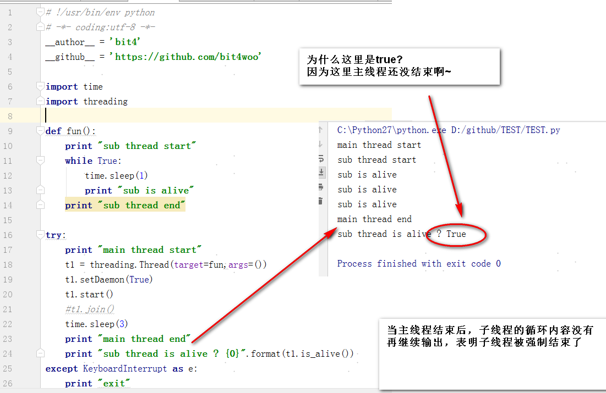
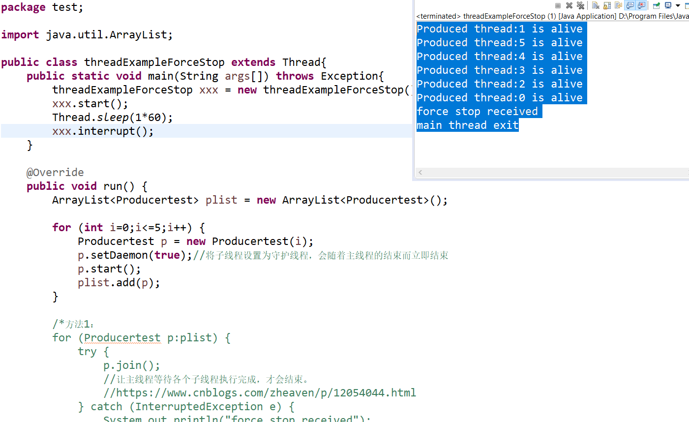

Title:python threading使用的一些注意点
Date: 2018-08-28 10:20
Category: 代码片段
Tags: python,threading
Slug: 
Authors: bit4woo
Summary: 

#### 0x0、threading的join和setDaemon方法的区别及用法

**join ()方法**：主线程A中创建了子线程B，并且在主线程A中调用了B.join()，**它的含义是【将线程B加入到当前线程的执行流程中】**。也就是说主线程A会在调用的地方等待，直到子线程B完成操作或超时后才可以接着往下执行。

另外，join可以设置超时时间，在超时后继续执行当前线程，停止阻塞，意味着“B线程从当前执行流程中（A线程）再次独立出来，不受主线程影响”。



如果每个子线程启动start()后马上调用了join()函数，那么每个子线程都是顺序执行的，并没有并发效果。


**setDaemon()方法**：

根据[官方文档](https://docs.python.org/2/library/threading.html#threading.Thread.daemon)

```
A boolean value indicating whether this thread is a daemon thread (True) or not (False). This must be set before start() is called, otherwise RuntimeError is raised. Its initial value is inherited from the creating thread; the main thread is not a daemon thread and therefore all threads created in the main thread default to daemon = False.

The entire Python program exits when no alive non-daemon threads are left.
```


```python
Daemon 是古希腊神话中人们的守护者精灵之类的角色，伴随着人的一生，是随着主人的消亡而消亡的。这么一想就容易理解了：

当子线程是【守护者线程】，那么当主人（主线程）死亡的时候，守护者（守护者子线程Daemon为True）也会立即死亡。主线程是非守护进程（主人不是守护者！）。

当子线程是【非守护者线程】，可以把它们看做是主人（主线程）的子孙后代（非守护者子线程Daemon为False），子孙后代的生命不会因为父线程生命的结束而结束。

```





**同时使用join()和setDaemon()方法**

用了join()方法，主线程会等子线程结束或超时，控制的是主线程的行为；而用了setDaemon(True)方法，主线程结束时子线程会被强制结束，控制的是子线程的行为。

当同时使用setDaemon(True)方法和join()方法时。可以实现：主线程给子线程足够的时间去完成任务，也能在主线程退出时让子线程也结束，能更好的控制子线程的行为。

```python
# !/usr/bin/env python
# -*- coding:utf-8 -*-
__author__ = 'bit4woo'
__github__ = 'https://github.com/bit4woo'

import time
import threading

def sub_thread_fun():
    print ("sub thread start")
    while True:
        time.sleep(1)
        print ("sub is alive")
    print ("sub thread end")


try:
    print ("main thread start")
    t1 = threading.Thread(target=sub_thread_fun,args=())
    t1.setDaemon(True)
    t1.start()
    t1.join(3)#当同时使用setDaemon(True)方法和join()方法时。可以实现：主线程给子线程足够的时间去完成任务，也能在主线程退出时让子线程也结束，能更好的控制子线程的行为。
    t1.join(3)
    t1.join(3)#多次join无影响,但如果加入时间参数，将是等待多个时间参数之和
    time.sleep(3)
    print ("main thread end")
    print ("sub thread is alive ? {0}".format(t1.is_alive()))
except KeyboardInterrupt as e:
    print(e)
    print ("exit")

```


类似的Java代码举例，Java中可以用Interrupt来强制结束主线程（python中没有对应的方法，目前已知的就是：关闭程序、设置join超时时间）。在Java中同时使用setDaemon(true)和join()方法，可以随时暴力干掉所有主线程和子线程。

```java
package test;

import java.util.ArrayList;

public class threadExampleForceStop extends Thread{
	public static void main(String args[]) throws Exception{
		threadExampleForceStop xxx = new threadExampleForceStop();
		xxx.start();
		Thread.sleep(1*60);
		xxx.interrupt();
	}

	@Override
	public void run() {
		ArrayList<Producertest> plist = new ArrayList<Producertest>();

		for (int i=0;i<=5;i++) {
			Producertest p = new Producertest(i);
			p.setDaemon(true);//将子线程设置为守护线程，会随着主线程的结束而立即结束
			p.start();
			plist.add(p);
		}

		/*方法1：
		for (Producertest p:plist) {
			try {
				p.join();
				//让主线程等待各个子线程执行完成，才会结束。
				//https://www.cnblogs.com/zheaven/p/12054044.html
			} catch (InterruptedException e) {
				System.out.println("force stop received");
				//e.printStackTrace();
				break;//必须跳出循环，否则只是不再等待其中的一个线程，还会继续等待其他线程
			}
		}*/

		try {
			for (Producertest p:plist) {
				p.join();
				//让主线程等待各个子线程执行完成，才会结束。
				//https://www.cnblogs.com/zheaven/p/12054044.html
			}
		} catch (InterruptedException e) {
			System.out.println("force stop received");
			//e.printStackTrace();
		}
		System.out.println("main thread exit");
		return;
	}
}

class Producertest extends Thread {
	private int threadNo;
	public Producertest(int threadNo) {
		this.threadNo = threadNo;
	}
	@Override
	public void run() {
		while (true) {
			try {
				System.out.println("Produced thread:"+ threadNo+" is alive");
				Thread.sleep(1*60);
				System.out.println("Produced thread:"+ threadNo+" is alive");
			} catch (Exception err) {
				err.printStackTrace();
			}
		}
	}
}
```




#### 0x1、同时运行的线程数据量控制

```python
# !/usr/bin/env python
# -*- coding:utf-8 -*-
__author__ = 'bit4'
__github__ = 'https://github.com/bit4woo'
#https://my.oschina.net/u/3524921/blog/920303
import threading
import time

sem = threading.Semaphore(4)  # 限制线程的最大数量为4个

def test(a):
    print(t.name)
    print(a)
    time.sleep(3)
    sem.release()#+1 释放一个计数资源，所以“资源”的数量加一


threadpool = []
for i in range(10):
    sem.acquire()#-1 获取、占用一个计数资源
    t = threading.Thread(target=test, args=(i,))
    threadpool.append(t)
    t.start()
# 如果这个步骤里，最大线程数占满，而且都异常阻塞了怎么办？整个程序就阻塞了。

for i in threadpool:#其实这里只对现存的活动线程有效。因为在上一个循环中，计数等待的时候就会有些线程运行完成了。
    print "join"
    i.join()

##################################################################################  
for i in threading.enumerate():# 所以可以用它代替上面的join循环
    if i.name =="MainThread":
        pass
    else:
        i.join()
    print(i.name)
```


针对上一个测试程序中的问题，优化代码如下：

```python
# !/usr/bin/env python
# -*- coding:utf-8 -*-
__author__ = 'bit4'
__github__ = 'https://github.com/bit4woo'
#https://my.oschina.net/u/3524921/blog/920303
import threading
import time

sem = threading.Semaphore(4)  # 限制线程的最大数量为4个

def test(a):
    print(t.name)
    print(a)
    time.sleep(3)
    sem.release()#+1


for i in range(10):
    if sem ==0:#可惜python的库没有像Java可以获取可用数量。这个写法不对！！！！！！！！！
    #思路：当活动线程数为最大值得时候，就设置超时时间并等待，这样的话可以防止整个程序阻塞，但是，必须等到当前所有的活动线程都结束才会进行下一步，可能增加程序的运行时间
        for i in threading.enumerate():
            if i.name == "MainThread":
                pass
            else:
                i.join()

    sem.acquire()#-1
    t = threading.Thread(target=test, args=(i,))
    t.start()

for i in threading.enumerate():#这里的也不能少，否则最后运行的线程可能还没结束，主线程就已经结束了
    if i.name == "MainThread":
        pass
    else:
        i.join()
```

### 0x2、最佳实践

上面的代码都不是最佳的，它们的特征是每个资源都创建一个线程，线程创建完成后再逐个运行。这就需要将创建的线程先存储起来，如果资源特别庞大呢？这种模式的代码根本就无法运行，会内存错误！

IBM博客推荐的写法如下。

这其实是“生产者--消费者”模式的写法：ThreadUrl是生产者，将生成结果放入out_queue中，DatamineThread是消费者，从out_queue取出对象进行处理。在main函数中直接固定创建了它们的线程数，线程数量利于控制；如果是大量资源的问题也容易解决，生产者负责生产大量资源（比如从其他地方读取，或者自己生成）然后放入queue缓存区中，消费者再从其中取出进行处理，再大的量都不怕！今后尽量使用这种模式。

```python
#IBM网站推荐的threading的最佳实践代码，输入和输出都使用Queue，线程数量创建时就固定，
#https://www.ibm.com/developerworks/aix/library/au-threadingpython/index.html
#!/usr/bin/env python
import Queue
import threading
import urllib2
import time
from BeautifulSoup import BeautifulSoup

hosts = ["http://yahoo.com", "http://google.com", "http://amazon.com",
        "http://ibm.com", "http://apple.com"]

queue = Queue.Queue()
out_queue = Queue.Queue()

class ThreadUrl(threading.Thread):
    """Threaded Url Grab"""
    def __init__(self, queue, out_queue):
        threading.Thread.__init__(self)
        self.queue = queue
        self.out_queue = out_queue

    def run(self):
        while True:
            #grabs host from queue
            host = self.queue.get()

            #grabs urls of hosts and then grabs chunk of webpage
            url = urllib2.urlopen(host)
            chunk = url.read()

            #place chunk into out queue
            self.out_queue.put(chunk)

            #signals to queue job is done
            self.queue.task_done()

class DatamineThread(threading.Thread):
    """Threaded Url Grab"""
    def __init__(self, out_queue):
        threading.Thread.__init__(self)
        self.out_queue = out_queue

    def run(self):
        while True:
            #grabs host from queue
            chunk = self.out_queue.get()

            #parse the chunk
            soup = BeautifulSoup(chunk)
            print soup.findAll(['title'])

            #signals to queue job is done
            self.out_queue.task_done()

start = time.time()
def main():

    #spawn a pool of threads, and pass them queue instance
    for i in range(5):
        t = ThreadUrl(queue, out_queue)
        t.setDaemon(True)
        t.start()

    #populate queue with data
    for host in hosts:
        queue.put(host)

    for i in range(5):
        dt = DatamineThread(out_queue)
        dt.setDaemon(True)
        dt.start()


    #wait on the queue until everything has been processed
    queue.join()#attention！this method only works with "queue.task_done()"，or the main threading will always supended!!!
    out_queue.join()

main()
print "Elapsed Time: %s" % (time.time() - start)


```


自己在[Teemo](https://github.com/bit4woo/teemo)中的使用，正常跑起来的，Queue和线程都有join()，注意区分使用场景：

```python
def domains2ips(domain_list):
    input_Queue = Queue.Queue()
    for item in domain_list:
        input_Queue.put(item)

    outout_ips_Queue = Queue.Queue()
    outout_lines_Queue = Queue.Queue()

    class customers(threading.Thread):
        def __init__(self,name):
            threading.Thread.__init__(self)
            print name

        def run(self):
            while True:
                if input_Queue.empty():
                    break
                domain = input_Queue.get(1)
                # input_Queue.task_done()#配合写法一，但是写在这里可能导致结果缺少数据
                domain = domain.strip()
                try:
                    ips, line = query(domain, record_type='A')
                    print line
                    for ip in ips:
                        outout_ips_Queue.put(ip)
                    outout_lines_Queue.put(line)
                except Exception, e:
                    print e
                #配合写法一
                # signals to queue job is done
                input_Queue.task_done()  # 配合写法一
                #outout_ips_Queue.task_done() # 用于put的，不能调用该方法！当然后续也不能调用它的join方法
                #outout_lines_Queue.task_done() # 用于put的，不能调用该方法！当然后续也不能调用它的join方法
    # 写法一：参考IBM最佳实践代码，推荐写法，
    # 但是值得注意的是：
    # 1.使用Queue的join()方法，必须配合Queue的task_done()方法，否则主进程将一直挂起
    # 2. put队列完成的时候千万不能用task_done()，否则会报错：# task_done() called too many times 因为该方法仅仅表示get成功后，执行的一个标记。
    # 3.task_done()的位置也是有讲究的，最好是放在程序块的末尾，保证所有逻辑都已执行完成，否则结果可能缺少数据！！！！
    # 因为它是线程结束的依据，如果它的位置在get()之后而不是在程序块的末尾，会出现刚取完数据，还未来得及处理主线程就已经结束的情况，从而缺少数据！！！
    for i in range(10):
        dt = customers(i)
        dt.setDaemon(True)
        dt.start()
    # wait on the queue until everything has been processed
    input_Queue.join()# this method works must with "input_Queue.task_done()", or the threading will not exit!!!
    # outout_ips_Queue.join() # 没有调用task_done()方法，就不能调用它的join()方法
    # outout_lines_Queue.join() # 没有调用task_done()方法，就不能调用它的join()方法


    # 写法二：这种写法并没有多线程的效果！！！
    # 当初在自己未充分理解第一种方法，未配合task_done()有问题时，尝试了该方法。该方法实际效果是单线程！
    # 因为join()的作用就是让主线程将等待当前这个线程，直到这个线程运行结束，即是说，只有当前线程结束后才会进入下次循环启动第二个线程
    # for i in range(10):
    #     dt = customers(i)
    #     dt.setDaemon(True)
    #     dt.start()
    #     dt.join()#use this instead Queue.join()，Queue.join() will lead to thread always running!!

    # 写法三：该方法可用于小量固定线程数的写法中，如果需要创建大量线程，则效率不高。
    # 为什么需要2次循环（相对方法二），不能在一次循环中完成？如果只在一个循环中，线程会在启动后马上加入到当前的执行流程，不会有并发的效果
    # 因为join()的作用就是让主线程将等待当前这个线程，直到这个线程运行结束，即是说，只有当前线程结束后才会进入下次循环启动第二个线程
    # Threadlist = []
    # for i in range(10):
    #     dt = customers(i)
    #     dt.setDaemon(True)
    #     dt.start()
    #     Threadlist.append(dt)
    #
    # for item in Threadlist:
    #     item.join()

    iplist =[]
    linelist = []
    while not outout_ips_Queue.empty():
        iplist.append(outout_ips_Queue.get(timeout=0.1))
    while not outout_lines_Queue.empty():
        linelist.append(outout_lines_Queue.get(timeout=0.1))
    return iplist,linelist
```


#### 0x3、多线程挂起问题排查


1.找到对应都得线程ID

ps -aux |grep python


2.用strace命令查看挂起原因

strace -T -tt -e trace=all -p 25208


3.用lsof命令查看所打开的IO资源，比如简历的请求链接

lsof -p 25208


```python
程序挂起的原因可能有：

1.requests等其他http请求没有设置超时时间，多个慢的服务器导可能长时间简历链接并等待，致整个程序挂起。避免方法，设置请求超时时间。

response= requests.get(url,verify=False,timeout=(5, 27))

2.当多个线程中都有使用Queue.get()方法时，在queue为空时，可能导致死锁从而挂起。避免方法，get方法设置超时

 while not ips_Queue.empty():
        iplist.append(ips_Queue.get(timeout=0.1))
        
3.其他各种资源、IO共享操作，可以通过设置join超时来避免，值得注意的是，我们需要注意join方法是否对可能挂起的线程生效了，在某些程序逻辑中，代码还未运行到join所在逻辑就已经挂起了。

    for t in threading.enumerate():
        if t.name == "MainThread":
            pass
        else:
            t.join(30)
```


#### 常用模板

```python
# !/usr/bin/env python
# -*- coding:utf-8 -*-
__author__ = 'bit4woo'
__github__ = 'https://github.com/bit4woo'

import sys, os
import datetime
import threading
try:
    from queue import Queue #python3
except Exception as e:
    import Queue  # python2
    pass

def ThreadRunner(inputList, threadNumber=100):
    try:  # python3
        input_Queue = Queue()
        output_queue = Queue()
    except Exception as e:  # python2
        input_Queue = Queue.Queue()
        output_queue = Queue.Queue()

    for item in inputList:
        input_Queue.put(item.strip())

    Threadlist = []
    for i in range(int(threadNumber)):
        dt = Customer(input_Queue, output_queue)
        dt.setDaemon(True)
        dt.start()
        Threadlist.append(dt)
    for item in Threadlist:
        item.join()

    resultlist = []

    while not output_queue.empty():
        itemx = output_queue.get(timeout=0.1)
        resultlist.append(itemx)

    resultlist = list(set(resultlist))
    return resultlist


class Customer(threading.Thread):
    def __init__(self, input_Queue, output_queue):
        threading.Thread.__init__(self)
        self.input_Queue = input_Queue
        self.output_queue = output_queue

    def run(self):
        while True:
            if self.input_Queue.empty():
                break
            item = self.input_Queue.get(1)
            try:
                result = Do_Your_Task_In_This_Function(item)
                self.output_queue.put(result)
            except Exception as e:
                print(item+" "+str(e))

def writefile(list, outputfile=None):
    if outputfile == None:
        now = datetime.datetime.now()
        timestr = now.strftime("-%Y-%m-%d-%H-%M")
        outputfile = "ThreadRunner" + timestr + ".txt"
    outputfile = os.path.join(os.path.dirname(__file__), "..", "output", outputfile)
    open(outputfile, "w").writelines("\n".join(list.__str__()))


def Do_Your_Task_In_This_Function(input):  # do your job in this function!!

    return input


if __name__ == "__main__":
    result = ThreadRunner(open(r"zookeeper.txt", "r").readlines())
    result.remove("")
    print("发现{0}个有效目标".format(len(result)))
    for item in result:
        print(item)

```

