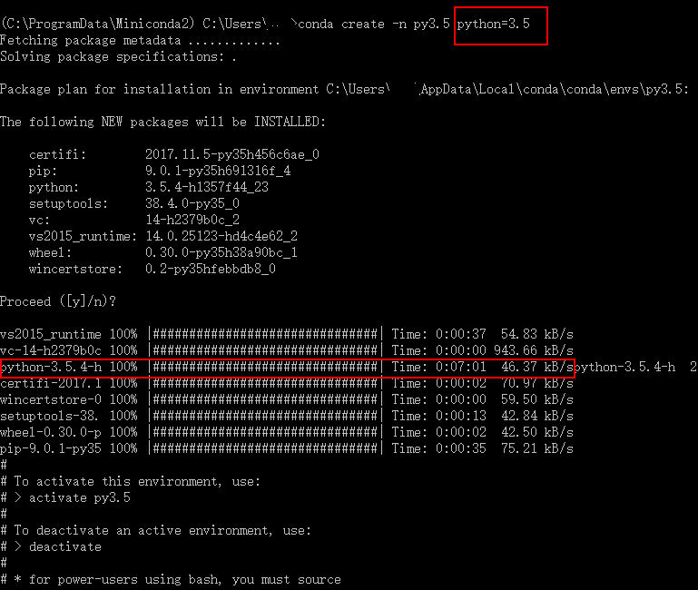
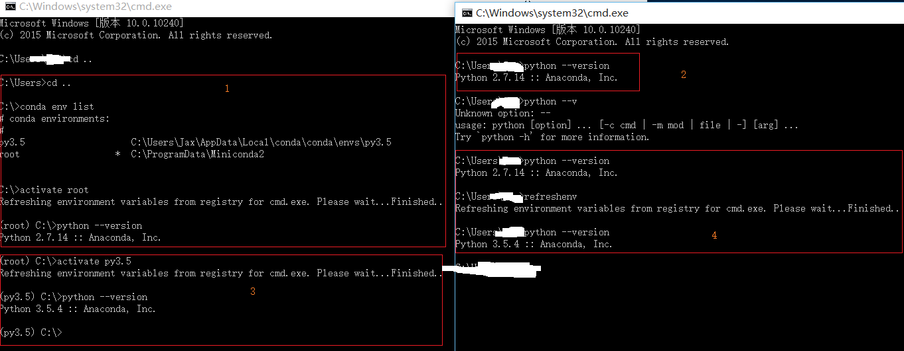

Title:使用Conda进行python多版本环境管理
Date: 2018-01-15 10:20
Category: 工具相关
Tags: python,环境,Conda,版本切换
Slug: 
Authors: bit4
Summary: 

### 0x0、conda VS. Anaconda VS. miniconda

[Anaconda](https://www.anaconda.com/download/) 是一个打包的集合，里面预装好了conda、某个版本的python、众多packages、科学计算工具等等，所以也称为Python的一种发行版，简单来说它就是一个安装包。

Conda可以理解为一个工具，也是一个可执行命令，其核心功能是包管理与环境管理

[Miniconda](https://conda.io/miniconda.html)，顾名思义它只包含最基本的内容——python与conda，以及相关的必须依赖项，可以把它看作一个安装包，我们部署环境就选择安装它。

### 0x1、virtualenv VS. conda

用virtualenv创建虚拟环境之前，系统中必须要安装有对应版本的python，并且卸载之后当前虚拟环境就无效了，这是它相对于conda的一个明显缺点；而conda则不需要，它会自动去下载安装。这是我选择使用conda的一个重要的原因。



### 0x2、安装Miniconda

从[这里](https://conda.io/miniconda.html)下载响应的安装包进行安装，然后通过在开始菜单运行Anaconda Prompt来进行操作

```
conda env list
#查看有哪些虚拟环境

conda list
#查看当前虚拟环境中安装了得python的包

conda create -n py3.5 python=3.5
#创建一个虚拟环境，-n是项目的名称（name）,后面是python的版本要求

activate py3.5

deactivate py3.5
```

### 0x3、实现全局切换python环境

环境切换的本质是环境变量path的修改，比如同是运行python，如果path指向的是2.7，那么运行的就是2.7版本的python，指向的是3.5则运行的是3.5版本的。

默认的conda设置脚本中（activate.bat 和deactivate.bat），环境变量的设置只是针对当前session，即是说，切换环境只影响当前命令行窗口。而我想要做的是实现系统级别（或者用户级别）的全局切换，即，切换后新打开的任意命令行窗口都是新的环境变量，切换是全局生效的。

通过对windows系统环境变量的理解：path分为系统path和用户path，path是通过注册表存储的，设置path的方法可以有set、setx、修改注册表

```
set 
#设置只针对当前session有效，如果关闭窗口或者程序，path将恢复为和注册表中一样，是零时的。

setx path "%path%"
#有长度限制，容易出现“警告: 正保存的数据被裁断到 1024 字符。”的错误，环境变量的字符串会被截断然后保存，而且是保存到user的path里的。

reg query
reg add /f
#修改注册表,最本质的方法，也最有效
```


通过"Anaconda Prompt"的快捷方式可以看到它指向的文件，也就是环境目录和启动脚本。

```
%windir%\System32\cmd.exe "/K" C:\ProgramData\Miniconda2\Scripts\activate.bat C:\ProgramData\Miniconda2
```

由于对bat编程不熟悉，经过一段时间的折腾，选择bat+python的方式实现我们的目标：通过注册表，修改用户path或者系统path，实现用户级别或者系统基本的全局环境遍历切换，从而实现python环境的切换。

```
在activate.bat的末尾加入如下内容：

@echo %path% > %~dp0\..\Scripts\tmppath.txt
@start python %~dp0\..\Scripts\global_switch.py %~dp0\..\Scripts\tmppath.txt
@call %~dp0\..\Scripts\RefreshEnv.cmd

并把global_switch.py 和 RefreshEnv.cmd 复制到Scripts目录下
```

对应的python脚本内容如下命名为[global_switch.py](https://github.com/bit4woo/code2sec.com/raw/master/code\conda\global_switch.py)，需要注意版本兼容问题，他需要在python2 和3 上都能正确运行才行：

```python
# !/usr/bin/env python
# -*- coding:utf-8 -*-
__author__ = 'bit4'
__github__ = 'https://github.com/bit4woo'

import os
import sys

def changepath(filename):
    system_path = os.popen('''Reg Query "HKEY_LOCAL_MACHINE\SYSTEM\ControlSet001\Control\Session Manager\Environment" /v "Path"''').read()
    system_path = system_path.replace("HKEY_LOCAL_MACHINE\SYSTEM\ControlSet001\Control\Session Manager\Environment","")
    system_path = system_path.replace("\n","")
    system_path = system_path.replace("    Path    REG_SZ    ","")
    #print(system_path)
    system_path_list = system_path.split(";")
    print("current system path")
    print(system_path_list)

    #current_path = os.environ['path']
    fp = open(filename,"r")
    current_path = fp.readline()
    fp.close()
    #print(current_path)
    current_path = current_path.replace("PATH=","")
    current_path_list = current_path.split(";")
    print("current path of conda")
    print(current_path_list)

    path_to_add = current_path_list
    for item in current_path_list:
        if item in system_path_list:
            path_to_add.remove(item)
    print("path to add:")
    print(path_to_add)
    cmd = '''Reg add "HKEY_CURRENT_USER\Environment" /v Path /t REG_SZ /d "{}" /f'''.format(";".join(path_to_add).strip())
    print(cmd)
    result = os.popen(cmd).read()
    print(result)

changepath(sys.argv[1])

```

如下脚本保存为[RefreshEnv.cmd](https://github.com/bit4woo/code2sec.com/raw/master/code/conda/RefreshEnv.cmd)，这个脚本来自于https://chocolatey.org/install，是用于刷新修改后的环境变量的。

```
@echo off
::
:: RefreshEnv.cmd
::
:: Batch file to read environment variables from registry and
:: set session variables to these values.
::
:: With this batch file, there should be no need to reload command
:: environment every time you want environment changes to propagate

::echo "RefreshEnv.cmd only works from cmd.exe, please install the Chocolatey Profile to take advantage of refreshenv from PowerShell"
echo | set /p dummy="Refreshing environment variables from registry for cmd.exe. Please wait..."

goto main

:: Set one environment variable from registry key
:SetFromReg
    "%WinDir%\System32\Reg" QUERY "%~1" /v "%~2" > "%TEMP%\_envset.tmp" 2>NUL
    for /f "usebackq skip=2 tokens=2,*" %%A IN ("%TEMP%\_envset.tmp") do (
        echo/set "%~3=%%B"
    )
    goto :EOF

:: Get a list of environment variables from registry
:GetRegEnv
    "%WinDir%\System32\Reg" QUERY "%~1" > "%TEMP%\_envget.tmp"
    for /f "usebackq skip=2" %%A IN ("%TEMP%\_envget.tmp") do (
        if /I not "%%~A"=="Path" (
            call :SetFromReg "%~1" "%%~A" "%%~A"
        )
    )
    goto :EOF

:main
    echo/@echo off >"%TEMP%\_env.cmd"

    :: Slowly generating final file
    call :GetRegEnv "HKLM\System\CurrentControlSet\Control\Session Manager\Environment" >> "%TEMP%\_env.cmd"
    call :GetRegEnv "HKCU\Environment">>"%TEMP%\_env.cmd" >> "%TEMP%\_env.cmd"

    :: Special handling for PATH - mix both User and System
    call :SetFromReg "HKLM\System\CurrentControlSet\Control\Session Manager\Environment" Path Path_HKLM >> "%TEMP%\_env.cmd"
    call :SetFromReg "HKCU\Environment" Path Path_HKCU >> "%TEMP%\_env.cmd"

    :: Caution: do not insert space-chars before >> redirection sign
    echo/set "Path=%%Path_HKLM%%;%%Path_HKCU%%" >> "%TEMP%\_env.cmd"

    :: Cleanup
    del /f /q "%TEMP%\_envset.tmp" 2>nul
    del /f /q "%TEMP%\_envget.tmp" 2>nul

    :: capture user / architecture
    SET "OriginalUserName=%USERNAME%"
    SET "OriginalArchitecture=%PROCESSOR_ARCHITECTURE%"

    :: Set these variables
    call "%TEMP%\_env.cmd"

    :: reset user / architecture
    SET "USERNAME=%OriginalUserName%"
    SET "PROCESSOR_ARCHITECTURE=%OriginalArchitecture%"

    echo | set /p dummy="Finished."
    echo .
```

如上就完成了脚本的修改，可以在实际的环境中使用了。

注意：如果在新打开的cmd中，环境变量仍未成功更新，可以直接运行RefreshEnv来更新变量path



终于可以在命令行下愉快得切换各种python环境了！