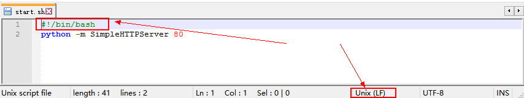

Title:使用docker+pelican搭建静态blog
Date: 2018-01-09 10:20
Category: 工具相关
Tags: pelican,blog,docker
Slug: 
Authors: bit4
Summary: 


为了使文章的编写和发布都更简便快捷，也为了更好得备份管理写过的东西，经过摸索，终于找到了一个自己比较满意的模式：

[typora](https://www.typora.io/)(Markdown编辑器)+[github](https://github.com/bit4woo/code2sec.com)(保存备份、共享)+[pelican](http://docs.getpelican.com)(静态网站生成工具) +docker==》[个人blog](http://www.code2sec.com/)

经过一段时间的折腾，将pelican的部署和配置过程，都写到了dockerfile里，以求实现快速部署。


### 0x0、pelicanconf.py的配置说明

元素配置文件在[这里](https://github.com/bit4woo/code2sec.com/blob/master/build/pelicanconf.py)

```python
#!/usr/bin/env python
# -*- coding: utf-8 -*- #
from __future__ import unicode_literals

AUTHOR = u'bit4'
SITENAME = u"bit4's blog"
SITEURL = ''

PATH = 'content'

TIMEZONE = 'Asia/Shanghai'

DEFAULT_LANG = u'en'

# Feed generation is usually not desired when developing
FEED_ALL_ATOM = None
CATEGORY_FEED_ATOM = None
TRANSLATION_FEED_ATOM = None
AUTHOR_FEED_ATOM = None
AUTHOR_FEED_RSS = None

# Blogroll，友情链接
LINKS = (('re4lity', 'http://rinige.com/'),
         ('BaoBaosb', 'http://www.meijj.org/'),
         ('CF_HB', 'http://www.coffeehb.cn/'),
         ('cdxy', 'https://www.cdxy.me/'),
	 ('薇拉vera', 'http://www.zuozuovera.cn/'),
	 ('bsmali4', 'http://www.codersec.net/'),
	 ('廖新喜','http://xxlegend.com/'),
	 ('PHITHON','https://www.leavesongs.com/'),
	 ('勾陈安全','http://www.polaris-lab.com/'),
	 ('threathunter','https://threathunter.org/'),)

# Social widget，个人的一些链接和联系方式
SOCIAL = (('github', 'https://github.com/bit4woo'),
          ('email', 'mailto:bit4woo@163.com'),)
#文章列表是否分页
DEFAULT_PAGINATION = False

# Uncomment following line if you want document-relative URLs when developing
# RELATIVE_URLS = True
#主题文件路径
THEME ='./pelican-themes/bootstrap2-dark'
#插件文件路径
PLUGIN_PATHS = [u"./pelican-plugins"]
#插件名称
PLUGINS = ["sitemap"]

## 配置sitemap 插件
SITEMAP = {
    "format": "xml",
    "priorities": {
        "articles": 1,
        "indexes": 0.5,
        "pages": 0.5,
    },
    "changefreqs": {
        "articles": "monthly",
        "indexes": "daily",
        "pages": "monthly",
    }
}
#文章中静态文件的路径
STATIC_PATHS = [u"img"]

#GOOGLE_ANALYTICS的编号，这个需要自己通过google帐号去开通申请，用于收集网站的访问统计之类的信息。 
GOOGLE_ANALYTICS = 'UA-111997857-1'

```


### 0x1、dockerfile的解析说明

原始dockerfile在[这里](https://github.com/bit4woo/code2sec.com/blob/master/build/dockerfile)，如下是对其中的一些点进行注释说明。

```dockerfile
FROM ubuntu:16.04

RUN sed -i 's/archive.ubuntu.com/mirrors.ustc.edu.cn/g' /etc/apt/sources.list
RUN apt-get update -y 

#resolve chinese coding issue
#以下部分是为了解决中文编码的问题
RUN apt-get install -y locales locales-all
RUN locale-gen zh_CN.UTF-8 &&\
  DEBIAN_FRONTEND=noninteractive dpkg-reconfigure locales
RUN locale-gen zh_CN.UTF-8
ENV LANG zh_CN.UTF-8
ENV LANGUAGE zh_CN:zh
ENV LC_ALL zh_CN.UTF-8

#pelican和其依赖的安装
RUN apt-get install -y python && apt-get install python-pip -y && apt-get install git -y
RUN pip install pelican markdown

#创建blog目录（项目），并且从github上克隆静态文件，将写好的pelicanconf.py配置文件进行替换。
RUN mkdir blog
WORKDIR /blog
RUN git clone https://github.com/bit4woo/code2sec.com
RUN cp /blog/code2sec.com/build/pelicanconf.py /blog/pelicanconf.py

#下载pelican的主题，我需要的是bootstrap2-dark
RUN git clone https://github.com/getpelican/pelican-themes
WORKDIR /blog/pelican-themes
#RUN git submodule update --init bootstrap2-dark

#下载pelican的插件，我需要的是给blog增加一个sitemap的插件
WORKDIR /blog
RUN git clone git://github.com/getpelican/pelican-plugins.git
RUN pelican code2sec.com

#处理favicon.ico
RUN mkdir output/theme/images -p
RUN cp /blog/code2sec.com/build/favicon.ico /blog/output/theme/images/

#设置启动脚本
WORKDIR /blog/output
RUN cp /blog/code2sec.com/build/start.sh start.sh
RUN chmod +x ./start.sh
CMD ["./start.sh"]

EXPOSE 80
```


### 0x2、快速部署

```bash
mkdir blog
wget https://github.com/bit4woo/code2sec.com/raw/master/build/dockerfile
docker build .
#docker build . --cache-from
docker tag b18b00c9828c bit4/blog
docker run -d -it -p 80:80 bit4/blog
#可以加上--restart=always 或者 --restart=on-failure在必要时重启

#如果服务没有正常启动，可以连接容器检测
docker exec -it container_ID_or_name /bin/bash
bash ./start.sh
```


### 0x3、文章更新

当有新的文章发布，可以先更新到github，然后连接容器进行操作，但是需要重启pelican server，但是kill掉这个进程将导致容器自动退出（因为没有IO阻塞了）。

所以将更新命令写到start.sh中，在容器启动时自动更新。

```
#!/bin/bash
cd /blog/code2sec.com
git pull
cd ..
pelican code2sec.com
python -m pelican.server 80
```


### 0x4、一些注意

关于dockerfile中的cmd和start.sh的一些坑：

1. `CMD  ["echo","hello world"]`这种格式（也就是字符串数组的格式）的实质是通过exec执行的，`CMD echo hello word` 这种格式的实质是 /bin/sh -c "echo hello world"执行的。

2. start.sh必须是Unix格式回车和换行符，而且shell脚本中不能少了`#!/bin/bash`否则会报`standard_init_linux.go:195: exec user process caused "exec format error"`的错误，window下可以通过notepad++来编辑start.sh并且在底部选择Unix的换行回车符。

   

3. start.sh必须要保证“阻塞stdout”,因为“如果没有阻塞住stdout ，docker容器会自动退出”。现象就是容器启动之后又自动退出了，通过log也看不到任何报错。

   ```bash
   #!/bin/bash
   python -m SimpleHTTPServer 80 &
   #以上的写法就是错误的，&让程序在后台运行，即未阻塞stdout，正确的写法需要去掉&符号。感谢皓烟洎铭师傅的指导。

   python -m SimpleHTTPServer 80
   nohup python -m SimpleHTTPServer 80
   #即以上2中方法都是可以的，不能少了“#!/bin/bash”
   ```

4. 关于docker启动的错误排查：

   ```bash
   docker ps -a
   docke logs container_id
   ```

   ​

关于shell退出时进程终止：

通过交互模式在docker容器中执行的命令，如果退出容器命令也会终止，即使是加了&符合让命令在后台执行。

有2个方式解决：

1. 不退出容器，直接关闭宿主机的shell（SSH远程链接）
2. 使用nohup + cmd +& 的格式来运行命令，然后退出容器（推荐使用这种方式）。

```bash
#在容器的交互模式中执行以下命令：
#退出容器时进程将会结束
python -m SimpleHTTPServer 80 &

#退出容器时，进程不会结束，将继续运行。在交互模式中应该这样使用。
nohup python -m SimpleHTTPServer 80 &
```


参考：

http://docs.getpelican.com/en/stable/quickstart.html#installation

http://csparpa.github.io/blog/2014/11/setup-static-blog-with-pelican.html

https://www.linuxzen.com/shi-yong-pelicanda-zao-jing-tai-bo-ke.html

https://www.cnblogs.com/cciejh/archive/2016/02/04/blog_building.html