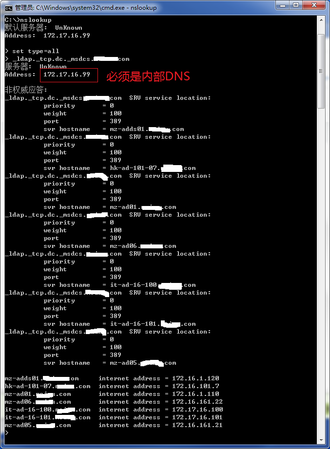
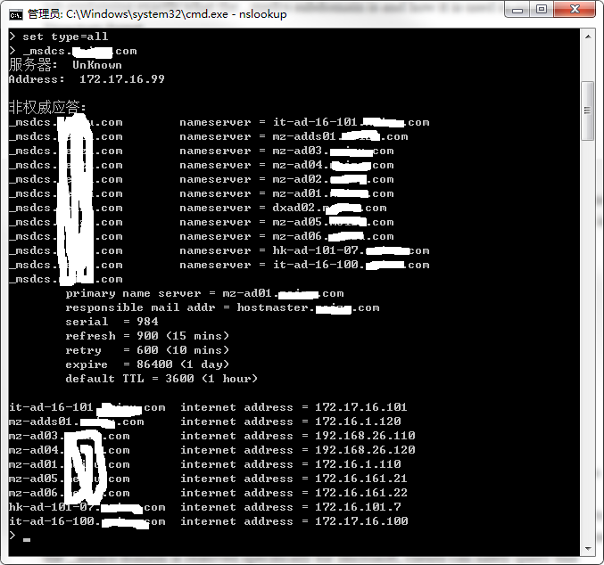
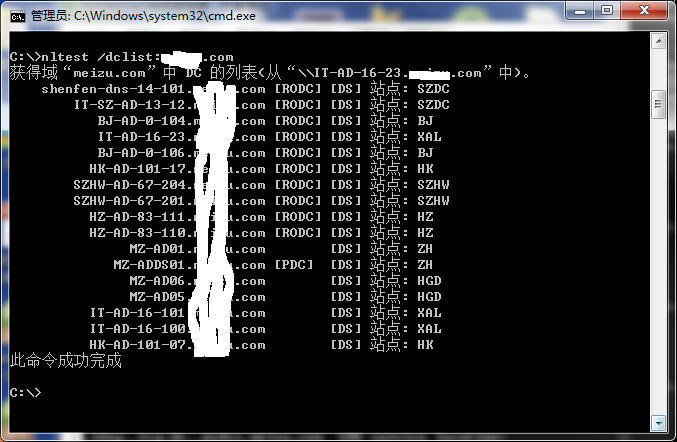
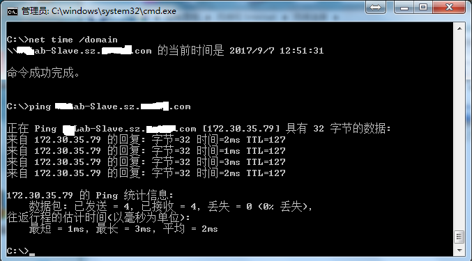
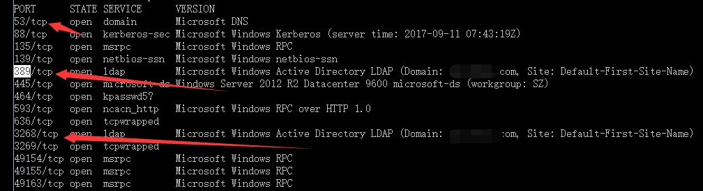

Title: 在内网环境中定位AD域控服务器
Date: 2017-09-07 10:20
Category: 基础知识、内网渗透
Tags: 域控、AD
Slug: 
Authors: bit4
Summary: 

注意：以下方法都有一个前提，本机已经加入域控。

 

**方法一、利用DNS记录**

```cmd
nslookup
set type=all
ldap.tcp.dc._msdcs.DOMAIN_NAME
```

或者

```
nslookup
set type=all
_msdcs.DOMAIN_NAME
```

 

原理：域控服务器会向DNS服务器注册DNS记录，以便当客户端需要加入域或者和域有其他交互的时候，可以找到它。

 

**值得注意的是，使用nslookup的时候，DNS服务器必须是内部DNS，否者是查询不到记录的，因为域控服务器只会向内部DNS服务器注册这个记录。**

 

大多情况下，内部DNS服务器和AD域控服务器默认部署在同一台服务器。如果是这种情况，找到DNS服务器就能找到了域控服务器。

 

参考：

<https://support.microsoft.com/zh-cn/help/816587/how-to-verify-that-srv-dns-records-have-been-created-for-a-domain-cont>

<https://technet.microsoft.com/en-us/library/cc978017.aspx>

 



 

 

**方法二、利用nltest命令**：

 

nltest /dclist:domainname

 



参考：

<https://technet.microsoft.com/zh-cn/library/cc731935(v=ws.10).aspx>

 

 **方法三**

 

net time /domain

 



 

**more:**

如果本机未加入域控，想到的思路：

1.端口扫描，域控服务器会开放389端口？ 如果和DNS同服务器，那么也会有53



2.加入域控肯定是要和服务器交互的，这个过程应该能识别到域控服务器，如何做到自动化呢，抓包？程序实现