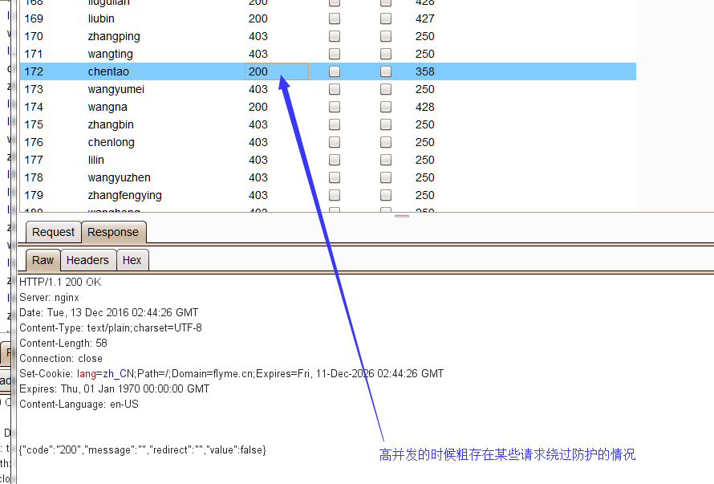

Title: 大力出奇迹：Web架构中的安全问题一例
Date: 2017-08-07 10:20
Category: 思路总结
Tags: web架构,漏洞,基础知识
Slug: 
Authors: bit4
Summary: 

在一起对线上业务的测试中，遇到过一个奇怪的问题，经排查和LVS以及后台应用服务的同步有关，现在分享如下；并对web架构的基础知识和个人经验认为可能存在的问题做简单的总结。

###  现象

    1. 爆破接口本来是做了防护的，即当某IP的请次数超过一定的阀值后返回403（正常请求返回的是200），但是大量的多线程请求中出现了某些请求仍然正常的情况。如图：

 

 2.在某次对另一个业务的测试中，也发现了类似的问题。某登录接口，多次尝试后开始要求图形验证码确认，但当用户多次点击按钮请求，图形验证码要求却消失了。

### 原因

​       经过运维的排查，发现根本原因是后端多台服务器配置不一致导致的，比如有三台服务器的代码是最新的，有防护策略，而有一台服务器的代码没有得到更新，没有防护策略，当多次请求的时候，LVS将流量指向了没有启用防护策略的服务器，响应包也就没有要求图形验证或响应正常，从而导致了多个请求中存在了无需验证的数据包。

### 测试方法和利用

​       多线程、高并发请求；这些大量异常包中的正常请求也是有可能被利用的，比如，如果LVS是轮询算法，即每N次就有一次可利用的请求。

### 总结

​    现在的web应用早已不是单台服务器的时代了，往往都有一个庞大的web架构来支撑一个应用。个人学习了一下相关基础知识，并根据经验罗列了一下这些架构中可能存在的问题。

 

习惯了通过思维导图来记录知识，高清大图请点击：

 

#### ** Web架构中的安全问题.png**

 

 

Web架构中的安全问题

	Web架构中的安全问题
		关键基础（常见web架构）
			典型架构
						在用户和LVS之间可能有CDN
				如果通过http请求访问网站，得到的ip是lvs服务器的IP
				如果有使用CDN，用户直接可见的IP就是CDN服务器的地址
			负载均衡LB
				常用的负载均衡开源软件有nginx、lvs、haproxy，商业的硬件负载均衡设备F5、Netscale
					lvs是负载均衡的一种实现而已
				前端负载均衡服务器，按不同的模式和算法将来自用户的请求分发至不同的服务器。也就是说负载均衡需要解决的两个核心问题是：选谁、转发
				LVS
					LVS 是四层负载均衡，LVS 支持 TCP/UDP 的负载均衡
					实际上 LVS 的机器代替真实的服务器与用户通过 TCP 三次握手建立了连接，所以 LVS 是需要关心「连接」级别的状态的。
					LVS 的工作模式
						DR
							
							LVS和后端服务器又相同的IP地址，使用了ARP抑制来防止IP冲突
						NAT
							
							LVS是网关的角色；客户端请求的时候，是直接请求LVS的。而LVS收到数据包的动作是：修改目的地址后再转发出去。
						TUNNEL
						Full-NAT
							
							优势是可以跨网段，扩容能力强；采用 Full-NAT 模式后，可以搭建 LVS 的集群。
								
					Session
						客户端不服务端的通信，一次请求可能包含多个 TCP 包，LVS 必须保证同一连接的 TCP 包，必须被转发到同一台 RS，否则就乱套了。为了确保返一点，LVS 内部维护着一个 Session的 Hash 表，通过客户端的某些信息可以找到应该转发到哪一台 RS 上。
					容灾
						容灾主要是靠 KeepAlived 来做的
					重要参考
						http://www.cnblogs.com/liwei0526vip/p/6370103.html
						http://blog.csdn.net/wsl211511/article/details/51615855
				haproxy
					七层负载均衡，面向的是HTTP包，所以可以做URL解析等工作
				LB的健康检查
					只能通过判断与其直连的设备端口开通情况来判断，端口通就是健康，不通就是异常；如果一个服务假死，端口依然可以连通，而进程不处理数据，这种是LB无法检查到的。
			Nginx--反向代理
				高性能的HTTP和反向代理服务器，轻量级web容器，占用内存少，稳定性高。
				主要是反向代理，也可以作为web容器，充当双重身份
				应用层的分流策略可以在这里做，比如对 /xx 路径的请求分到 a 服务器，对 /yy 路径的请求分到 b 服务器，或者按照 cookie 进行小流量测试等
				缓存，并在后端服务挂掉的时候显示友好的 404 页面
			Jetty--web容器，应用所在服务器
				基于Java的web容器，为jsp和servlet提供运行环境
				真正意义上的web服务器，就像apache
			CDN
				自己可以搭建一个服务器，并使用cloudflare的免费https，可以看到需要修改DNS服务器为cloudflare的DNS服务器。而修改后解析的IP也成了cloudflare的一个IP
				作用
					提供网站访问速度
					隐藏真实IP
					防护攻击
			waf
				以上的架构中都没有包含WAF，这又是一个单独的大课题了
		可能的安全问题
			反向代理nginx
				当作为反向代理服务器的时候，对获取用户IP的影响
					ngx_http_realip_module
					http://www.jianshu.com/p/14dcc24272fe
			负载均衡LVS
				案例1
					现象
						爆破接口做了防护，超过次数后返回403，但是多线程请求出现某些请求仍然正常的情况。
							
						某登录接口，多次尝试后开始要求图形验证码确认，但当用户多次点击按钮请求，图形验证码要求消失。
					原因
						多台服务器配置不一致，导致某些防护绕过，因为请求经过了不同的后台服务器处理，故结果不一致。
					测试方法
						多线程请求
						批量请求测试
					利用
						如果是轮询算法，即每N次就有一次可利用的请求
				LVS DOS攻击
					http://www.linuxvirtualserver.org/docs/defense.html
					http://www.austintek.com/LVS/LVS-HOWTO/HOWTO/LVS-HOWTO.operation.html
			CDN（比如加速乐、cloudflare）
				如何知道一个网站是否使用了CDN

					关键看DNS服务器属于谁，如果属于cloudflare等CDN厂商，那当然是有使用了
				绕过CDN找真实IP
		特点
			这些问题都是在简单的测试环境发现不了的
		by bit4
