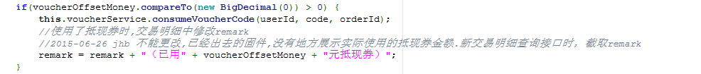
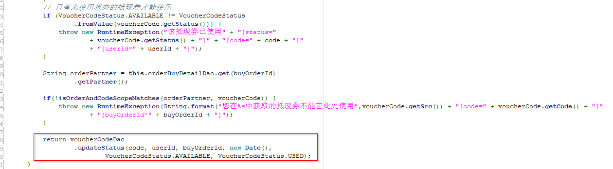
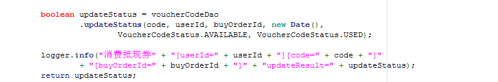
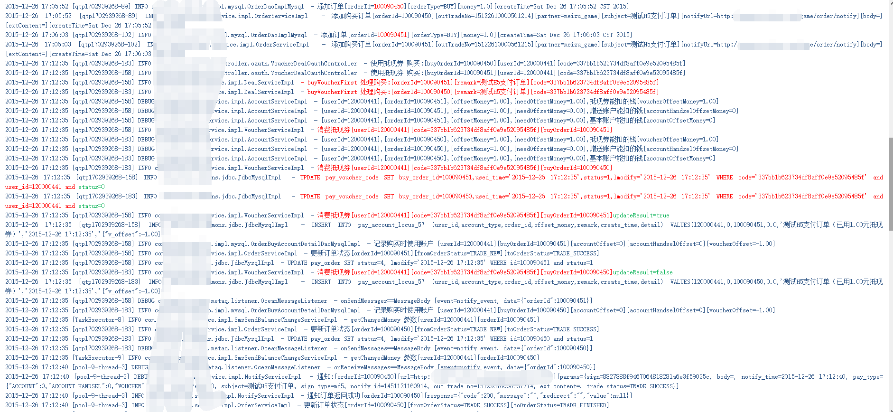
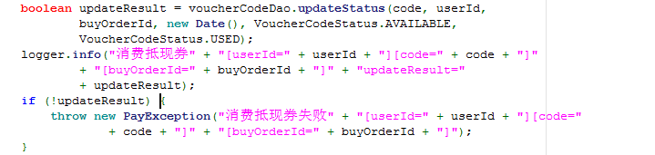

Title: 条件竞争导致的安全问题–抵现券一券多用问题原理与总结
Date: 2017-05-26 10:20
Category: 思路总结
Tags: 条件竞争,漏洞
Slug: 
Authors: bit4
Summary: 


## 背景

支付H5预计2015-12-31上线，故在2015-12-21日提测了一个服务端的安全测试单（单号：1632363），由安全测试人员bit4帮忙跟进测试。bit4于2015-12-26日于redmine系统提交了一个安全bug(单号：266626 【安全】【支付】抵现券高并发处理不当，可一券多用)。

## 测试步骤

1. 通过PaySdk客户端，生成业务订单，并点击支付生成支付订单，但不进行购买，如此反复生成多个初始化的购买订单
2. 通过抵现券查询接口（有三个，都可以），直接进行支付流程就会有这个接口的的返回信息，抓包查看即可，选取一个抵现券记录下它的code值，比如：`d2404ac1b2a54a1aadad752b536fxxxx`
3. 截获支付流程中的购买接口（`https://pay.xxx.com/pay/oauth/voucher/deal/buy`），真正进行支付订单支付的接口，替换其中的code值为刚记录的值，并替换订单值为第一步骤中所记录的初始化订单的值。
4. 同时发起订单号不同而抵现券值相同的多个请求，构成并发请求。之后查看结果。发现有两个请求均获得支付成功。

注：以上环境中，设置的订单金额和使用的抵现券的金额都是一元，以保证请求是有效的，不受其他逻辑的干扰。而且测试的时候资金账号基本余额也做了检查，余额未变动。而抵现券也只是少了一个。

## 现象

同一个抵现券在高并发请求下出现被多次使用成功，多个订单可以使用同一个抵现券购买成功。

## 核实问题

根据安全测试人员提供的订单号及抵现券code, 分析日志及DB中的订单状态，抵现券状态，确实发现两个不同的购买订单使用同一个抵现券code购买成功，且可重现。

## 分析问题出现原因

经分析代码`AccountServiceImpl.decrVoucherFirst()`方法发现调用消费抵现券方法`VoucherServiceImpl.consumeVoucherCode()`时未对方法是否消费抵现券成功做处理，而该方法本身也没有对是否成功消费抵现券做处理。

故导致，同一个抵现券在高并发请求下，有多个请求同时满足消费抵现券的前置条件，到达如下图二所标识部分，则多个请求都可以执行完该方法，只是返回值不同, 上层调用者如图一所示， 并未对返回结果做判断。





## 验证问题

修改`VoucherServiceImpl.consumeVoucherCode()`方法，不更改程序原有逻辑，仅添加详细日志来验证分析出的原因是否正确， 修改如下。



重新打包，提交到测试环境，请安全测试人员重新测试， 日志如下：



日志与预期结果相符，验证了猜测。

于2015-12-27日，修复了该bug, 修改如下图所未， 调用到更新DB时，更改失败时，抛出消费抵现券失败异常， 阻止程序继续执行。



重新打包，部署到测试环境，测试结果如下：

测试时发现有三个请求在同时尝试修改券的状态，其中两个返回了“消费抵现券失败”，只有一个成功。确认修复有效。

## 总结

Mysql处理高并发，防止库存超卖的问题，大部分人一般想到的都是事务，但是事务是控制库存超卖的必要条件，但不是充分必要条件。

**举例：**

- 商品总库存：4个商品
- 并发请求人：a、1个商品 b、2个商品 c、3个商品

假如产品表名为：`t_store`, 商品id为：`12345`, 商品库存字符为: `amount`, 请求减掉的库存数量: `quantity`

程序如下：

```sql
BeginTransaction(开启事务)
try{
$result = $dbca->query('select amount from t_store where product_id = 12345');
if(result->amount > 0){
$dbca->query('update t_store set amount = amount - quantity where product_id = 12345');
}
}catch($e Exception){
rollBack(回滚);
}
commit(提交事务);
EndTransaction(结束事务)
```

以上代码就是我们平时控制库存写的代码了，大多数人都会这么写，看似问题不大，其实隐藏着巨大的漏洞。

数据库的访问其实就是对磁盘文件的访问，数据库中的表其实就是保存在磁盘上的一个个文件，甚至一个文件包含了多张表。
 例如由于高并发，当前有三个用户a、b、c三个用户进入到了这个事务中，这个时候会产生一个共享锁（读锁，允许多个事务读，但是不允许修改），

---me:为什么这里加的是共享锁而不是排他锁呢？因为是先`query`，也就是读取，所以加共享锁。而下边的`update`是修改，只能是排它锁。

所以在select的时候，这三个用户查到的库存数量都是4个，同时还要注意，`mysql innodb`查到的结果是有版本控制（MVCC，有兴趣的同学可以自己百度）的，在其他用户更新没有`commit`之前(也就是没有产生新版本之前)，当前用户查到的结果依然是旧版本。

然后是update，假如这三个用户同时到达`update`这里，这个时候Mysql会把`update`更新语句并发串行化，也就是给同时到达这里的是三个用户排个序，一个一个执行，并生成排他锁（可读可写，独占资源），在当前这个`update`语句`commit`之前，其他用户等待执行，`commit`后，生成新的版本；

这样执行完后，库存肯定为负数了。但是根据以上描述，我们修改一下代码就不会出现超买现象了，代码如下:

```sql
BeginTransaction(开启事务)
try{
$dbca->query('update t_store set amount = amount - quantity where amount>= quantity and product_id = 12345');
}catch($e Exception){
rollBack(回滚);
}
commit(提交事务);
EndTransaction(结束事务)
```

这样就可以控制库存超卖的情况了， 但是还需要处理一点，就是执行这个update事务究竟是否更新成功(即更新成功的`records`是否大于``)呢 , 上面的`update`更新成功才能够接着处理用户扣钱，等一系列的操作。

再来看看此次我们所犯的错误：

很明显所犯的正是没有关心`update`执行是否成功亦即更新成功的`records`是否大于``，在没有做任何的判断的情况下让程序继续向下执行。故而导致此bug的出现。