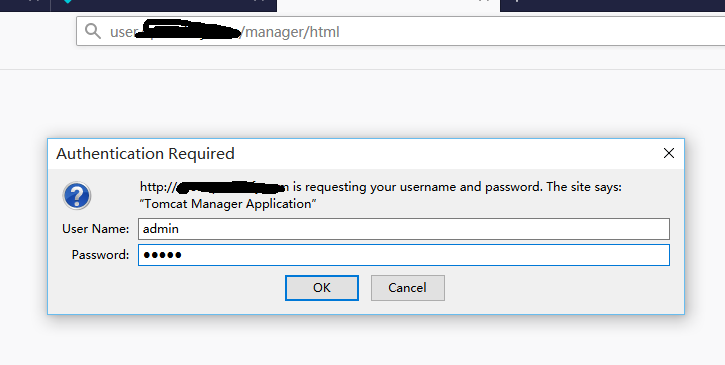
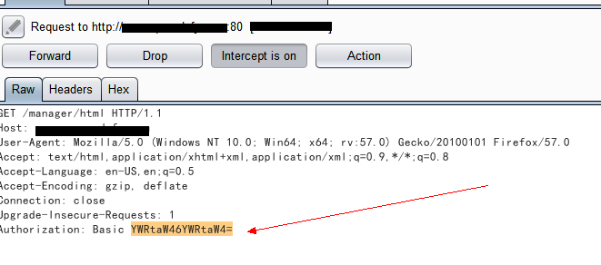
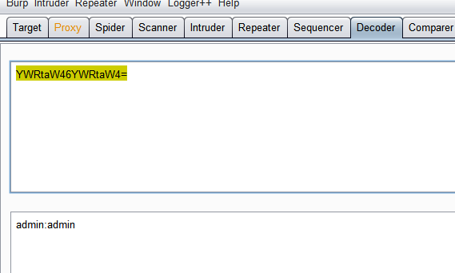
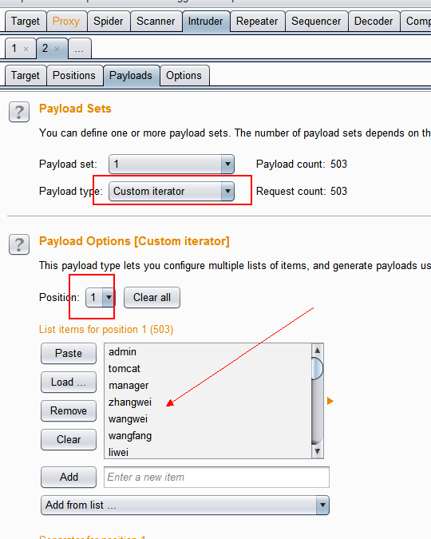
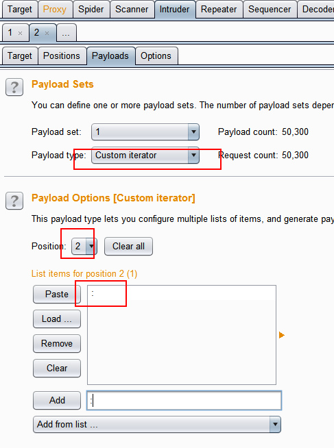
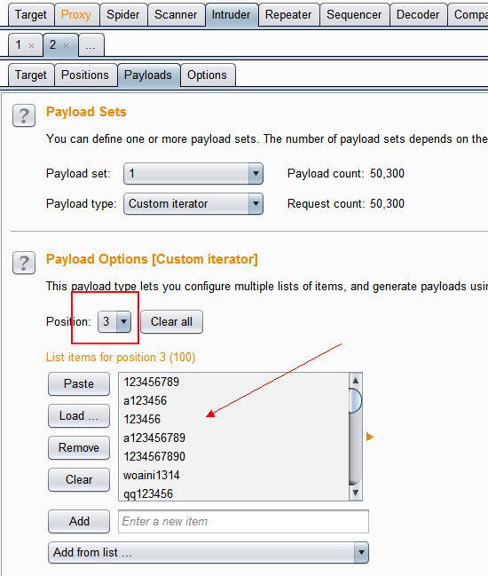
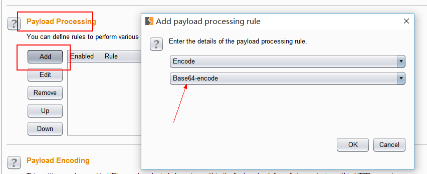
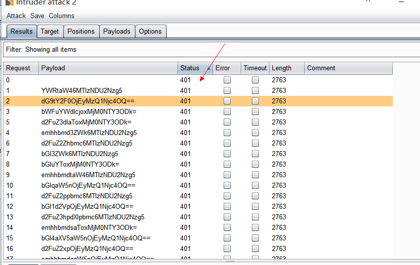

Title: 用burpsuite进行 basic Authentication爆破
Date: 2017-12-01 10:20
Category: 基础知识
Tags: basic Authentication, brute force
Slug: 
Authors: bit4
Summary: 

### 0x0、了解basic Authentication的本质

 

我们先用 admin作为用户名和密码。登录抓包。

拦截到如下请求包

把请求包中 "Authorization: Basic "后的加密串放到decoder中进行解密尝试，可用用base64成功解密，明文的格式如下 username:password

即用户名和密码是中间用冒号分隔。

 

### 0x1、构造爆破的payload

 

已经知道字符串的构造是  base64(username:password) 的格式，那么我们就来构造下,以下配置都是在Intruder---Payloads的Tab中。

 

首先、需要用到 custom iterator来构造明文串，第一个位置是用户名，第二个位置是：，第三个位置是密码。

 

 

其次、配置对明文串进行base64加密。

 

最后、还要注意Payload Encoding选项，是否对payload进行url编码，这里是不需要的，取消就好了。

 

### 0x02、整体效果展示

通过查询响应包的Status Code就可以知道是否爆破成功了。

