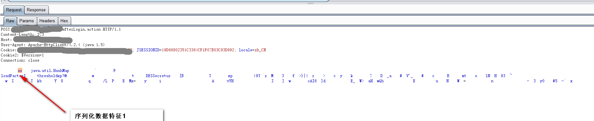
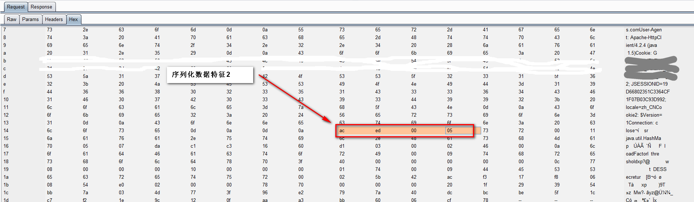
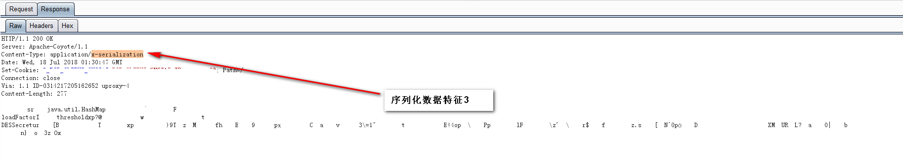
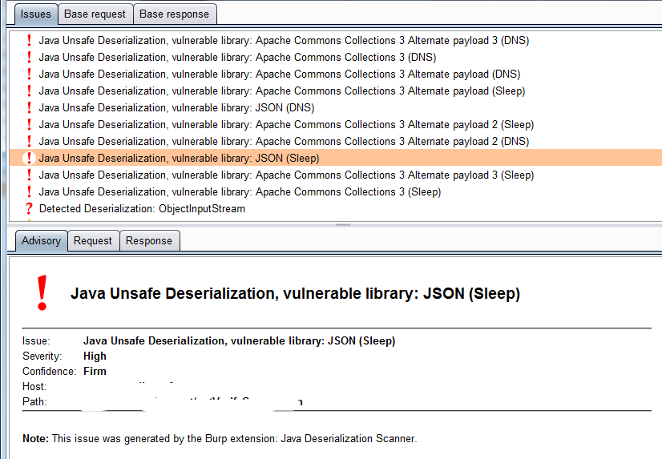
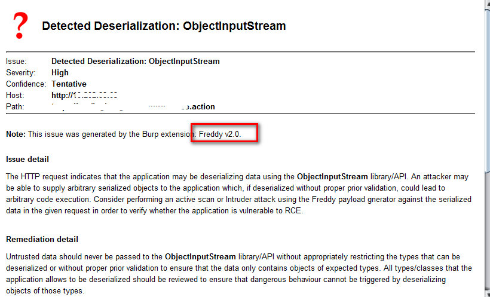
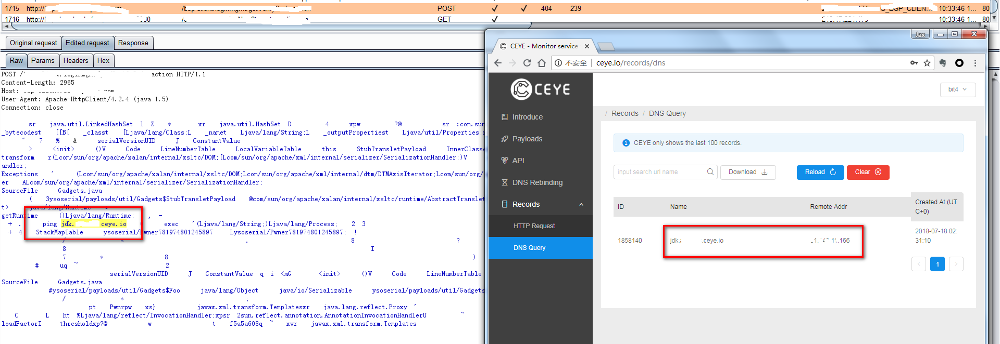
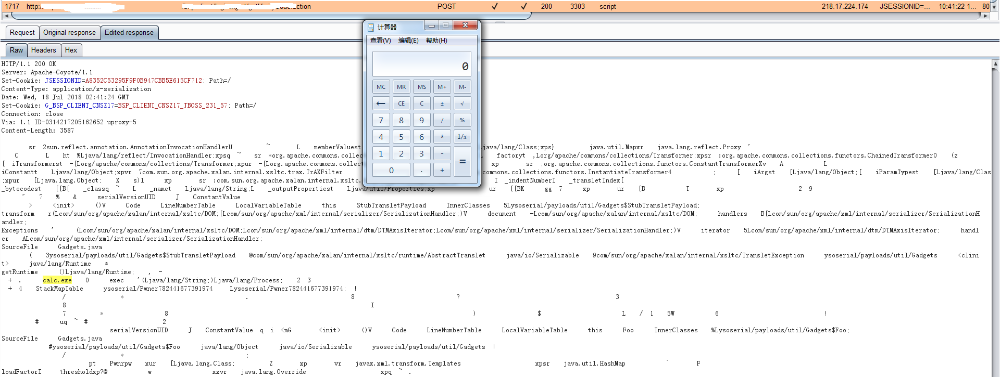
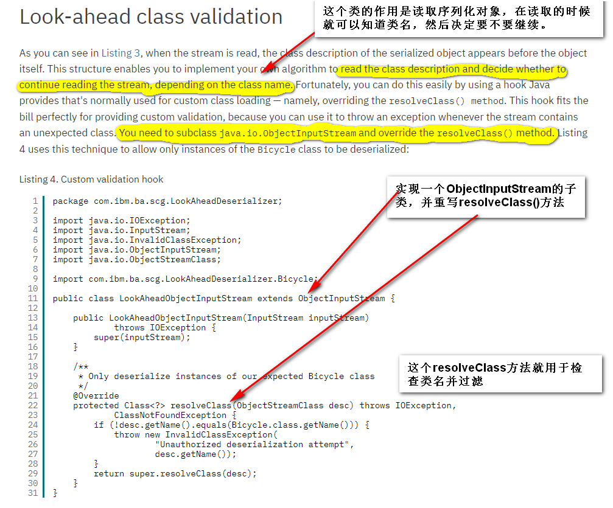
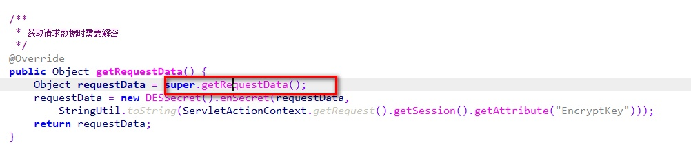
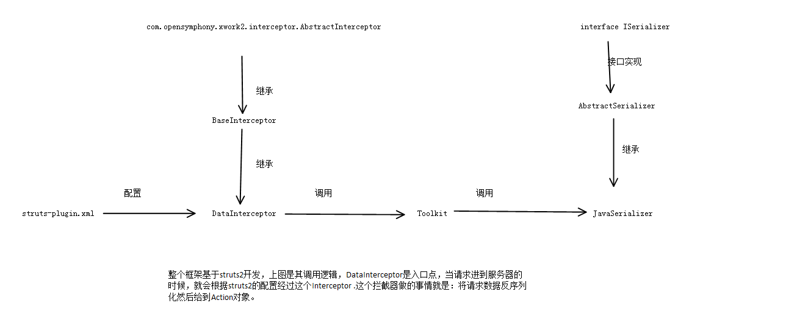

Title:记一次Java反序列化漏洞的发现和修复
Date: 2018-07-18 20:30
Category: 漏洞实践
Tags: Java,反序列化,漏洞
Slug:
Authors: bit4woo
Summary: 


### 背景简介

本文是自己对一次反序列化漏洞的发现和修复过程，如有错误请斧正，大神请轻喷。

目标应用系统是典型的CS模式。

客户端是需要安装的windows桌面程序，但是它是大部分内容都是基于Java开发（安装目录有很多Jar包）。

服务端是基于Jboss开发。

客户端和服务端之间的通信流量是序列化了的数据流量。客户端接收和解析数据流量的模式和服务端一样，也是通过http服务，它在本地起了80、81端口，用于接收反序列化对象。


### 0x0、Java序列化流量特征

特征1：参考特征，反序列化数据看起来就是这个样子:  sr 、类名、空白字符



特征2：固有特征，是Java的序列化数据就一定是这样，如果是base64编码的，就是以rO0A开头的。



特征3：参考特征，有些content-type就说明了它是是序列化数据。



### 0x1、检测工具

当确定是序列化数据后，我使用了2个会主动进行反序列化漏洞扫描的burp插件：

- [Java Deserialization Scanner](https://github.com/federicodotta/Java-Deserialization-Scanner)  --能识别流量，也成功报了漏洞，而且使用了多种payload。
- [Freddy](https://github.com/nccgroup/freddy) --只是识别了流量，并未报漏洞。

当时忘即截图了，这是后续在测试环境的截图：



Freddy的流量识别截图：


### 0x2、复现方法(攻击服务器端)

使用ysoserial生成一个payload，这里以Jdk7u21为例，由于是内部系统，我知道服务器上JDK的版本。

```
java -jar ysoserial-master.jar Jdk7u21 "ping jdk.xxx.ceye.io" > Jdk7u21
```

将生成的payload通过burp向服务端进行请求，命令执行成功。




### 0x3、攻击客户端

晚上回家想了想，返回包也是序列化格式的，是不是可以试试攻击客户端呢？第二天来一试，还真的可以。

对客户端做了一个简单的分析，发现客户端在本地起了80和81端口，也是通过http 服务来接收序列化对象的，反序列化过程和服务端如出一辙。

```
java -jar ysoserial-master.jar CommonsCollections3 "calc.exe" >CC3-desktop 
```




这里自己想象了一种攻击场景：当攻击者控制了服务器之后，可以干掉这个服务，自己开启一个恶意的服务端，当反序列化请求过来时，都返回一个恶意的响应包，比如反弹shell子类的，凡是使用了该客户端的用户都可能被攻击。危害还是不容小视的。


### 0x4、防护思路

到了这里就开始考虑修复了，我给开发提供了2种修复思路。

1.升级

升级服务端所依赖的可能被利用的jar包，当然还包括JDK。不错所料，开发一听就否了。一来升级需要经过各种功能性测试，耗时较长，二来是JDK的升级可能造成稳定性问题（之前一个AMF的反序列化问题就是如此，升了2个月了还没搞定）。

2.过滤

另一个思路就是过滤了，**需要继承Java.io.ObjectInputStream实现一个子类，在子类中重写resolveClass方法，以实现在其中通过判断类名来过滤危险类。然后在JavaSerializer类中使用这个子类来读取序列化数据，从而修复漏洞。** 



### 0x5、失败的修复

我将以上的第二种修复思路给到了开发，并提醒参考SerialKiller项目。过了一段时间，开发告诉我修复了，然而我的验证显示漏洞依然存在。

只好硬着头皮去开发电脑上看代码，后来发现开发将过滤方法用在了下图的方法之后，而且是在判断获取到的对象是不是HashMap实例之后（开发不愿意给我截图了...）。到这里我终于发现了点不对劲，在判断对象类型了，岂不是说明已经反序列化完成了？

通过对这个getRequestData()函数的追踪，确定反序列化过程是在一个底层的Jar包中完成的。




### 0x6、对底层Jar包的分析

然后我拿到这个Jar进行了分析，它是公司自己开发的框架。最后艰难地理出了其中的调用逻辑：该框架基于struts2开发，从下图的调动逻辑可以看出，所有的请求到达服务端后，都会首先经过DataInterceptor这个拦截器，这个拦截器执行的动作就是反序列化数据然后给到Action。上面的getRequestData()方法，已经是在这个流程之后了，属于Action中的逻辑。故而开发的修复方式无效。



DataInterceptor类的实现如下：

```java
public class DataInterceptor
  extends BaseInterceptor
{
  private static final long serialVersionUID = 1L;
  
  public String intercept(ActionInvocation invocation)
    throws Exception
  {
    HttpServletRequest request = (HttpServletRequest)invocation
      .getInvocationContext().get("com.opensymphony.xwork2.dispatcher.HttpServletRequest");
    Object action = invocation.getAction();
    if ((action instanceof IDataAction))
    {
      IDataAction richAction = (IDataAction)action;
      Serializable model = Toolkit.getSerializer().deserialize(
        request.getInputStream());//这里执行了反序列化操作
      richAction.setRequestData(model);//将对象传递给了Action，getRequestData()方法才能获取到
    }
    else if ((action instanceof IDataBundleAction))
    {
      IDataBundleAction richAction = (IDataBundleAction)action;
      Serializable model = Toolkit.getSerializer().deserialize(
        request.getInputStream());
      richAction.setRequestDataBundle((DataBundle)model);
    }
    return invocation.invoke();
  }
}
```

JavaSerializer的实现如下：

```java
import java.io.BufferedInputStream;
import java.io.IOException;
import java.io.InputStream;
import java.io.ObjectInputStream;
import java.io.Serializable;

public class JavaSerializer
  extends AbstractSerializer
{
  public Serializable deserialize(InputStream in)
    throws IOException
  {
    ObjectInputStream oo = new ObjectInputStream(new BufferedInputStream(in));
    try
    {
      return (Serializable)oo.readObject();
    }
    catch (ClassNotFoundException e)
    {
      throw new IOException("序列化类文件找不到：" + e.getMessage());
    }
    finally
    {
      oo.close();
    }
  }
```

到这里就清楚了，真正有漏洞的代码就在这里。

### 0x7、成功的修复

要修复这个漏洞，就需要将上面的第二种过滤修复方法用到这个类里，具体的实现方法和SerialKiller一样。

```
需要继承Java.io.ObjectInputStream实现一个子类（SerialKiller），在子类中重写resolveClass方法，以实现在其中通过判断类名来过滤危险类。然后在JavaSerializer类中使用这个子类来读取序列化数据，从而修复漏洞。
```

通过如上方法修复了该漏洞，验证也是成功修复。修复后的JavaSerializer类：

```Java
import com.xxx.xxx.xxx.core.security.SerialKiller;
import java.io.BufferedInputStream;
import java.io.IOException;
import java.io.InputStream;
import java.io.ObjectInputStream;
import java.io.Serializable;

public class JavaSerializer
  extends AbstractSerializer
{
  public Serializable deserialize(InputStream in)
    throws IOException
  {
    ObjectInputStream ois = new SerialKiller(new BufferedInputStream(in));//SerialKiller是重写了resolveClass方法的子类。
    try
    {
      return (Serializable)ois.readObject();
    }
    catch (ClassNotFoundException e)
    {
      throw new IOException("序列化类文件找不到：" + e.getMessage());
    }
    finally
    {
      ois.close();
    }
  }
  
```

### 0x8、意外之喜----另一处XMLDecoder 反序列化漏洞

然而，对Java包的分析还发现了另外一处反序列化漏洞。问题出在对XML的反序列化过程中，和weblogic的XMLDecoder RCE如出一辙。

漏洞代码如下：

```java
import java.beans.XMLDecoder;
import java.io.IOException;
import java.io.InputStream;
import java.io.Serializable;

public class XmlSerializer
  extends AbstractSerializer
{
  public Serializable deserialize(InputStream in)
    throws IOException
  {
    XMLDecoder xd = new XMLDecoder(in);//和weblogic的XMLDecoder RCE如出一辙
    try
    {
      return (Serializable)xd.readObject();
    }
    finally
    {
      xd.close();
    }
  }
```

它的修复方式也是参考了weblogic的，需要实现一个validate 函数，在执行XML解码(XMLDecoder)前，对InputStream对象进行检查过滤。

```java
private void validate(InputStream is){
      WebLogicSAXParserFactory factory = new WebLogicSAXParserFactory();
      try {
         SAXParser parser = factory.newSAXParser();
         
         parser.parse(is, new DefaultHandler() {
            private int overallarraylength = 0;
            public void startElement(String uri, String localName, String qName, Attributes attributes) throws SAXException {
               if(qName.equalsIgnoreCase("object")) {
                  throw new IllegalStateException("Invalid element qName:object");
               } else if(qName.equalsIgnoreCase("new")) {
                  throw new IllegalStateException("Invalid element qName:new");
               } else if(qName.equalsIgnoreCase("method")) {
                  throw new IllegalStateException("Invalid element qName:method");
               } else {
                  if(qName.equalsIgnoreCase("void")) {
                     for(int attClass = 0; attClass < attributes.getLength(); ++attClass) {
                        if(!"index".equalsIgnoreCase(attributes.getQName(attClass))) {
                           throw new IllegalStateException("Invalid attribute for element void:" + attributes.getQName(attClass));
                        }
                     }
                  }
                  
                  if(qName.equalsIgnoreCase("array")) {
                     String var9 = attributes.getValue("class");
                     if(var9 != null && !var9.equalsIgnoreCase("byte")) {
                        throw new IllegalStateException("The value of class attribute is not valid for array element.");
                     }
                  }
               }
             }
         });
         
         } catch (ParserConfigurationException var5) {
            throw new IllegalStateException("Parser Exception", var5);
         } catch (SAXException var6) {
            throw new IllegalStateException("Parser Exception", var6);
         } catch (IOException var7) {
            throw new IllegalStateException("Parser Exception", var7);
         }
}

```

### 0x9、总结

零零散散学习反序列化漏洞已经很长时间了，这是第一次在公司自研框架中发现反序列化漏洞，所以总结记录一下，大神请轻喷！也算是对该漏洞知识的一个梳理。学习还是要实践过、做过了才算是学到了，否则永远不是自己的！

### 0xA、参考：

过滤方法的一个开源库，但是这个库需要依赖JDK1.8:  <https://github.com/ikkisoft/SerialKiller>

反序列化漏洞的入口和限制条件+反序列化过滤防御思路：<https://www.ibm.com/developerworks/library/se-lookahead/> 

廖师傅的Weblogic XMLDecoder RCE分析: http://xxlegend.com/2017/12/23/Weblogic%20XMLDecoder%20RCE%E5%88%86%E6%9E%90/