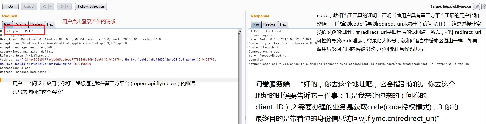
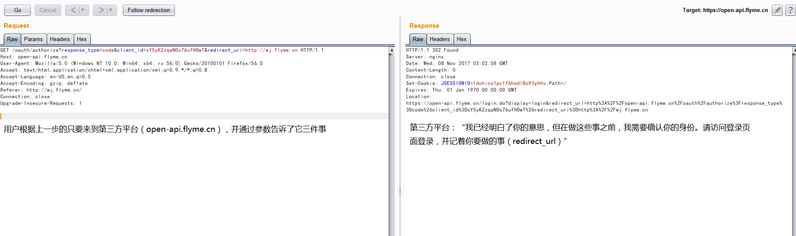
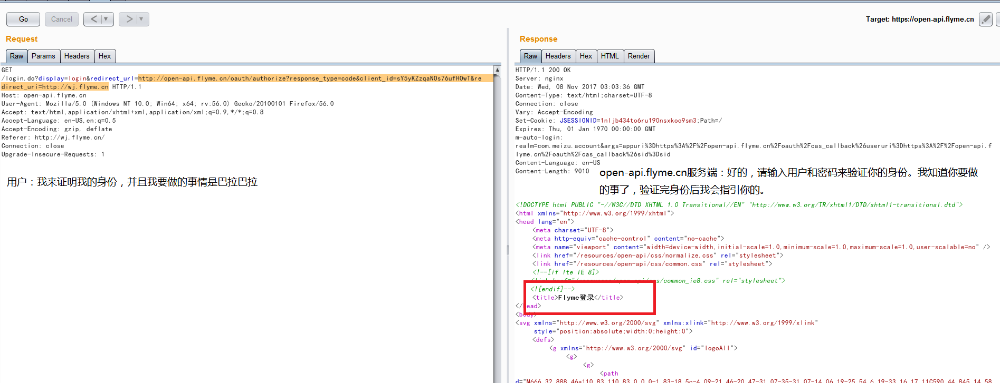
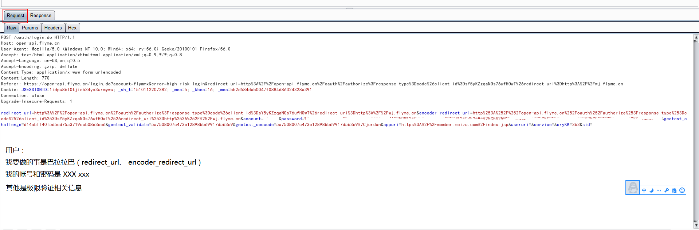
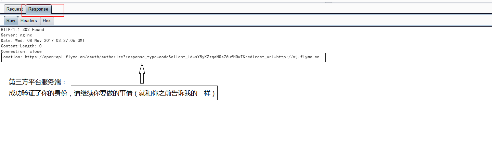
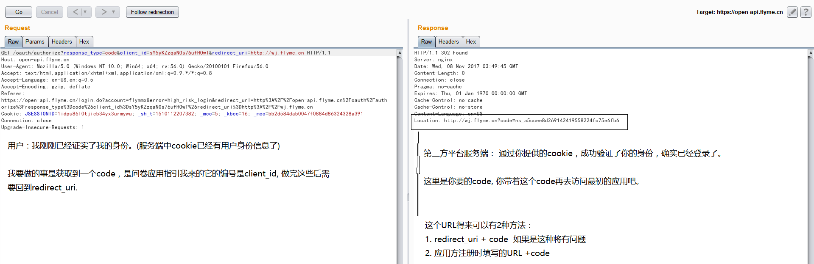
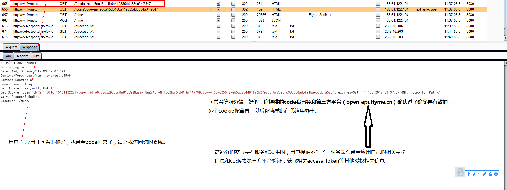
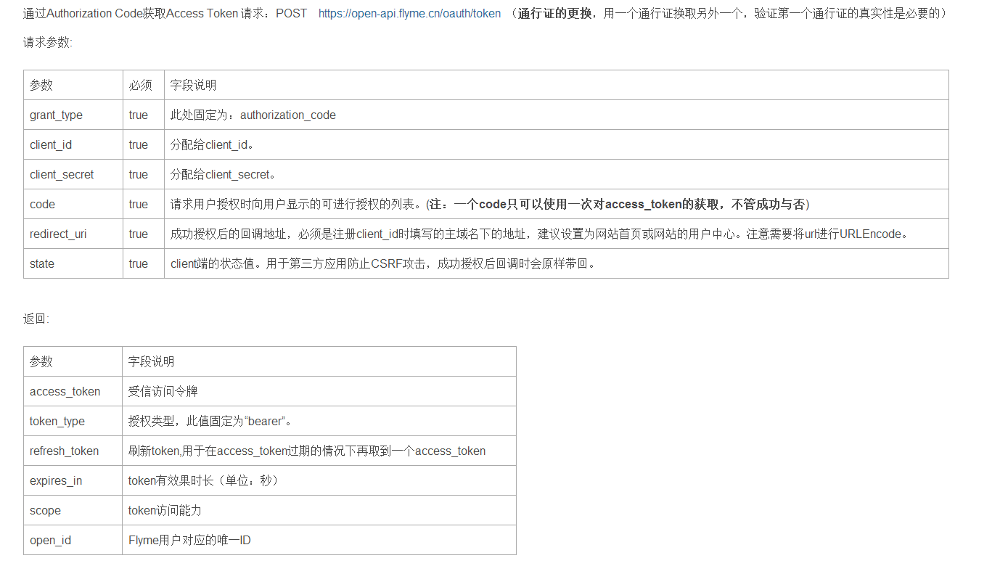
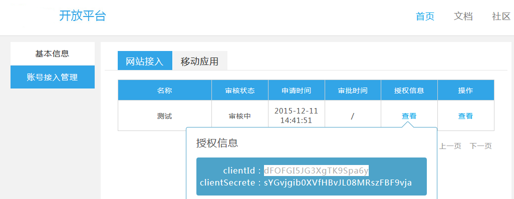

Title:通过实例理解OAuth2.0的授权码模式（authorization code）
Date: 2018-01-29 10:20
Category: 思路总结
Tags: OAuth2.0,authorization code,授权码模式
Slug: 
Authors: bit4
Summary: 

根据自己的理解，通俗地理解OAuth2.0的授权码模式

### 0x0、理解完整流程

第一步：用户点击登录



第二步：用户根据第一步的指引访问第三方平台（统一登录中心）



第三步：验证用户名密码的准备




第四步：验证用户名密码



验证成功后的跳转指引（一般会有一个授权过程，需要用户点击确认才可以到达这里，但是在这个实例里面没有，需要注意！）



第五步：带着验证成功的身份信息请求code。



第六步：带着code去访问应用



第七步：通过code换token



### 0x1、可能的安全问题

1. 第二步中，可能通过修改redirect_uri实现任意url跳转，从而实现token的窃取。client_id和redirect_uri都应该是在开发者平台注册的时候确定，并绑定关系的 。如果注册的时候就通过通配符来填充子域名，将可能造成这个问题

```
2010-11-03 WooYun: Sina 微博OAuth 提供者存在session fixation attack漏洞
2011-02-18 WooYun: 新浪微博应用URL跳转
2011-04-29 WooYun: 街旁网第三方登录劫持漏洞
2013-07-01 WooYun: 图虫网第三方认证缺陷导致可以劫持帐号
2013-07-23 WooYun: 团800oauth缺陷可能导用户帐号被劫持
```





2. client_id（appkey）和client_secret（app secret）泄露

3. 平台方提供的接口存在XSS

4. 平台方授权页面的csrf

```
2012-02-15 WooYun: CSRF导致微博应用自动授权
2012-07-20 WooYun: 第三方APP强制新浪用户OAUTH授权漏洞
2012-12-03 WooYun: 网易开放平台第三方应用oauth强制用户授权漏洞
```

5. 流程漏洞，可忽略前面步骤，类似密码重置逻辑漏洞，UID修改

```
2013-02-19 WooYun: 猪八戒网不用账号密码登录任意账号
http://www.wooyun.org/bugs/wooyun-2013-018898
2013-03-18 WooYun: 饭统网登录任意账户漏洞
http://www.wooyun.org/bugs/wooyun-2013-020258
```

6. 使用了Oauth后导致的跨应用登录问题（OAuth 2.0无绑定token问题）

  通过一系列，登录授权后，获取到一个代表用户身份的code--access_token--或者UID. 如果能找到这个参数的规律，能进行修改或者替换，那么将导致任意用户登录。

```
WooYun: 金山快盘手机客户端任意进入他人快盘账号
http://www.wooyun.org/bugs/wooyun-2013-017543
金山快盘手机客户端任意进入他人快盘账号.pdf
WooYun: 啪啪任意进入他人账号（OAuth 2.0无绑定token问题）
http://www.wooyun.org/bugs/wooyun-2013-017306
啪啪任意进入他人账号（OAuth 2.0无绑定token问题）.pdf
WooYun: 淘网址sina oauth认证登录漏洞
http://www.wooyun.org/bugs/wooyun-2012-011104
淘网址sina oauth认证登录漏洞.pdf
```

### 0x2、参考
https://github.com/bit4woo/code2sec.com/refrence/OAuth2.0